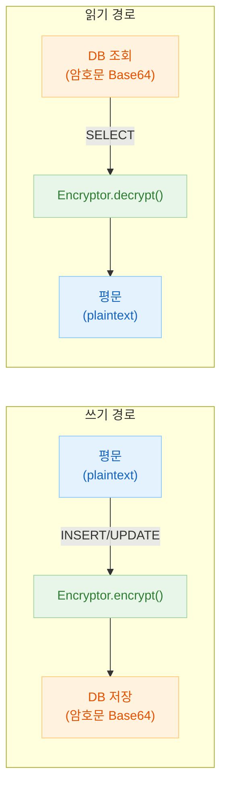
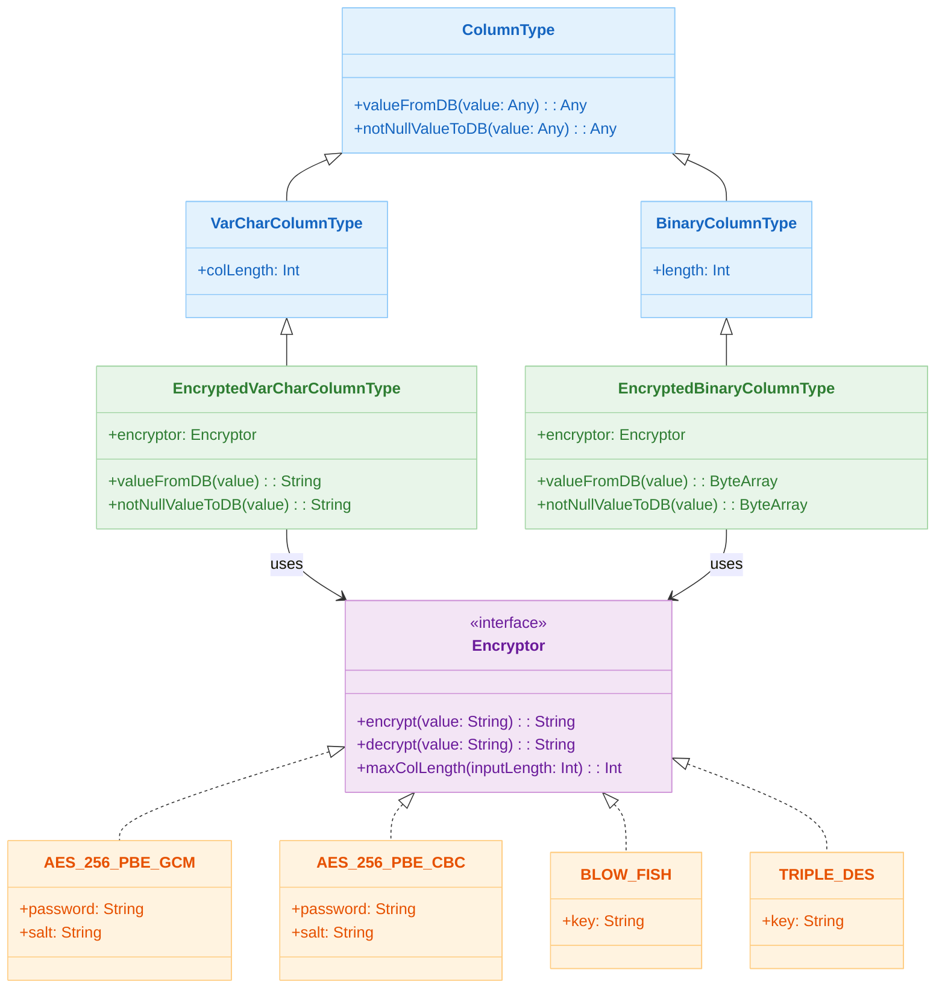

# 06 Advanced: exposed-crypt (01)

[English](./README.md) | 한국어

`exposed-crypt`를 사용해 컬럼 데이터를 투명하게 암복호화하는 모듈입니다. 민감 정보 저장 시 애플리케이션 코드 변경을 최소화하는 패턴을 다룹니다.

## 개요

`encryptedVarchar` /
`encryptedBinary` 함수로 선언된 컬럼은 INSERT 시 자동으로 암호화하고 SELECT 시 자동으로 복호화합니다. 애플리케이션 코드는 평문을 그대로 읽고 쓰며, DB에는 암호문이 저장됩니다.

## 학습 목표

- `encryptedVarchar`, `encryptedBinary` 컬럼 정의와 CRUD 패턴을 익힌다.
- DSL/DAO 경로에서 암호화 컬럼 사용법을 이해한다.
- `Encryptor.maxColLength()`로 암호화 후 길이를 사전 계산한다.
- 검색 제약(비결정적 암호화)과 대안을 정리한다.

## 선수 지식

- [`../../05-exposed-dml/README.ko.md`](../../05-exposed-dml/README.ko.md)

## 암호화 흐름



## 지원 알고리즘

| 알고리즘 상수                      | 방식          | 특징           |
|------------------------------|-------------|--------------|
| `Algorithms.AES_256_PBE_GCM` | AES-256 GCM | 인증 암호화, 비결정적 |
| `Algorithms.AES_256_PBE_CBC` | AES-256 CBC | 블록 암호, 비결정적  |
| `Algorithms.BLOW_FISH`       | Blowfish    | 레거시 호환, 비결정적 |
| `Algorithms.TRIPLE_DES`      | 3DES        | 레거시 호환, 비결정적 |

> 모든 알고리즘은 **비결정적(non-deterministic)** 암호화입니다. 같은 평문을 암호화해도 매번 다른 암호문이 생성되므로 WHERE 절 검색이 불가능합니다. 검색이 필요한 필드는
`10-exposed-jasypt` 또는 `12-exposed-tink` (DAEAD) 를 사용하세요.

## 핵심 개념

### 암호화 컬럼 선언 (DSL)

```kotlin
val nameEncryptor = Algorithms.AES_256_PBE_CBC("passwd", "5c0744940b5c369b")

val stringTable = object : IntIdTable("StringTable") {
    // VARCHAR 컬럼 — 문자열 암호화
    val name: Column<String> = encryptedVarchar("name", 80, nameEncryptor)
    val city: Column<String> =
        encryptedVarchar("city", 80, Algorithms.AES_256_PBE_GCM("passwd", "5c0744940b5c369b"))
    val address: Column<String> = encryptedVarchar("address", 100, Algorithms.BLOW_FISH("key"))

    // BINARY 컬럼 — 바이트 배열 암호화
    val data: Column<ByteArray> =
        encryptedBinary("data", 100, Algorithms.AES_256_PBE_CBC("passwd", "12345678"))
}
```

생성되는 DDL (PostgreSQL):

```sql
CREATE TABLE IF NOT EXISTS stringtable (
    id   SERIAL PRIMARY KEY,
    name VARCHAR(80)  NOT NULL,   -- 암호화된 Base64 문자열 저장
    city VARCHAR(80)  NOT NULL,
    address VARCHAR(100) NOT NULL,
    data BYTEA NOT NULL
)
```

### CRUD — 평문으로 읽고 쓰기

```kotlin
withTables(testDB, stringTable) {
    // INSERT — 자동 암호화 (평문 그대로 전달)
    val id = stringTable.insertAndGetId {
        it[name] = "testName"       // DB에는 Base64 암호문으로 저장
        it[city] = "testCity"
        it[address] = "testAddress"
        it[data] = "testData".toUtf8Bytes()
    }

    // SELECT — 자동 복호화 (평문으로 반환)
    val row = stringTable.selectAll().where { stringTable.id eq id }.single()
    row[stringTable.name]    // "testName"  (자동 복호화)
    row[stringTable.city]    // "testCity"
    row[stringTable.address] // "testAddress"

    // UPDATE — 자동 암호화
    stringTable.update({ stringTable.id eq id }) {
        it[name] = "updatedName"
        it[data] = "updatedData".toUtf8Bytes()
    }
}
```

### 암호화 컬럼 선언 (DAO)

```kotlin
object UserTable : IntIdTable("users") {
    val name    = encryptedVarchar("name", 80, Algorithms.AES_256_PBE_GCM("secret", "12345678"))
    val address = encryptedVarchar("address", 200, Algorithms.BLOW_FISH("key"))
}

class UserEntity(id: EntityID<Int>) : IntEntity(id) {
    companion object : IntEntityClass<UserEntity>(UserTable)
    var name    by UserTable.name
    var address by UserTable.address
}

// DAO 사용 — 평문으로 읽고 쓰기
val user = UserEntity.new {
    name = "홍길동"       // DB에는 암호화되어 저장
    address = "서울시 종로구"
}
println(user.name)     // "홍길동" (자동 복호화)
```

### 컬럼 길이 계산

암호화 후 암호문은 원본보다 길어지므로 컬럼 크기를 충분히 잡아야 합니다.

```kotlin
val encryptor = Algorithms.AES_256_PBE_GCM("passwd", "12345678")
val inputLength = "testName".toUtf8Bytes().size

// 알고리즘별 필요 컬럼 길이 계산
val requiredLength = encryptor.maxColLength(inputLength)

// 암호화 실제 결과 길이 검증
encryptor.encrypt("testName").toUtf8Bytes().size shouldBeEqualTo requiredLength
```

### 로그 마스킹 확인

SQL 로그에 평문이 노출되지 않는지 검증합니다.

```kotlin
val logCaptor = LogCaptor.forName(exposedLogger.name)
logCaptor.setLogLevelToDebug()

stringTable.insertAndGetId { it[name] = "testName" }

val insertLog = logCaptor.debugLogs.single()
insertLog.shouldStartWith("INSERT ")
insertLog.shouldContainNone(listOf("testName"))  // 평문 미노출 확인
```

## 컬럼 타입 계층



## 예제 구성

| 파일                                  | 설명                                    |
|-------------------------------------|---------------------------------------|
| `Ex01_EncryptedColumn.kt`           | DSL 암호화 컬럼 선언, CRUD, 길이 계산, 로그 마스킹 검증 |
| `Ex02_EncryptedColumnWithEntity.kt` | DAO Entity 방식 암호화 컬럼 CRUD             |

## 테스트 실행 방법

```bash
# 전체 테스트
./gradlew :06-advanced:01-exposed-crypt:test

# H2만 대상으로 빠른 테스트
./gradlew :06-advanced:01-exposed-crypt:test -PuseFastDB=true

# 특정 테스트 클래스만 실행
./gradlew :06-advanced:01-exposed-crypt:test \
    --tests "exposed.examples.crypt.Ex01_EncryptedColumn"
```

## 알려진 제약 사항

- **WHERE 절 검색 불가**: 비결정적 암호화 방식이므로 암호화 컬럼을 WHERE 조건으로 사용할 수 없습니다.
- **인덱스 미지원**: 암호화 컬럼에 인덱스를 생성해도 검색 시 활용할 수 없습니다.
- **대안**: 검색이 필요한 필드는 `10-exposed-jasypt`(결정적 암호화) 또는 `12-exposed-tink`(DAEAD)를 사용하세요.

## 실습 체크리스트

- 평문/암호문 저장 결과를 비교한다.
- 키 변경 시 복호화 실패 시나리오를 점검한다.
- 키/시크릿은 코드가 아닌 외부 설정으로 관리한다.

## 다음 모듈

- [`../02-exposed-javatime/README.ko.md`](../02-exposed-javatime/README.ko.md)
