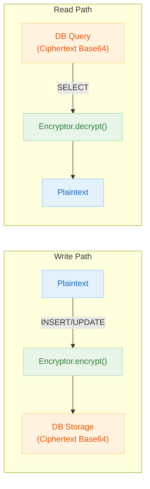
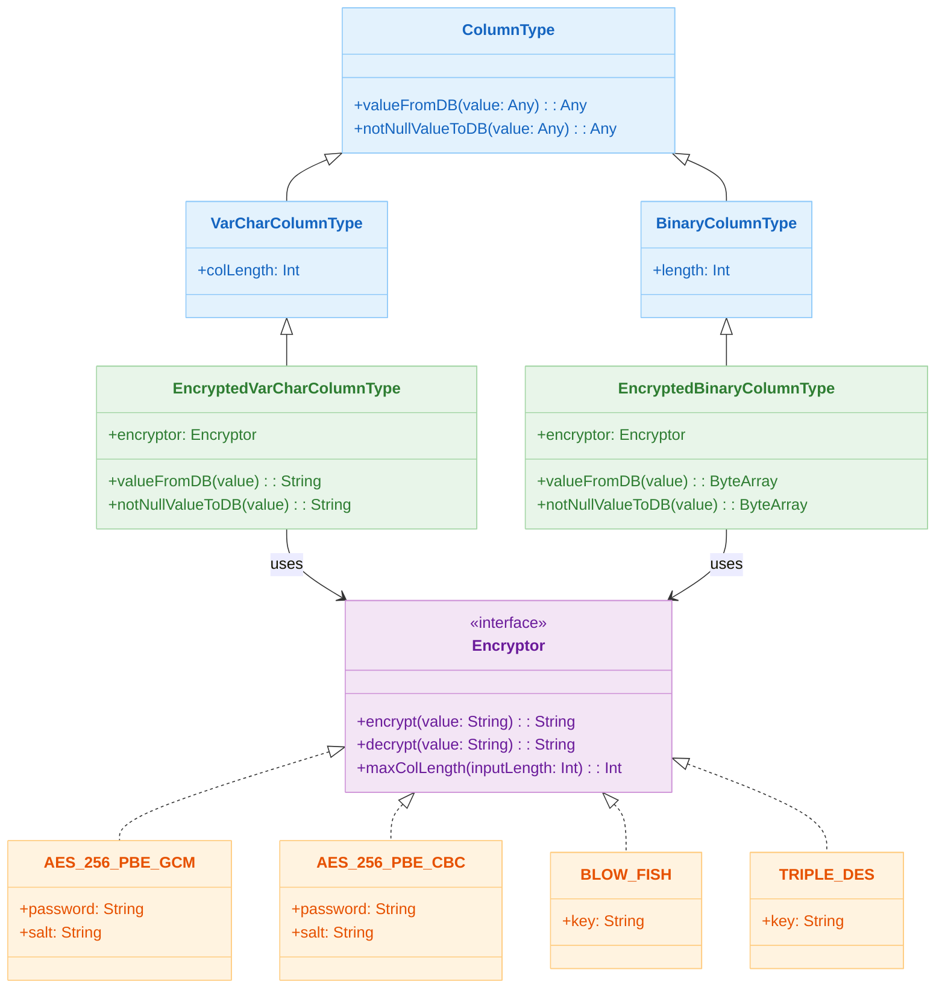

# 06 Advanced: exposed-crypt (01)

English | [한국어](./README.ko.md)

A module for transparently encrypting and decrypting column data using `exposed-crypt`. It covers patterns that minimize application code changes when storing sensitive information.

## Overview

Columns declared with `encryptedVarchar` / `encryptedBinary` functions automatically encrypt on INSERT and decrypt on SELECT. Application code reads and writes plaintext as-is, while ciphertext is stored in the DB.

## Learning Objectives

- Learn `encryptedVarchar` and `encryptedBinary` column definitions and CRUD patterns.
- Understand how to use encrypted columns in DSL/DAO paths.
- Pre-calculate post-encryption length with `Encryptor.maxColLength()`.
- Summarize search constraints (non-deterministic encryption) and alternatives.

## Prerequisites

- [`../../05-exposed-dml/README.md`](../../05-exposed-dml/README.md)

## Encryption Flow



## Supported Algorithms

| Algorithm Constant             | Method      | Characteristics                    |
|-------------------------------|-------------|------------------------------------|
| `Algorithms.AES_256_PBE_GCM` | AES-256 GCM | Authenticated encryption, non-deterministic |
| `Algorithms.AES_256_PBE_CBC` | AES-256 CBC | Block cipher, non-deterministic    |
| `Algorithms.BLOW_FISH`       | Blowfish    | Legacy compatible, non-deterministic |
| `Algorithms.TRIPLE_DES`      | 3DES        | Legacy compatible, non-deterministic |

> All algorithms are **non-deterministic** encryption. Encrypting the same plaintext produces different ciphertext each time, making WHERE clause searches impossible. For searchable fields, use `10-exposed-jasypt` or `12-exposed-tink` (DAEAD).

## Key Concepts

### Encrypted Column Declaration (DSL)

```kotlin
val nameEncryptor = Algorithms.AES_256_PBE_CBC("passwd", "5c0744940b5c369b")

val stringTable = object : IntIdTable("StringTable") {
    // VARCHAR column — string encryption
    val name: Column<String> = encryptedVarchar("name", 80, nameEncryptor)
    val city: Column<String> =
        encryptedVarchar("city", 80, Algorithms.AES_256_PBE_GCM("passwd", "5c0744940b5c369b"))
    val address: Column<String> = encryptedVarchar("address", 100, Algorithms.BLOW_FISH("key"))

    // BINARY column — byte array encryption
    val data: Column<ByteArray> =
        encryptedBinary("data", 100, Algorithms.AES_256_PBE_CBC("passwd", "12345678"))
}
```

Generated DDL (PostgreSQL):

```sql
CREATE TABLE IF NOT EXISTS stringtable (
    id   SERIAL PRIMARY KEY,
    name VARCHAR(80)  NOT NULL,   -- Encrypted Base64 string stored
    city VARCHAR(80)  NOT NULL,
    address VARCHAR(100) NOT NULL,
    data BYTEA NOT NULL
)
```

### CRUD — Read and Write in Plaintext

```kotlin
withTables(testDB, stringTable) {
    // INSERT — automatic encryption (pass plaintext as-is)
    val id = stringTable.insertAndGetId {
        it[name] = "testName"       // Stored as Base64 ciphertext in DB
        it[city] = "testCity"
        it[address] = "testAddress"
        it[data] = "testData".toUtf8Bytes()
    }

    // SELECT — automatic decryption (returned as plaintext)
    val row = stringTable.selectAll().where { stringTable.id eq id }.single()
    row[stringTable.name]    // "testName"  (auto-decrypted)
    row[stringTable.city]    // "testCity"
    row[stringTable.address] // "testAddress"

    // UPDATE — automatic encryption
    stringTable.update({ stringTable.id eq id }) {
        it[name] = "updatedName"
        it[data] = "updatedData".toUtf8Bytes()
    }
}
```

### Encrypted Column Declaration (DAO)

```kotlin
object UserTable : IntIdTable("users") {
    val name    = encryptedVarchar("name", 80, Algorithms.AES_256_PBE_GCM("secret", "12345678"))
    val address = encryptedVarchar("address", 200, Algorithms.BLOW_FISH("key"))
}

class UserEntity(id: EntityID<Int>) : IntEntity(id) {
    companion object : IntEntityClass<UserEntity>(UserTable)
    var name    by UserTable.name
    var address by UserTable.address
}

// DAO usage — read and write in plaintext
val user = UserEntity.new {
    name = "홍길동"       // Stored encrypted in DB
    address = "서울시 종로구"
}
println(user.name)     // "홍길동" (auto-decrypted)
```

### Column Length Calculation

Since ciphertext is longer than the original, column size must be set sufficiently large.

```kotlin
val encryptor = Algorithms.AES_256_PBE_GCM("passwd", "12345678")
val inputLength = "testName".toUtf8Bytes().size

// Calculate required column length per algorithm
val requiredLength = encryptor.maxColLength(inputLength)

// Verify actual encryption result length
encryptor.encrypt("testName").toUtf8Bytes().size shouldBeEqualTo requiredLength
```

### Log Masking Verification

Verify that plaintext is not exposed in SQL logs.

```kotlin
val logCaptor = LogCaptor.forName(exposedLogger.name)
logCaptor.setLogLevelToDebug()

stringTable.insertAndGetId { it[name] = "testName" }

val insertLog = logCaptor.debugLogs.single()
insertLog.shouldStartWith("INSERT ")
insertLog.shouldContainNone(listOf("testName"))  // Verify plaintext not exposed
```

## Column Type Hierarchy



## Example Files

| File                                | Description                                           |
|-------------------------------------|-------------------------------------------------------|
| `Ex01_EncryptedColumn.kt`           | DSL encrypted column declaration, CRUD, length calculation, log masking verification |
| `Ex02_EncryptedColumnWithEntity.kt` | DAO Entity encrypted column CRUD                      |

## How to Run Tests

```bash
# Full test
./gradlew :06-advanced:01-exposed-crypt:test

# Quick test targeting H2 only
./gradlew :06-advanced:01-exposed-crypt:test -PuseFastDB=true

# Run specific test class only
./gradlew :06-advanced:01-exposed-crypt:test \
    --tests "exposed.examples.crypt.Ex01_EncryptedColumn"
```

## Known Limitations

- **WHERE clause search not possible**: Non-deterministic encryption means encrypted columns cannot be used as WHERE conditions.
- **Index not supported**: Even if an index is created on an encrypted column, it cannot be utilized for searches.
- **Alternatives**: For searchable fields, use `10-exposed-jasypt` (deterministic encryption) or `12-exposed-tink` (DAEAD).

## Practice Checklist

- Compare plaintext vs ciphertext storage results.
- Test decryption failure scenarios when changing keys.
- Manage keys/secrets through external configuration, not in code.

## Next Module

- [`../02-exposed-javatime/README.md`](../02-exposed-javatime/README.md)
