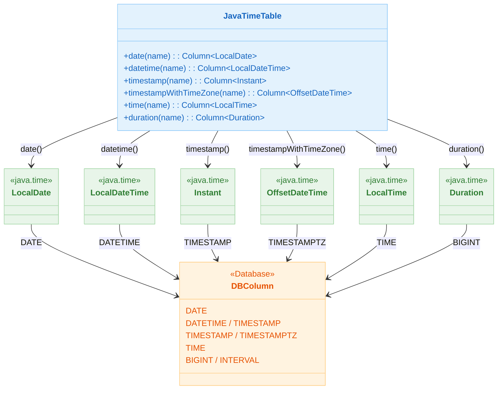

# 06 Advanced: exposed-java-time (02)

English | [한국어](./README.ko.md)

A module for mapping `java.time` types to Exposed columns. Practice time type storage/retrieval and literal/default value handling patterns.

## Learning Objectives

- Learn `LocalDate`, `LocalDateTime`, `Instant` mappings.
- Understand time-related SQL function usage.
- Verify timezone/precision differences across databases.

## Prerequisites

- [`../05-exposed-dml/02-types/README.md`](../05-exposed-dml/02-types/README.md)

## Java Time Type Mapping



## Key Concepts

- `date`, `datetime`, `timestamp`, `timestampWithTimeZone`
- `defaultExpression(CurrentTimestamp)`
- Literal-based conditional queries

## Example Files

| File                      | Description          |
|---------------------------|----------------------|
| `Ex01_JavaTime.kt`        | Basic types/functions |
| `Ex02_Defaults.kt`        | Default value handling |
| `Ex03_DateTimeLiteral.kt` | Literal-based queries |
| `Ex04_MiscTable.kt`       | Integrated examples   |

## Precision Differences by Database

| DB         | timestamp Precision | timestampWithTimeZone Support |
|------------|--------------------|-----------------------------|
| PostgreSQL | Microseconds (μs)  | Supported (`TIMESTAMPTZ`)    |
| MySQL V8   | Microseconds (μs)  | Not supported (stores as UTC conversion) |
| MariaDB    | Microseconds (μs)  | Not supported                |
| H2         | Nanoseconds (ns)   | Supported                    |

`timestampWithTimeZone` is not supported on MySQL/MariaDB, and those tests are skipped using `Assumptions.assumeTrue`.

## How to Run

```bash
./gradlew :06-advanced:02-exposed-javatime:test
```

## Advanced Scenarios

### Timezone Handling

The `timestampWithTimeZone` column differs in how databases store timezone information.
Tests verify storage/retrieval consistency across various offsets such as Seoul/Cairo after INSERT, querying as UTC.

- Related file: [`Ex01_JavaTime.kt`](src/test/kotlin/exposed/examples/java/time/Ex01_JavaTime.kt)
- Test: `timestampWithTimeZone` — Verifies storage/retrieval consistency across multiple timezone offsets

### Date Default Value Configuration

Validates various default value strategies such as `defaultExpression(CurrentDateTime)` and `clientDefault { }`.
After changing defaults, `addMissingColumnsStatements` should not generate unnecessary `ALTER TABLE` statements.

- Related file: [`Ex02_Defaults.kt`](src/test/kotlin/exposed/examples/java/time/Ex02_Defaults.kt)
- Tests: `testDateDefaultDoesNotTriggerAlterStatement`, `testTimestampWithTimeZoneDefaultDoesNotTriggerAlterStatement`

## Practice Checklist

- Compare results before and after timezone conversion of the same value.
- Record precision differences (seconds/milliseconds) by database.

## Performance and Stability Checkpoints

- Fix the application reference timezone (UTC recommended)
- Maintain type consistency for time literal comparisons

## Next Module

- [`../03-exposed-kotlin-datetime/README.md`](../03-exposed-kotlin-datetime/README.md)
