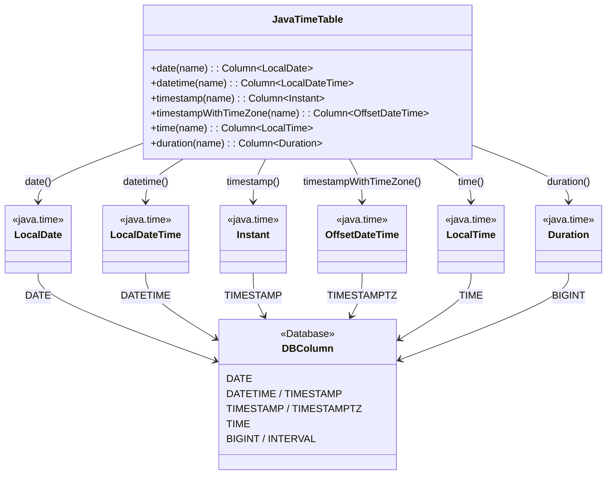

# 06 Advanced: exposed-java-time (02)

`java.time` 타입을 Exposed 컬럼으로 매핑하는 모듈입니다. 시간 타입 저장/조회와 리터럴/기본값 처리 패턴을 실습합니다.

## 학습 목표

- `LocalDate`, `LocalDateTime`, `Instant` 매핑을 익힌다.
- 시간 관련 SQL 함수 사용법을 이해한다.
- DB별 시간대/정밀도 차이를 검증한다.

## 선수 지식

- [`../05-exposed-dml/02-types/README.md`](../05-exposed-dml/02-types/README.md)

## Java Time 타입 매핑



## 핵심 개념

- `date`, `datetime`, `timestamp`, `timestampWithTimeZone`
- `defaultExpression(CurrentTimestamp)`
- 리터럴 기반 조건 조회

## 예제 구성

| 파일                        | 설명        |
|---------------------------|-----------|
| `Ex01_JavaTime.kt`        | 기본 타입/함수  |
| `Ex02_Defaults.kt`        | 기본값 처리    |
| `Ex03_DateTimeLiteral.kt` | 리터럴 기반 조회 |
| `Ex04_MiscTable.kt`       | 통합 예제     |

## DB별 정밀도 차이

| DB | timestamp 정밀도 | timestampWithTimeZone 지원 |
|----|----------------|--------------------------|
| PostgreSQL | 마이크로초(μs) | 지원 (`TIMESTAMPTZ`) |
| MySQL V8 | 마이크로초(μs) | 미지원 (UTC 변환 저장) |
| MariaDB | 마이크로초(μs) | 미지원 |
| H2 | 나노초(ns) | 지원 |

MySQL/MariaDB에서 `timestampWithTimeZone`은 지원되지 않으며, 해당 테스트는 `Assumptions.assumeTrue`로 건너뜁니다.

## 실행 방법

```bash
./gradlew :06-advanced:02-exposed-javatime:test
```

## 복잡한 시나리오

### 타임존 처리

`timestampWithTimeZone` 컬럼은 DB가 시간대 정보를 저장하는 방식이 다릅니다.
서울/카이로 등 다양한 오프셋에서 INSERT 후 UTC로 조회하는 시나리오를 검증합니다.

- 관련 파일: [`Ex01_JavaTime.kt`](src/test/kotlin/exposed/examples/java/time/Ex01_JavaTime.kt)
- 테스트: `timestampWithTimeZone` — 여러 타임존 오프셋에서 저장/조회 정합성 검증

### Date Default 값 설정

`defaultExpression(CurrentDateTime)`, `clientDefault { }` 등 다양한 기본값 전략을 검증합니다.
기본값 변경 후 `addMissingColumnsStatements`가 불필요한 `ALTER TABLE`을 생성하지 않아야 합니다.

- 관련 파일: [`Ex02_Defaults.kt`](src/test/kotlin/exposed/examples/java/time/Ex02_Defaults.kt)
- 테스트: `testDateDefaultDoesNotTriggerAlterStatement`, `testTimestampWithTimeZoneDefaultDoesNotTriggerAlterStatement`

## 실습 체크리스트

- 동일 값의 타임존 변환 전후 결과를 비교한다.
- DB별 정밀도 차이(초/밀리초)를 기록한다.

## 성능·안정성 체크포인트

- 애플리케이션 기준 시간대(UTC 권장)를 고정
- 시간 리터럴 비교는 타입 일관성을 유지

## 다음 모듈

- [`../03-exposed-kotlin-datetime/README.md`](../03-exposed-kotlin-datetime/README.md)
