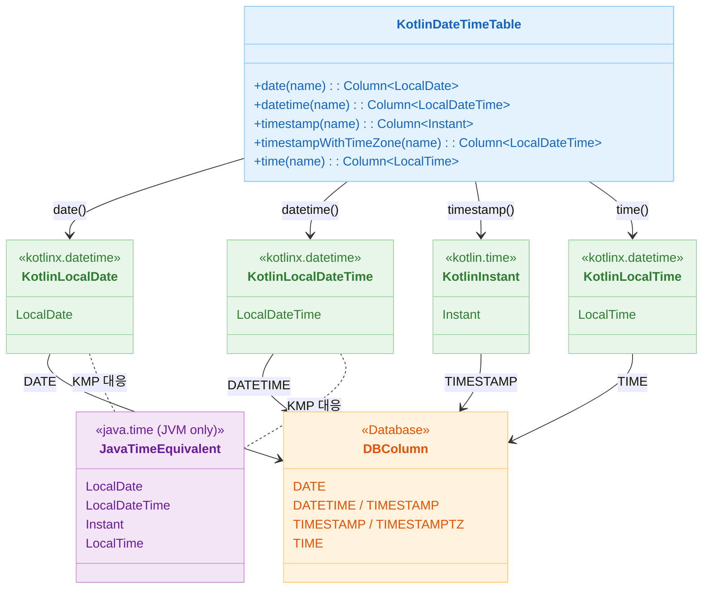

# 06 Advanced: exposed-kotlin-datetime (03)

[English](./README.md) | 한국어

`kotlinx.datetime` 타입을 Exposed와 연동하는 모듈입니다. KMP 친화적인 날짜/시간 처리가 필요한 경우의 표준 패턴을 제공합니다.

## 학습 목표

- `kotlinx.datetime` 타입 매핑을 익힌다.
- `java.time` 대비 차이를 이해하고 선택 기준을 세운다.
- 리터럴/기본값 처리 시 호환성을 검증한다.

## 선수 지식

- [`../02-exposed-javatime/README.ko.md`](../02-exposed-javatime/README.ko.md)

## Kotlin DateTime 타입 매핑



## 핵심 개념

- `kotlinx.datetime.LocalDate/Instant`
- 멀티플랫폼 시간 처리
- DB 저장 타입 매핑

## 예제 구성

| 파일                        | 설명       |
|---------------------------|----------|
| `Ex01_KotlinDateTime.kt`  | 기본 타입/함수 |
| `Ex02_Defaults.kt`        | 기본값 처리   |
| `Ex03_DateTimeLiteral.kt` | 리터럴 조회   |

## java.time과의 차이점 비교

| 항목 | `java.time` | `kotlinx.datetime` |
|------|-------------|-------------------|
| 패키지 | `org.jetbrains.exposed.v1.javatime` | `org.jetbrains.exposed.v1.datetime` |
| 타입 | `java.time.LocalDate` 등 | `kotlinx.datetime.LocalDate` 등 |
| KMP 지원 | JVM 전용 | 멀티플랫폼(KMP) 지원 |
| Instant | `java.time.Instant` | `kotlin.time.Instant` (`@ExperimentalTime`) |
| 컬럼 함수 | `date()`, `datetime()`, `timestamp()` | 동일 이름, 다른 패키지 |

`kotlinx.datetime`은 KMP 환경을 고려할 때 선택합니다. JVM 전용 프로젝트라면 `java.time`이 더 성숙합니다.

## 실행 방법

```bash
./gradlew :06-advanced:03-exposed-kotlin-datetime:test
```

## 복잡한 시나리오

### 기본값 처리

`clientDefault`, `defaultExpression(CurrentDateTime)` 등 kotlinx.datetime 기반 기본값을 검증합니다.
기본값 변경 후 불필요한 `ALTER TABLE`이 생성되지 않는지 확인합니다.

- 관련 파일: [`Ex02_Defaults.kt`](src/test/kotlin/exposed/examples/kotlin/datetime/Ex02_Defaults.kt)
- 테스트: `testDateDefaultDoesNotTriggerAlterStatement`, `Default CurrentDateTime`

### 리터럴 기반 조건 조회

`dateLiteral`, `dateTimeLiteral`, `timestampLiteral`을 사용해 WHERE 조건을 작성합니다.

- 관련 파일: [`Ex03_DateTimeLiteral.kt`](src/test/kotlin/exposed/examples/kotlin/datetime/Ex03_DateTimeLiteral.kt)

## 실습 체크리스트

- 같은 시나리오를 `java.time` 모듈과 비교한다.
- 시간대 변환 경계 케이스를 추가 테스트한다.

## 성능·안정성 체크포인트

- 플랫폼별 시간 처리 차이를 공통 테스트로 고정
- 직렬화 포맷(ISO-8601 등)을 일관되게 유지

## 다음 모듈

- [`../04-exposed-json/README.ko.md`](../04-exposed-json/README.ko.md)
