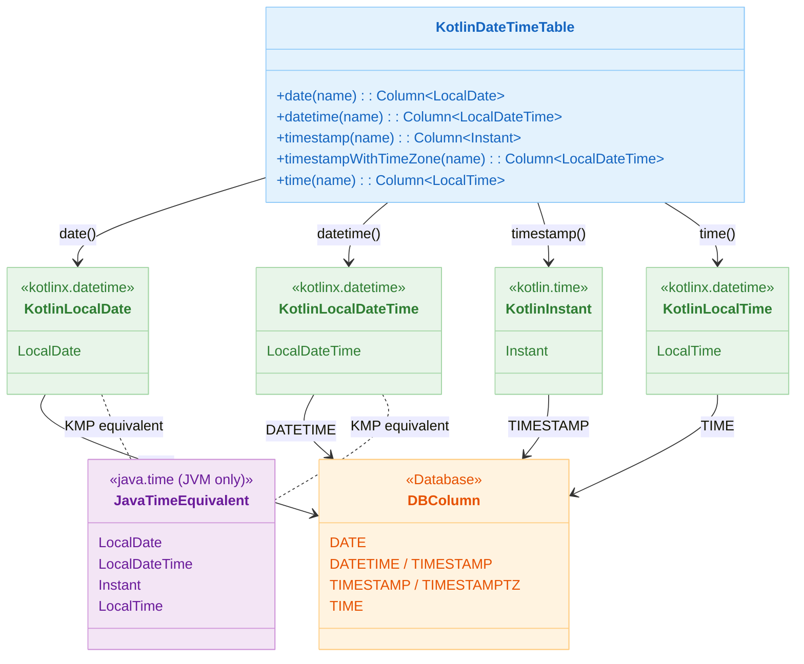

# 06 Advanced: exposed-kotlin-datetime (03)

English | [한국어](./README.ko.md)

A module for integrating `kotlinx.datetime` types with Exposed. Provides standard patterns for KMP-friendly date/time handling.

## Learning Objectives

- Learn `kotlinx.datetime` type mappings.
- Understand differences compared to `java.time` and establish selection criteria.
- Verify compatibility when handling literals/default values.

## Prerequisites

- [`../02-exposed-javatime/README.md`](../02-exposed-javatime/README.md)

## Kotlin DateTime Type Mapping



## Key Concepts

### Kotlin DateTime Column Declaration

```kotlin
object KotlinDateTimeTable : IntIdTable("kotlin_datetime_table") {
    val birthDate = date("birth_date")              // kotlinx.datetime.LocalDate
    val lastActivity = datetime("last_activity")    // kotlinx.datetime.LocalDateTime
    val recordedAt = timestamp("recorded_at")       // kotlin.time.Instant
    val eventTime = time("event_time")              // kotlinx.datetime.LocalTime
}
```

### CRUD with Kotlin DateTime

```kotlin
withTables(testDB, KotlinDateTimeTable) {
    // INSERT
    val id = KotlinDateTimeTable.insertAndGetId {
        it[birthDate] = Clock.System.todayIn(TimeZone.currentSystemDefault())
        it[lastActivity] = Clock.System.now().toLocalDateTime(TimeZone.currentSystemDefault())
        it[recordedAt] = Clock.System.now()
    }

    // SELECT returns Kotlin datetime objects
    val row = KotlinDateTimeTable.selectAll().where { 
        KotlinDateTimeTable.id eq id 
    }.single()
    
    println(row[KotlinDateTimeTable.birthDate])     // kotlinx.datetime.LocalDate
}
```

### Time-based Query

```kotlin
val recentDate = Clock.System.todayIn(TimeZone.currentSystemDefault()).minus(1, DateTimeUnit.MONTH)
KotlinDateTimeTable.selectAll()
    .where { KotlinDateTimeTable.birthDate greaterEq recentDate }
```

## Example Files

| File                      | Description         |
|---------------------------|---------------------|
| `Ex01_KotlinDateTime.kt`  | Basic types/functions |
| `Ex02_Defaults.kt`        | Default value handling |
| `Ex03_DateTimeLiteral.kt` | Literal queries      |

## Comparison with java.time

| Item           | `java.time`                              | `kotlinx.datetime`                       |
|----------------|------------------------------------------|------------------------------------------|
| Package        | `org.jetbrains.exposed.v1.javatime`      | `org.jetbrains.exposed.v1.datetime`      |
| Types          | `java.time.LocalDate` etc.               | `kotlinx.datetime.LocalDate` etc.        |
| KMP Support    | JVM only                                 | Multiplatform (KMP) support              |
| Instant        | `java.time.Instant`                      | `kotlin.time.Instant` (`@ExperimentalTime`) |
| Column Functions | `date()`, `datetime()`, `timestamp()`  | Same names, different packages           |

Choose `kotlinx.datetime` when considering KMP environments. For JVM-only projects, `java.time` is more mature.

## How to Run

```bash
./gradlew :06-advanced:03-exposed-kotlin-datetime:test
```

## Advanced Scenarios

### Default Value Handling

Validates kotlinx.datetime-based defaults such as `clientDefault` and `defaultExpression(CurrentDateTime)`.
Confirms that unnecessary `ALTER TABLE` statements are not generated after changing defaults.

- Related file: [`Ex02_Defaults.kt`](src/test/kotlin/exposed/examples/kotlin/datetime/Ex02_Defaults.kt)
- Tests: `testDateDefaultDoesNotTriggerAlterStatement`, `Default CurrentDateTime`

### Literal-Based Conditional Queries

Write WHERE conditions using `dateLiteral`, `dateTimeLiteral`, and `timestampLiteral`.

- Related file: [`Ex03_DateTimeLiteral.kt`](src/test/kotlin/exposed/examples/kotlin/datetime/Ex03_DateTimeLiteral.kt)

## Practice Checklist

- Compare the same scenarios with the `java.time` module.
- Add tests for timezone conversion edge cases.

## Performance and Stability Checkpoints

- Lock down cross-platform time handling differences with common tests
- Maintain consistent serialization format (ISO-8601 etc.)

## Next Module

- [`../04-exposed-json/README.md`](../04-exposed-json/README.md)
