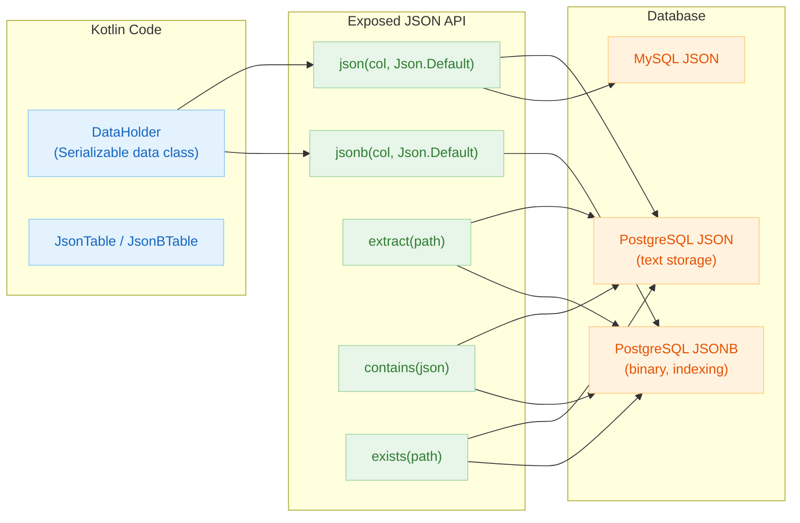
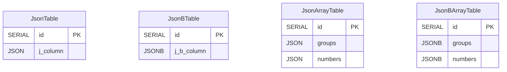
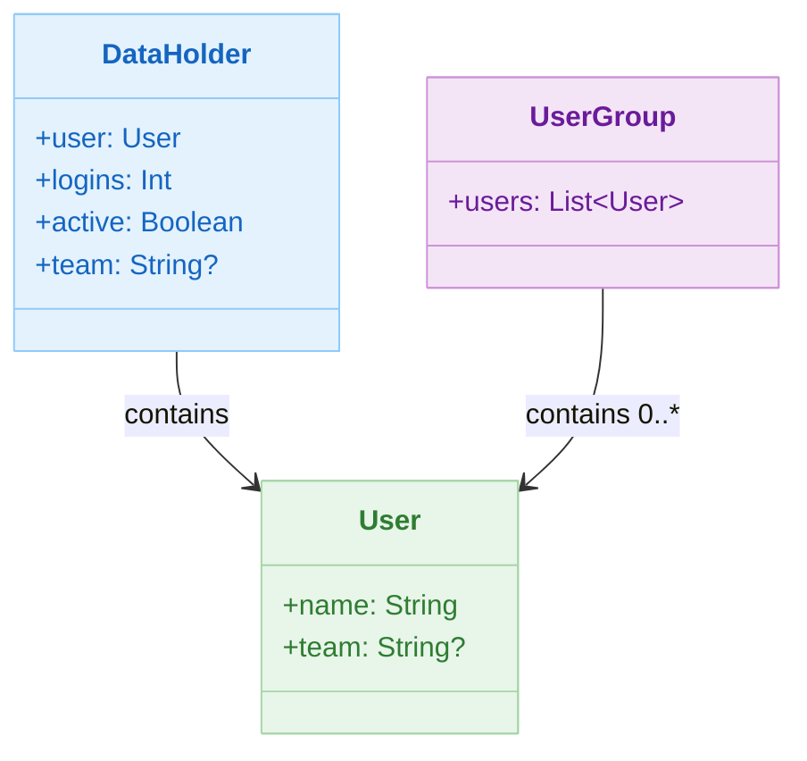

# 06 Advanced: exposed-json (04)

English | [한국어](./README.ko.md)

A module for storing and querying Kotlin objects in JSON/JSONB columns. Learn Exposed JSON query patterns for domains requiring document-type fields.

## Overview

Store Kotlin serializable objects in JSON columns using `json<T>()` / `jsonb<T>()` functions. Uses `kotlinx.serialization` as the default serialization engine, and expresses JSON path functions like `extract`, `contains`, and `exists` through DSL.

## Learning Objectives

- Learn `json<T>()` and `jsonb<T>()` column definitions and Kotlin serialization object mapping.
- Use `extract` to leverage JSON field internal values as SELECT conditions/return values.
- Use `contains` and `exists` to apply JSON document structure as conditions.
- Understand JSON vs JSONB selection criteria.

## Prerequisites

- [`../../05-exposed-dml/README.md`](../../05-exposed-dml/README.md)

## Architecture Flow



## Table ERD



## Domain Model

```kotlin
// kotlinx.serialization annotation required
@Serializable
data class DataHolder(
    val user: User,
    val logins: Int,
    val active: Boolean,
    val team: String?,
)

@Serializable
data class User(
    val name: String,
    val team: String?,
)

@Serializable
data class UserGroup(
    val users: List<User>,
)
```

## Domain Class Diagram



## Key Concepts

### JSON/JSONB Column Declaration

```kotlin
// JSON column
object JsonTable : IntIdTable("j_table") {
    val jsonColumn = json<DataHolder>("j_column", Json.Default)
}

// JSONB column (PostgreSQL — binary storage, GIN index capable)
object JsonBTable : IntIdTable("j_b_table") {
    val jsonBColumn = jsonb<DataHolder>("j_b_column", Json.Default)
}

// Array type JSON column
object JsonArrayTable : IntIdTable("j_arrays") {
    val groups = json<UserGroup>("groups", Json.Default)
    val numbers = json<IntArray>("numbers", Json.Default)
}
```

Generated DDL (PostgreSQL):

```sql
CREATE TABLE IF NOT EXISTS j_table (
    id       SERIAL PRIMARY KEY,
    j_column JSON NOT NULL
);

CREATE TABLE IF NOT EXISTS j_b_table (
    id         SERIAL PRIMARY KEY,
    j_b_column JSONB NOT NULL   -- JSONB: binary storage, GIN index support
);
```

### CRUD

```kotlin
withTables(testDB, JsonTable) {
    // INSERT — pass object as-is
    val id = JsonTable.insertAndGetId {
        it[jsonColumn] = DataHolder(
            user = User("Alice", "dev"),
            logins = 5,
            active = true,
            team = "backend"
        )
    }

    // SELECT — automatic deserialization
    val row = JsonTable.selectAll().where { JsonTable.id eq id }.single()
    val data = row[JsonTable.jsonColumn]   // Returned as DataHolder object
    println(data.user.name)               // "Alice"
}
```

### JSON Path Extraction (extract)

```kotlin
// Directly SELECT internal JSON field values
JsonBTable.select(JsonBTable.jsonBColumn.extract<String>("$.user.name"))
    .where { JsonBTable.id eq id }
    .single()
// Returns: "Alice"

// Nested field conditions
JsonBTable.selectAll()
    .where { JsonBTable.jsonBColumn.extract<Int>("$.logins") greaterEq 3 }
```

### JSON Containment (contains) — JSONB Only

```kotlin
// JSONB @> operator: check if document contains a specific sub-document
val searchJson = """{"user": {"name": "Alice"}}"""
JsonBTable.selectAll()
    .where { JsonBTable.jsonBColumn contains searchJson }
    .count()  // 1L
```

### JSON Path Existence (exists) — JSONB Only

```kotlin
// jsonb_path_exists: check if a path exists
JsonBTable.selectAll()
    .where { JsonBTable.jsonBColumn.exists("$.team") }
```

### DAO Approach

```kotlin
class JsonEntity(id: EntityID<Int>) : IntEntity(id) {
    companion object : IntEntityClass<JsonEntity>(JsonTable)
    var jsonColumn: DataHolder by JsonTable.jsonColumn
}

// Usage
val entity = JsonEntity.new {
    jsonColumn = DataHolder(User("Bob", null), logins = 1, active = true, team = null)
}
println(entity.jsonColumn.user.name)  // "Bob"
```

## JSON/JSONB Support by Database

| DB         | JSON                                        | JSONB                                              |
|------------|---------------------------------------------|----------------------------------------------------|
| PostgreSQL | Text storage, preserves insertion order      | Binary storage, GIN indexing capable, removes duplicate keys |
| MySQL V8   | Binary storage (`JSON` type)                | No separate type (same as JSON)                    |
| MariaDB    | JSON type                                   | Not supported                                      |
| H2         | JSON type                                   | Not supported                                      |

If search performance is important, prioritize PostgreSQL JSONB + GIN index.

```sql
-- PostgreSQL GIN index creation
CREATE INDEX idx_jsonb_gin ON j_b_table USING gin(j_b_column);
```

## Example Files

| File                  | Description                                                 |
|-----------------------|-------------------------------------------------------------|
| `JsonTestData.kt`     | Table/Entity definitions, `DataHolder`/`User`/`UserGroup` models |
| `Ex01_JsonColumn.kt`  | JSON column CRUD, `extract` path extraction                 |
| `Ex02_JsonBColumn.kt` | JSONB column CRUD, `contains`, `exists` conditional queries |

## How to Run Tests

```bash
# Full test
./gradlew :06-advanced:04-exposed-json:test

# Quick test targeting H2 only (JSONB features limited)
./gradlew :06-advanced:04-exposed-json:test -PuseFastDB=true

# Run specific test class only
./gradlew :06-advanced:04-exposed-json:test \
    --tests "exposed.examples.json.Ex02_JsonBColumn"
```

## Advanced Scenarios

### JSON Path Extraction

Use the `extract` function to directly leverage internal JSON field values as SELECT conditions or return values.

Related tests: `Ex01_JsonColumn` / `Ex02_JsonBColumn` — `jsonExtract` nested field path (`$.field`) extraction verification

### JSON Existence Check

Use the `exists` function to apply the presence of a specific path or value within a JSON document as a condition.

Related tests: `Ex02_JsonBColumn` — `jsonbExists` (based on PostgreSQL `jsonb_path_exists`)

### JSON Containment Check

Use the `contains` function to check if a JSON document contains a specific sub-document.

Related tests: `Ex02_JsonBColumn` — `jsonbContains` (based on JSONB `@>` operator)

## Practice Checklist

- Compare query performance on JSON vs JSONB columns for the same query.
- Try adding nested field conditional queries.
- Prioritize JSONB + GIN index strategy for search-heavy use cases.
- Validate data quality risks arising from schema flexibility.

## Next Module

- [`../05-exposed-money/README.md`](../05-exposed-money/README.md)
