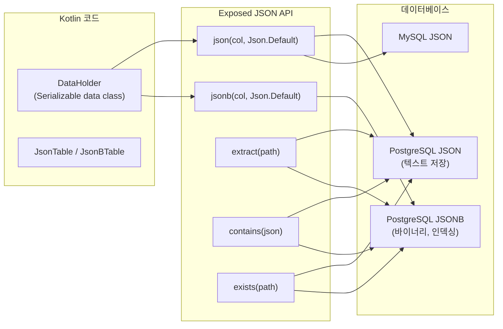
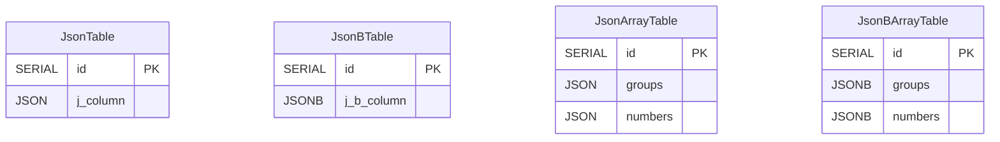
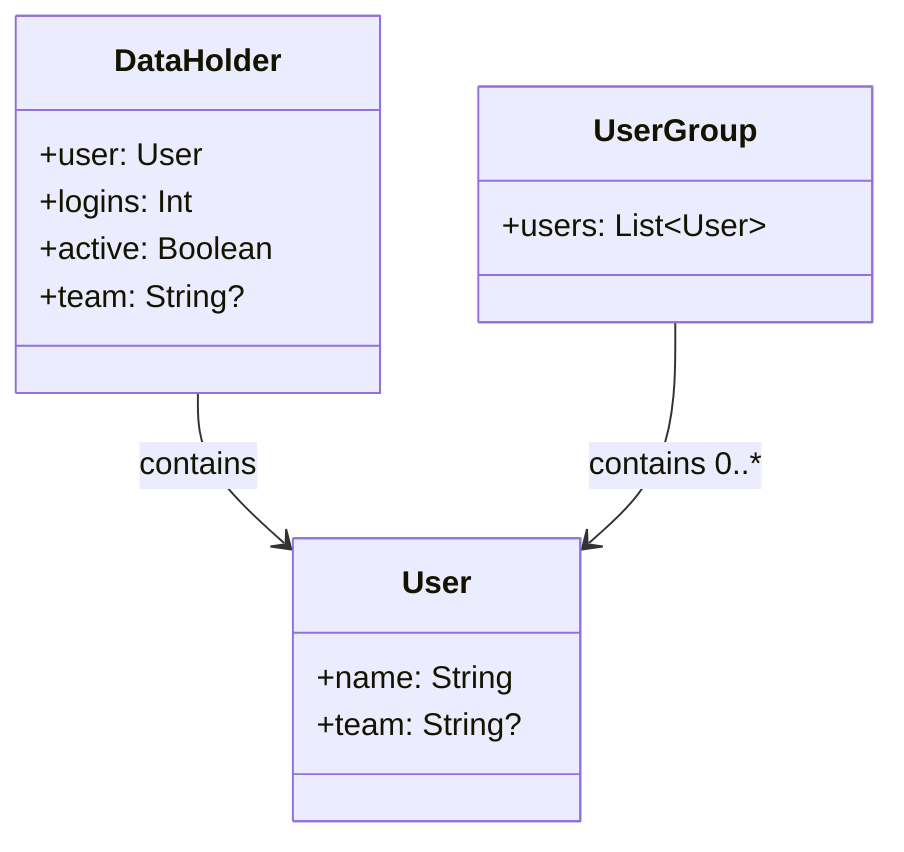

# 06 Advanced: exposed-json (04)

JSON/JSONB 컬럼에 Kotlin 객체를 저장/조회하는 모듈입니다. 문서형 필드가 필요한 도메인에서 Exposed JSON 쿼리 패턴을 학습합니다.

## 개요

`json<T>()` / `jsonb<T>()` 함수로 Kotlin 직렬화 가능한 객체를 JSON 컬럼에 저장합니다. `kotlinx.serialization`을 기본 직렬화 엔진으로 사용하며, `extract`,
`contains`, `exists` 등의 JSON 경로 함수를 DSL로 표현합니다.

## 학습 목표

- `json<T>()`, `jsonb<T>()` 컬럼 정의와 Kotlin 직렬화 객체 매핑을 익힌다.
- `extract`로 JSON 필드 내부 값을 SELECT 조건/반환값으로 활용한다.
- `contains`, `exists`로 JSON 문서 구조를 조건으로 사용한다.
- JSON vs JSONB 선택 기준을 이해한다.

## 선수 지식

- [`../../05-exposed-dml/README.md`](../../05-exposed-dml/README.md)

## 아키텍처 흐름



## 테이블 ERD



## 도메인 모델

```kotlin
// kotlinx.serialization 어노테이션 필요
@Serializable
data class DataHolder(
    val user: User,
    val logins: Int,
    val active: Boolean,
    val team: String?,
)

@Serializable
data class User(
    val name: String,
    val team: String?,
)

@Serializable
data class UserGroup(
    val users: List<User>,
)
```

## 도메인 클래스 다이어그램



## 핵심 개념

### JSON/JSONB 컬럼 선언

```kotlin
// JSON 컬럼
object JsonTable : IntIdTable("j_table") {
    val jsonColumn = json<DataHolder>("j_column", Json.Default)
}

// JSONB 컬럼 (PostgreSQL — 바이너리 저장, GIN 인덱스 가능)
object JsonBTable : IntIdTable("j_b_table") {
    val jsonBColumn = jsonb<DataHolder>("j_b_column", Json.Default)
}

// 배열 타입 JSON 컬럼
object JsonArrayTable : IntIdTable("j_arrays") {
    val groups = json<UserGroup>("groups", Json.Default)
    val numbers = json<IntArray>("numbers", Json.Default)
}
```

생성되는 DDL (PostgreSQL):

```sql
CREATE TABLE IF NOT EXISTS j_table (
    id       SERIAL PRIMARY KEY,
    j_column JSON NOT NULL
);

CREATE TABLE IF NOT EXISTS j_b_table (
    id         SERIAL PRIMARY KEY,
    j_b_column JSONB NOT NULL   -- JSONB: 바이너리 저장, GIN 인덱스 지원
);
```

### CRUD

```kotlin
withTables(testDB, JsonTable) {
    // INSERT — 객체 그대로 전달
    val id = JsonTable.insertAndGetId {
        it[jsonColumn] = DataHolder(
            user = User("Alice", "dev"),
            logins = 5,
            active = true,
            team = "backend"
        )
    }

    // SELECT — 자동 역직렬화
    val row = JsonTable.selectAll().where { JsonTable.id eq id }.single()
    val data = row[JsonTable.jsonColumn]   // DataHolder 객체로 반환
    println(data.user.name)               // "Alice"
}
```

### JSON 경로 추출 (extract)

```kotlin
// JSON 필드 내부 값을 직접 SELECT
JsonBTable.select(JsonBTable.jsonBColumn.extract<String>("$.user.name"))
    .where { JsonBTable.id eq id }
    .single()
// 반환: "Alice"

// 중첩 필드 조건
JsonBTable.selectAll()
    .where { JsonBTable.jsonBColumn.extract<Int>("$.logins") greaterEq 3 }
```

### JSON 포함 여부 (contains) — JSONB 전용

```kotlin
// JSONB @> 연산자: 문서가 특정 하위 문서를 포함하는지
val searchJson = """{"user": {"name": "Alice"}}"""
JsonBTable.selectAll()
    .where { JsonBTable.jsonBColumn contains searchJson }
    .count()  // 1L
```

### JSON 경로 존재 여부 (exists) — JSONB 전용

```kotlin
// jsonb_path_exists: 경로가 존재하는지 확인
JsonBTable.selectAll()
    .where { JsonBTable.jsonBColumn.exists("$.team") }
```

### DAO 방식

```kotlin
class JsonEntity(id: EntityID<Int>) : IntEntity(id) {
    companion object : IntEntityClass<JsonEntity>(JsonTable)
    var jsonColumn: DataHolder by JsonTable.jsonColumn
}

// 사용
val entity = JsonEntity.new {
    jsonColumn = DataHolder(User("Bob", null), logins = 1, active = true, team = null)
}
println(entity.jsonColumn.user.name)  // "Bob"
```

## DB별 JSON/JSONB 지원

| DB         | JSON                | JSONB                        |
|------------|---------------------|------------------------------|
| PostgreSQL | 텍스트 저장, 삽입 순서 유지    | 바이너리 저장, GIN 인덱싱 가능, 중복 키 제거 |
| MySQL V8   | 바이너리 저장 (`JSON` 타입) | 별도 타입 없음 (JSON과 동일)          |
| MariaDB    | JSON 타입             | 미지원                          |
| H2         | JSON 타입             | 미지원                          |

검색 성능이 중요하면 PostgreSQL JSONB + GIN 인덱스를 우선 고려합니다.

```sql
-- PostgreSQL GIN 인덱스 생성
CREATE INDEX idx_jsonb_gin ON j_b_table USING gin(j_b_column);
```

## 예제 구성

| 파일                    | 설명                                                |
|-----------------------|---------------------------------------------------|
| `JsonTestData.kt`     | 테이블/Entity 정의, `DataHolder`/`User`/`UserGroup` 모델 |
| `Ex01_JsonColumn.kt`  | JSON 컬럼 CRUD, `extract` 경로 추출                     |
| `Ex02_JsonBColumn.kt` | JSONB 컬럼 CRUD, `contains`, `exists` 조건 쿼리         |

## 테스트 실행 방법

```bash
# 전체 테스트
./gradlew :06-advanced:04-exposed-json:test

# H2만 대상으로 빠른 테스트 (JSONB 기능 제한)
./gradlew :06-advanced:04-exposed-json:test -PuseFastDB=true

# 특정 테스트 클래스만 실행
./gradlew :06-advanced:04-exposed-json:test \
    --tests "exposed.examples.json.Ex02_JsonBColumn"
```

## 복잡한 시나리오

### JSON 경로 추출

`extract` 함수로 JSON 필드 내부 값을 직접 SELECT 조건이나 반환값으로 활용합니다.

관련 테스트: `Ex01_JsonColumn` / `Ex02_JsonBColumn` — `jsonExtract` 중첩 필드 경로(`$.field`) 추출 검증

### JSON 존재 여부 체크

`exists` 함수로 JSON 문서 내 특정 경로나 값의 존재 여부를 조건으로 사용합니다.

관련 테스트: `Ex02_JsonBColumn` — `jsonbExists` (PostgreSQL `jsonb_path_exists` 기반)

### JSON 포함 여부 체크

`contains` 함수로 JSON 문서가 특정 하위 문서를 포함하는지 확인합니다.

관련 테스트: `Ex02_JsonBColumn` — `jsonbContains` (JSONB `@>` 연산자 기반)

## 실습 체크리스트

- JSON/JSONB 컬럼에서 동일 쿼리 성능을 비교한다.
- 중첩 필드 조건 조회를 추가해본다.
- 검색 중심이면 JSONB + GIN 인덱스 전략을 우선한다.
- 스키마 유연성 때문에 발생하는 데이터 품질 리스크를 검증한다.

## 다음 모듈

- [`../05-exposed-money/README.md`](../05-exposed-money/README.md)
