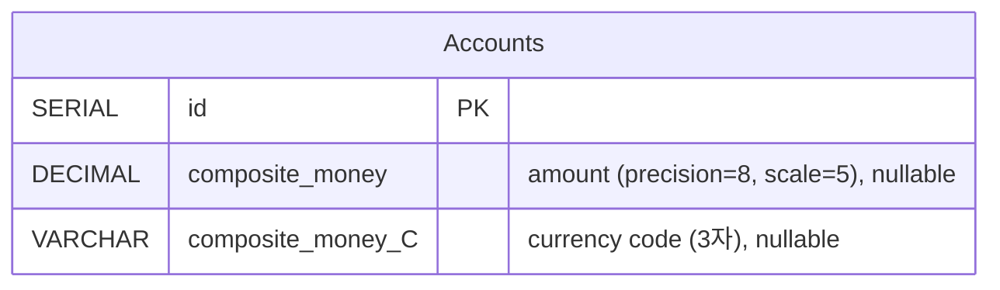
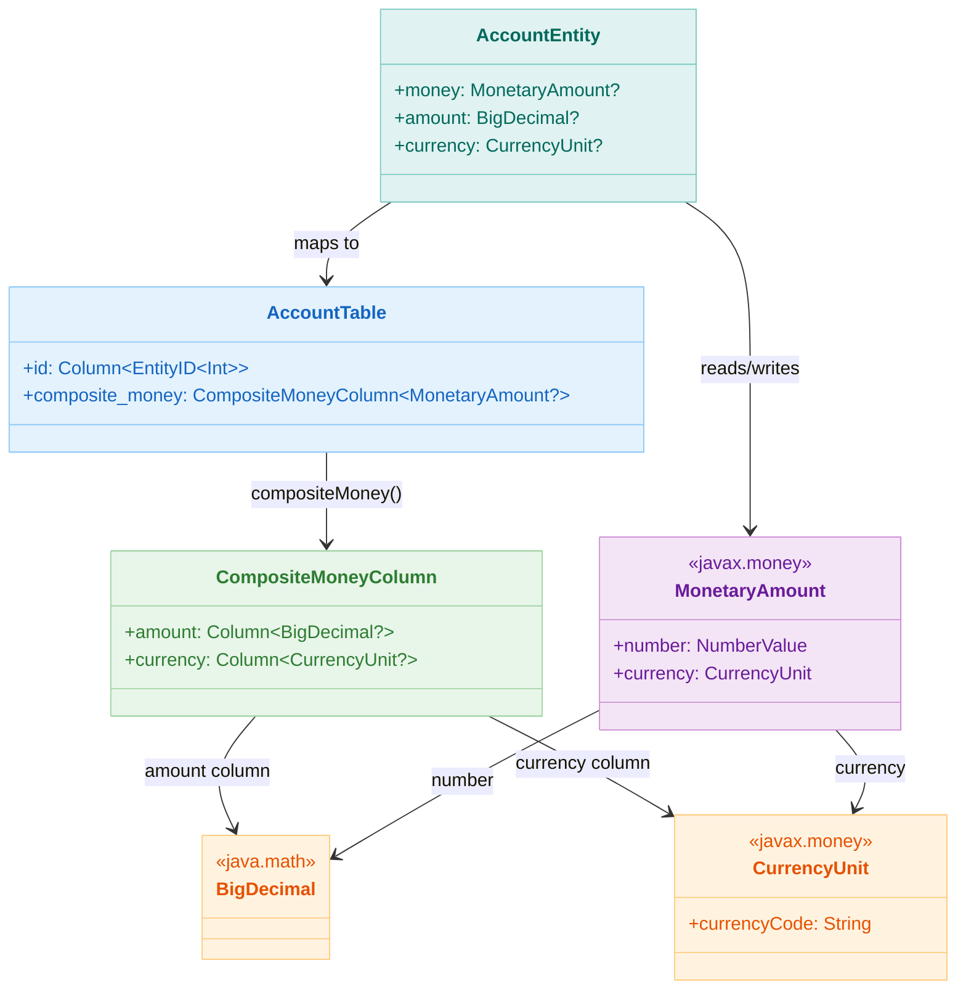

# 06 Advanced: exposed-money (05)

[English](./README.md) | 한국어

JavaMoney 기반 통화 값을 Exposed 컬럼으로 다루는 모듈입니다. 금액과 통화를 함께 저장해 금융 도메인 정합성을 높이는 패턴을 제공합니다.

## 학습 목표

- `compositeMoney` 매핑 구조를 이해한다.
- 통화/금액 동시 저장과 조회 패턴을 익힌다.
- 부동소수점 오차 대신 정밀 타입을 사용하는 이유를 이해한다.

## 선수 지식

- [`../05-exposed-dml/02-types/README.ko.md`](../05-exposed-dml/02-types/README.ko.md)

## AccountTable ERD



## MonetaryAmount 타입 매핑



## 핵심 개념

- `MonetaryAmount` <-> 복합 컬럼 매핑
- 통화 코드 기반 필터링
- 기본값/클라이언트 기본값

## 예제 구성

| 파일                      | 설명         |
|-------------------------|------------|
| `MoneyData.kt`          | 테이블/도메인 정의 |
| `Ex01_MoneyDefaults.kt` | 기본값 설정     |
| `Ex02_Money.kt`         | CRUD/조회    |

## 실행 방법

```bash
./gradlew :06-advanced:05-exposed-money:test
```

## 복잡한 시나리오

### 통화 코드 필터링

`compositeMoney` 는 금액(`amount`)과 통화 코드(`currency`) 두 컬럼으로 구성됩니다.
통화 코드 컬럼을 직접 WHERE 조건으로 사용해 특정 통화만 조회할 수 있습니다.

- 관련 파일: [`Ex02_Money.kt`](src/test/kotlin/exposed/examples/money/Ex02_Money.kt)
- 테스트: `filterByCurrencyCode` — 통화 코드 컬럼 기반 조건 조회 검증

### 자릿수 초과 예외 처리

`BigDecimal` 컬럼의 `precision`/`scale` 범위를 초과하는 금액 삽입 시 DB 예외가 발생합니다.
이 시나리오를 `assertFailsWith`로 검증합니다.

- 관련 파일: [`Ex02_Money.kt`](src/test/kotlin/exposed/examples/money/Ex02_Money.kt)
- 테스트: `insertMoneyWithOverflow`

### compositeMoney null 처리

`compositeMoney` 컬럼은 `nullable()` 옵션을 지원합니다.
금액 또는 통화 중 하나만 null인 경우의 동작과, 전체 null 처리를 검증합니다.

- 관련 파일: [`Ex01_MoneyDefaults.kt`](src/test/kotlin/exposed/examples/money/Ex01_MoneyDefaults.kt)
- 테스트: `nullableCompositeMoney` — null 저장/조회 정합성 검증

## 실습 체크리스트

- 동일 금액의 서로 다른 통화 입력 시 동작을 검증한다.
- 금액 정렬/집계 시 타입 정밀도를 확인한다.

## 성능·안정성 체크포인트

- 금액은 `Double/Float` 대신 Decimal 기반 타입 사용
- 환율 변환 책임(애플리케이션/외부 서비스)을 명확히 분리

## 다음 모듈

- [`../06-custom-columns/README.ko.md`](../06-custom-columns/README.ko.md)
