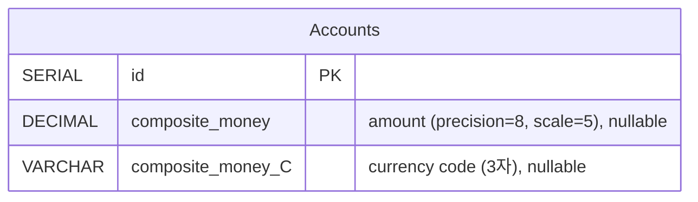
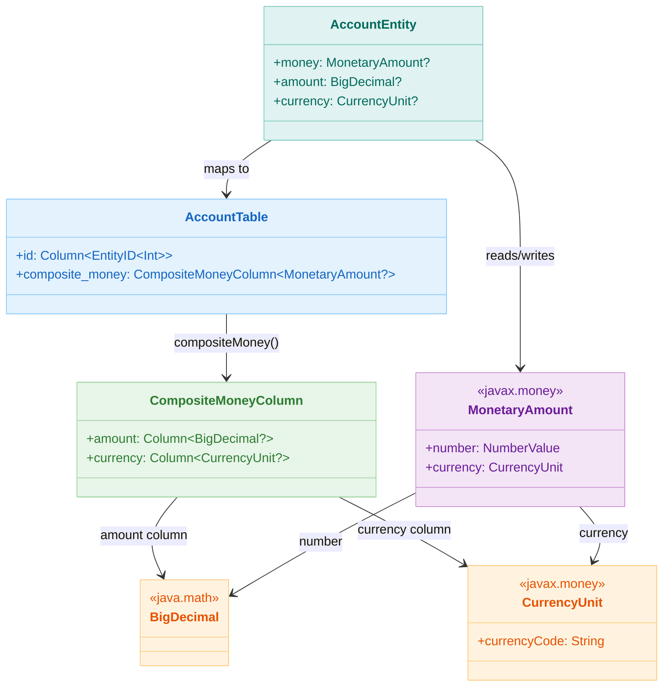

# 06 Advanced: exposed-money (05)

[English](./README.md) | 한국어

JavaMoney 기반 통화 값을 Exposed 컬럼으로 다루는 모듈입니다. 금액과 통화를 함께 저장해 금융 도메인 정합성을 높이는 패턴을 제공합니다.

## 학습 목표

- `compositeMoney` 매핑 구조를 이해한다.
- 통화/금액 동시 저장과 조회 패턴을 익힌다.
- 부동소수점 오차 대신 정밀 타입을 사용하는 이유를 이해한다.

## 선수 지식

- [`../05-exposed-dml/02-types/README.ko.md`](../05-exposed-dml/02-types/README.ko.md)

## AccountTable ERD



## MonetaryAmount 타입 매핑



## 핵심 개념

### Composite Money 컬럼 선언

```kotlin
object AccountTable : IntIdTable("accounts") {
    // compositeMoney는 두 개 컬럼 생성: amount와 currency_code
    val balance: Column<MonetaryAmount?> = compositeMoney("composite_money", nullable = true)
    val amount: Column<BigDecimal?> get() = balance.amount
    val currency: Column<CurrencyUnit?> get() = balance.currency
}
```

생성되는 DDL (PostgreSQL):

```sql
CREATE TABLE accounts (
    id                  SERIAL PRIMARY KEY,
    composite_money     DECIMAL(8,5),      -- 금액 컬럼
    composite_money_C   VARCHAR(3)         -- 통화 코드 컬럼
);
```

### CRUD 작업

```kotlin
withTables(testDB, AccountTable) {
    // INSERT with MonetaryAmount
    val accountId = AccountTable.insertAndGetId {
        it[balance] = Money.of(BigDecimal("1000.50"), "USD")
    }

    // SELECT는 MonetaryAmount 객체 반환
    val account = AccountTable.selectAll().where { 
        AccountTable.id eq accountId 
    }.single()
    val money = account[AccountTable.balance]      // MonetaryAmount
    println(money.number.numberValue(BigDecimal::class.java))  // 1000.50
    println(money.currency.currencyCode)           // "USD"

    // UPDATE with 새 금액/통화
    AccountTable.update({ AccountTable.id eq accountId }) {
        it[balance] = Money.of(BigDecimal("2000.00"), "EUR")
    }
}
```

### DAO 패턴

```kotlin
object AccountTable : IntIdTable("accounts") {
    val balance = compositeMoney("composite_money", nullable = true)
}

class AccountEntity(id: EntityID<Int>) : IntEntity(id) {
    companion object : IntEntityClass<AccountEntity>(AccountTable)
    var balance: MonetaryAmount? by AccountTable.balance
}

// 사용
val account = AccountEntity.new {
    balance = Money.of(BigDecimal("500.00"), "KRW")
}
println("잔액: ${account.balance}")
```

### 통화 코드 필터링

```kotlin
// currency 컴포넌트를 이용해 통화로 계정 조회
AccountTable.selectAll()
    .where { AccountTable.currency eq "USD" }
    .forEach { row ->
        val money = row[AccountTable.balance]
        println("USD 금액: ${money?.number}")
    }

// 통화별 계정 수 집계
AccountTable.selectAll()
    .where { AccountTable.currency eq "EUR" }
    .count()
```

## Advanced Scenarios

### 정밀도 및 스케일 설정

`compositeMoney` 컬럼은 금액을 `DECIMAL(precision, scale)`로 저장합니다. 적절하게 설정하세요:

```kotlin
// 예: 총 8자리, 소수점 5자리 (최대 999.99999 지원)
val balance = compositeMoney("balance")

// 더 큰 금액을 위해 정밀도 조정
// DECIMAL(15, 2)는 최대 9999999999999.99 지원
```

**관련 테스트**: `Ex02_Money.kt` → `insertMoneyWithOverflow`

### Null 처리 전략

```kotlin
val optionalBalance = compositeMoney("balance", nullable = true)
val requiredBalance = compositeMoney("balance", nullable = false)

// nullable인 경우: amount와 currency 모두 null 가능
// not nullable인 경우: 둘 다 반드시 존재해야 함
```

**관련 테스트**: `Ex01_MoneyDefaults.kt` → `nullableCompositeMoney`

### 기본값 설정

```kotlin
object AccountTable : IntIdTable("accounts") {
    val balance = compositeMoney("balance", nullable = true)
        .clientDefault { Money.of(BigDecimal.ZERO, "USD") }
}

// INSERT 시 balance를 지정하지 않으면 기본값 적용 (USD 0.00)
val id = AccountTable.insertAndGetId {
    // balance 미지정 → USD 0.00 기본값 사용
}
```

**관련 테스트**: `Ex01_MoneyDefaults.kt` → `moneyWithDefaults`

## 주의사항

1. **스케일 정밀도 간과**
    - ❌ `DECIMAL(8, 5)`는 999.99999 이하만 지원
    - ✅ 실무에서는 `DECIMAL(15, 2)` 이상 사용

2. **통화를 무시하고 금액만 조회**
    - ❌ `where { AccountTable.amount greaterThan BigDecimal("100") }`
    - ✅ 항상 통화 컨텍스트 확인: `where { AccountTable.currency eq "USD" and (AccountTable.amount greaterThan ...) }`

3. **금융 금액에 Float/Double 사용**
    - ❌ `var balance: Double` (정밀도 손실)
    - ✅ 항상 `BigDecimal` 사용

4. **통화 누락**
    - ❌ 금액만 설정하고 통화는 미지정 → NULL 통화 결과
    - ✅ 항상 `Money.of(금액, 통화코드)`로 둘 다 설정

## 성능 팁

- **인덱싱**: 통화 코드 기반 쿼리를 위해 인덱스 생성
  ```sql
  CREATE INDEX idx_accounts_currency ON accounts(composite_money_C);
  ```
- **배치 작업**: 여러 계정 삽입 시 `batchInsert` 사용
  ```kotlin
  AccountTable.batchInsert(accounts) { account ->
      this[balance] = Money.of(account.amount, account.currencyCode)
  }
  ```
- **집계**: DBMS는 같은 통화의 금액들을 합산 가능
  ```kotlin
  AccountTable.selectAll()
      .where { AccountTable.currency eq "USD" }
      .map { it[AccountTable.balance]?.number?.numberValue(BigDecimal::class.java) ?: BigDecimal.ZERO }
      .reduce { acc, value -> acc + value }
  ```

## 예제 구성

| 파일                      | 설명         |
|-------------------------|------------|
| `MoneyData.kt`          | 테이블/도메인 정의 |
| `Ex01_MoneyDefaults.kt` | 기본값 설정     |
| `Ex02_Money.kt`         | CRUD/조회    |

## 실행 방법

```bash
./gradlew :06-advanced:05-exposed-money:test
```

## 복잡한 시나리오

### 통화 코드 필터링

`compositeMoney` 는 금액(`amount`)과 통화 코드(`currency`) 두 컬럼으로 구성됩니다.
통화 코드 컬럼을 직접 WHERE 조건으로 사용해 특정 통화만 조회할 수 있습니다.

- 관련 파일: [`Ex02_Money.kt`](src/test/kotlin/exposed/examples/money/Ex02_Money.kt)
- 테스트: `filterByCurrencyCode` — 통화 코드 컬럼 기반 조건 조회 검증

### 자릿수 초과 예외 처리

`BigDecimal` 컬럼의 `precision`/`scale` 범위를 초과하는 금액 삽입 시 DB 예외가 발생합니다.
이 시나리오를 `assertFailsWith`로 검증합니다.

- 관련 파일: [`Ex02_Money.kt`](src/test/kotlin/exposed/examples/money/Ex02_Money.kt)
- 테스트: `insertMoneyWithOverflow`

### compositeMoney null 처리

`compositeMoney` 컬럼은 `nullable()` 옵션을 지원합니다.
금액 또는 통화 중 하나만 null인 경우의 동작과, 전체 null 처리를 검증합니다.

- 관련 파일: [`Ex01_MoneyDefaults.kt`](src/test/kotlin/exposed/examples/money/Ex01_MoneyDefaults.kt)
- 테스트: `nullableCompositeMoney` — null 저장/조회 정합성 검증

## 실습 체크리스트

- 동일 금액의 서로 다른 통화 입력 시 동작을 검증한다.
- 금액 정렬/집계 시 타입 정밀도를 확인한다.

## 성능·안정성 체크포인트

- 금액은 `Double/Float` 대신 Decimal 기반 타입 사용
- 환율 변환 책임(애플리케이션/외부 서비스)을 명확히 분리

## 다음 모듈

- [`../06-custom-columns/README.ko.md`](../06-custom-columns/README.ko.md)
