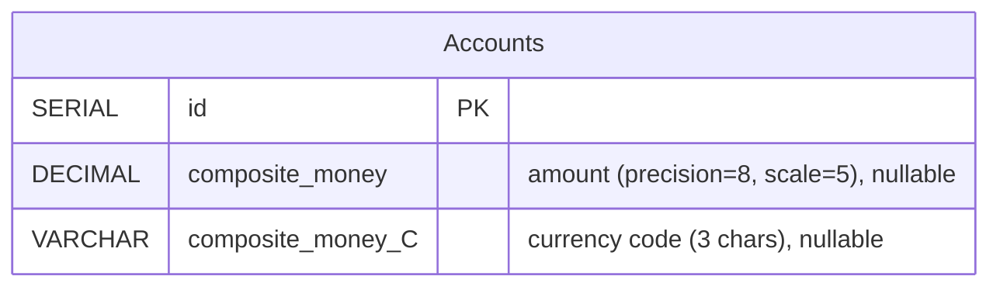
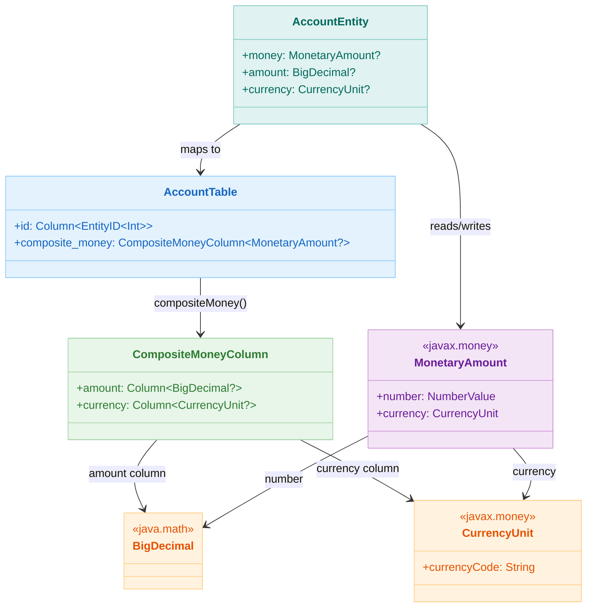

# 06 Advanced: exposed-money (05)

English | [한국어](./README.ko.md)

A module for handling JavaMoney-based currency values as Exposed columns. Provides patterns for improving financial domain consistency by storing amounts and currencies together.

## Learning Objectives

- Understand the `compositeMoney` mapping structure.
- Learn patterns for storing and querying currency/amount simultaneously.
- Understand why precision types should be used instead of floating-point errors.

## Prerequisites

- [`../05-exposed-dml/02-types/README.md`](../05-exposed-dml/02-types/README.md)

## AccountTable ERD



## MonetaryAmount Type Mapping



## Key Concepts

- `MonetaryAmount` <-> composite column mapping
- Currency code-based filtering
- Default values / client defaults

## Example Files

| File                    | Description            |
|-------------------------|------------------------|
| `MoneyData.kt`          | Table/domain definitions |
| `Ex01_MoneyDefaults.kt` | Default value configuration |
| `Ex02_Money.kt`         | CRUD/queries           |

## How to Run

```bash
./gradlew :06-advanced:05-exposed-money:test
```

## Advanced Scenarios

### Currency Code Filtering

`compositeMoney` consists of two columns: amount (`amount`) and currency code (`currency`).
You can use the currency code column directly as a WHERE condition to query specific currencies.

- Related file: [`Ex02_Money.kt`](src/test/kotlin/exposed/examples/money/Ex02_Money.kt)
- Test: `filterByCurrencyCode` — Validates currency code column-based conditional query

### Digit Overflow Exception Handling

A DB exception occurs when inserting an amount exceeding the `precision`/`scale` range of a `BigDecimal` column.
This scenario is verified with `assertFailsWith`.

- Related file: [`Ex02_Money.kt`](src/test/kotlin/exposed/examples/money/Ex02_Money.kt)
- Test: `insertMoneyWithOverflow`

### compositeMoney Null Handling

The `compositeMoney` column supports the `nullable()` option.
Validates behavior when only one of amount or currency is null, and full null handling.

- Related file: [`Ex01_MoneyDefaults.kt`](src/test/kotlin/exposed/examples/money/Ex01_MoneyDefaults.kt)
- Test: `nullableCompositeMoney` — Validates null storage/retrieval consistency

## Practice Checklist

- Verify behavior when entering the same amount in different currencies.
- Confirm type precision during amount sorting/aggregation.

## Performance and Stability Checkpoints

- Use Decimal-based types instead of `Double/Float` for amounts
- Clearly separate exchange rate conversion responsibility (application/external service)

## Next Module

- [`../06-custom-columns/README.md`](../06-custom-columns/README.md)
