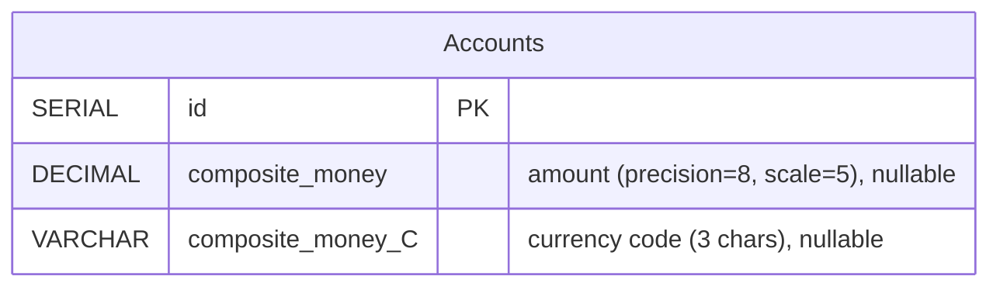
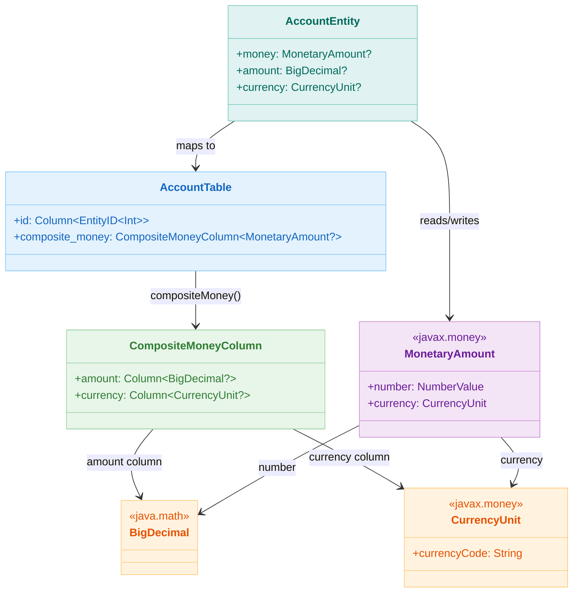

# 06 Advanced: exposed-money (05)

English | [한국어](./README.ko.md)

A module for handling JavaMoney-based currency values as Exposed columns. Provides patterns for improving financial domain consistency by storing amounts and currencies together.

## Learning Objectives

- Understand the `compositeMoney` mapping structure.
- Learn patterns for storing and querying currency/amount simultaneously.
- Understand why precision types should be used instead of floating-point errors.

## Prerequisites

- [`../05-exposed-dml/02-types/README.md`](../05-exposed-dml/02-types/README.md)

## AccountTable ERD



## MonetaryAmount Type Mapping



## Key Concepts

### Composite Money Column Declaration

```kotlin
object AccountTable : IntIdTable("accounts") {
    // compositeMoney creates TWO columns: amount and currency_code
    val balance: Column<MonetaryAmount?> = compositeMoney("composite_money", nullable = true)
    val amount: Column<BigDecimal?> get() = balance.amount
    val currency: Column<CurrencyUnit?> get() = balance.currency
}
```

Generated DDL (PostgreSQL):

```sql
CREATE TABLE accounts (
    id          SERIAL PRIMARY KEY,
    composite_money     DECIMAL(8,5),      -- Amount column
    composite_money_C   VARCHAR(3)         -- Currency code column
);
```

### CRUD Operations

```kotlin
withTables(testDB, AccountTable) {
    // INSERT with MonetaryAmount
    val accountId = AccountTable.insertAndGetId {
        it[balance] = Money.of(BigDecimal("1000.50"), "USD")
    }

    // SELECT returns MonetaryAmount object
    val account = AccountTable.selectAll().where { 
        AccountTable.id eq accountId 
    }.single()
    val money = account[AccountTable.balance]      // MonetaryAmount
    println(money.number.numberValue(BigDecimal::class.java))  // 1000.50
    println(money.currency.currencyCode)           // "USD"

    // UPDATE with new amount/currency
    AccountTable.update({ AccountTable.id eq accountId }) {
        it[balance] = Money.of(BigDecimal("2000.00"), "EUR")
    }
}
```

### DAO Pattern

```kotlin
object AccountTable : IntIdTable("accounts") {
    val balance = compositeMoney("composite_money", nullable = true)
}

class AccountEntity(id: EntityID<Int>) : IntEntity(id) {
    companion object : IntEntityClass<AccountEntity>(AccountTable)
    var balance: MonetaryAmount? by AccountTable.balance
}

// Usage
val account = AccountEntity.new {
    balance = Money.of(BigDecimal("500.00"), "KRW")
}
println("Balance: ${account.balance}")
```

### Currency Code Filtering

```kotlin
// Query accounts by currency using the currency component
AccountTable.selectAll()
    .where { AccountTable.currency eq "USD" }
    .forEach { row ->
        val money = row[AccountTable.balance]
        println("USD Amount: ${money?.number}")
    }

// Count accounts by currency
AccountTable.selectAll()
    .where { AccountTable.currency eq "EUR" }
    .count()
```

## Advanced Scenarios

### Precision and Scale Configuration

The `compositeMoney` column stores amounts as `DECIMAL(precision, scale)`. Configure appropriately:

```kotlin
// Example: 8 total digits, 5 decimal places (supports up to 999.99999)
val balance = compositeMoney("balance")

// For larger amounts, adjust precision
// DECIMAL(15, 2) supports amounts up to 9999999999999.99
```

**Related Test**: `Ex02_Money.kt` → `insertMoneyWithOverflow`

### Null Handling Strategies

```kotlin
val optionalBalance = compositeMoney("balance", nullable = true)
val requiredBalance = compositeMoney("balance", nullable = false)

// When nullable: both amount AND currency can be null
// When not nullable: both must be present together
```

**Related Test**: `Ex01_MoneyDefaults.kt` → `nullableCompositeMoney`

### Default Values

```kotlin
object AccountTable : IntIdTable("accounts") {
    val balance = compositeMoney("balance", nullable = true)
        .clientDefault { Money.of(BigDecimal.ZERO, "USD") }
}

// Default applied on INSERT when not specified
val id = AccountTable.insertAndGetId {
    // balance not set → uses USD 0.00 as default
}
```

**Related Test**: `Ex01_MoneyDefaults.kt` → `moneyWithDefaults`

## Common Pitfalls

1. **Forgetting scale precision**
    - ❌ `DECIMAL(8, 5)` only supports amounts < 999.99999
    - ✅ Use `DECIMAL(15, 2)` or higher for realistic financial amounts

2. **Querying only amount, ignoring currency**
    - ❌ `where { AccountTable.amount greaterThan BigDecimal("100") }`
    - ✅ Always check currency context:
      `where { AccountTable.currency eq "USD" and (AccountTable.amount greaterThan ...) }`

3. **Float/Double for financial amounts**
    - ❌ `var balance: Double` (precision loss)
    - ✅ Always use `BigDecimal` for financial calculations

4. **Missing currency when storing**
    - ❌ Setting amount but not currency results in NULL currency
    - ✅ Always provide both via `Money.of(amount, currency)`

## Performance Tips

- **Indexing**: Create an index on the currency code column for currency-based queries
  ```sql
  CREATE INDEX idx_accounts_currency ON accounts(composite_money_C);
  ```
- **Batch operations**: Use `batchInsert` for multiple accounts
  ```kotlin
  AccountTable.batchInsert(accounts) { account ->
      this[balance] = Money.of(account.amount, account.currencyCode)
  }
  ```
- **Aggregations**: DBMS can sum amounts if they share the same currency
  ```kotlin
  AccountTable.selectAll()
      .where { AccountTable.currency eq "USD" }
      .map { it[AccountTable.balance]?.number?.numberValue(BigDecimal::class.java) ?: BigDecimal.ZERO }
      .reduce { acc, value -> acc + value }
  ```

## Example Files

| File                    | Description            |
|-------------------------|------------------------|
| `MoneyData.kt`          | Table/domain definitions |
| `Ex01_MoneyDefaults.kt` | Default value configuration |
| `Ex02_Money.kt`         | CRUD/queries           |

## How to Run

```bash
./gradlew :06-advanced:05-exposed-money:test
```

## Advanced Scenarios

### Currency Code Filtering

`compositeMoney` consists of two columns: amount (`amount`) and currency code (`currency`).
You can use the currency code column directly as a WHERE condition to query specific currencies.

- Related file: [`Ex02_Money.kt`](src/test/kotlin/exposed/examples/money/Ex02_Money.kt)
- Test: `filterByCurrencyCode` — Validates currency code column-based conditional query

### Digit Overflow Exception Handling

A DB exception occurs when inserting an amount exceeding the `precision`/`scale` range of a `BigDecimal` column.
This scenario is verified with `assertFailsWith`.

- Related file: [`Ex02_Money.kt`](src/test/kotlin/exposed/examples/money/Ex02_Money.kt)
- Test: `insertMoneyWithOverflow`

### compositeMoney Null Handling

The `compositeMoney` column supports the `nullable()` option.
Validates behavior when only one of amount or currency is null, and full null handling.

- Related file: [`Ex01_MoneyDefaults.kt`](src/test/kotlin/exposed/examples/money/Ex01_MoneyDefaults.kt)
- Test: `nullableCompositeMoney` — Validates null storage/retrieval consistency

## Practice Checklist

- Verify behavior when entering the same amount in different currencies.
- Confirm type precision during amount sorting/aggregation.

## Performance and Stability Checkpoints

- Use Decimal-based types instead of `Double/Float` for amounts
- Clearly separate exchange rate conversion responsibility (application/external service)

## Next Module

- [`../06-custom-columns/README.md`](../06-custom-columns/README.md)
