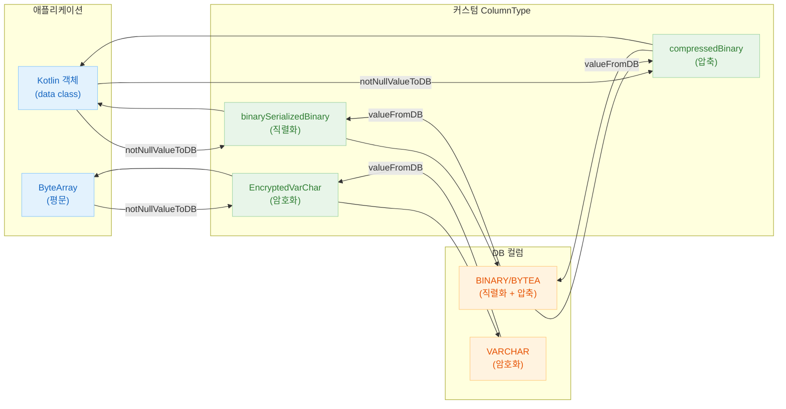
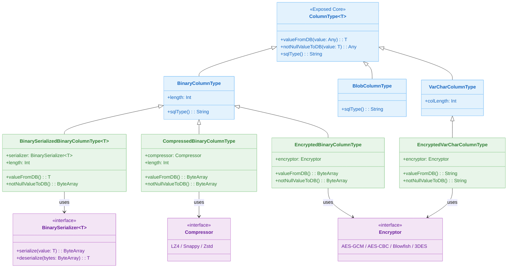

# 06 Advanced: Custom Columns (06)

[English](./README.md) | 한국어

도메인 요구에 맞는 커스텀 컬럼 타입을 구현하는 모듈입니다. 직렬화/압축/암호화 변환 로직을 컬럼 계층에 캡슐화하는 패턴을 다룹니다.

## 개요

Exposed의 `ColumnType`을 확장하면 DB 저장 시 자동으로 변환(직렬화, 압축, 암호화)을 수행하는 커스텀 컬럼을 만들 수 있습니다.
`bluetape4k-exposed` 라이브러리가 제공하는 확장 함수들을 통해 Kotlin 객체를 BINARY 컬럼에 저장하거나, 데이터를 압축하여 저장할 수 있습니다.

## 학습 목표

- 커스텀 `ColumnType` 구현 구조(`valueFromDB`, `notNullValueToDB`)를 이해한다.
- 읽기/쓰기 변환 로직을 컬럼 계층에 안전하게 분리한다.
- 직렬화/압축/암호화 컬럼을 DSL과 DAO 양쪽에서 사용한다.
- 테스트로 변환 손실·호환성 문제를 검증한다.

## 선수 지식

- [`../../05-exposed-dml/README.ko.md`](../../05-exposed-dml/README.ko.md)

## 아키텍처 흐름



## 커스텀 ColumnType 계층



## 커스텀 컬럼 타입 목록

| 확장 함수                         | 저장 컬럼 타입         | 변환 방식 | 직렬화 엔진                           | 설명                        |
|-------------------------------|------------------|-------|----------------------------------|---------------------------|
| `binarySerializedBinary<T>()` | `BINARY`/`BYTEA` | 직렬화   | Fory LZ4/Zstd, Kryo LZ4/Zstd     | Kotlin 객체 → 직렬화 바이트 배열 저장 |
| `binarySerializedBlob<T>()`   | `BLOB`           | 직렬화   | Fory LZ4/Zstd, Kryo LZ4/Zstd     | Kotlin 객체 → BLOB 저장       |
| `compressedBinary()`          | `BINARY`/`BYTEA` | 압축    | LZ4, Snappy, Zstd                | ByteArray 압축 저장           |
| `compressedBlob()`            | `BLOB`           | 압축    | LZ4, Snappy, Zstd                | ByteArray 압축 BLOB 저장      |
| `encryptedBinary()`           | `BINARY`/`BYTEA` | 암호화   | AES-GCM, AES-CBC, Blowfish, 3DES | ByteArray 암호화 저장          |
| `encryptedVarChar()`          | `VARCHAR`        | 암호화   | AES-GCM, AES-CBC, Blowfish, 3DES | 문자열 암호화 저장                |

## 핵심 개념

### 직렬화 컬럼 (binarySerializedBinary)

```kotlin
object T1: IntIdTable() {
    val name = varchar("name", 50)

    // Fory + LZ4 직렬화 → BINARY 컬럼에 저장
    val lz4Fory = binarySerializedBinary<Embeddable>(
        "lz4_fory", 4096, BinarySerializers.LZ4Fory
    ).nullable()

    // Kryo + Zstd 직렬화
    val zstdKryo = binarySerializedBinary<Embeddable2>(
        "zstd_kryo", 4096, BinarySerializers.ZstdKryo
    ).nullable()
}

data class Embeddable(
    val name: String,
    val age: Int,
    val address: String,
): Serializable
```

생성되는 DDL (PostgreSQL):

```sql
CREATE TABLE IF NOT EXISTS t1
(
    id        SERIAL PRIMARY KEY,
    name      VARCHAR(50) NOT NULL,
    lz4_fory  BYTEA       NULL, -- 직렬화된 바이트 배열
    zstd_kryo BYTEA       NULL
)
```

DSL 사용:

```kotlin
val embedded = Embeddable("Alice", 20, "Seoul")

val id = T1.insertAndGetId {
    it[T1.name] = "Alice"
    it[T1.lz4Fory] = embedded    // 자동 직렬화
}

val row = T1.selectAll().where { T1.id eq id }.single()
row[T1.lz4Fory] shouldBeEqualTo embedded   // 자동 역직렬화
```

### 압축 컬럼 (compressedBinary)

```kotlin
object T1: IntIdTable() {
    val lzData = compressedBinary("lz4_data", 4096, Compressors.LZ4).nullable()
    val snappyData = compressedBinary("snappy_data", 4096, Compressors.Snappy).nullable()
    val zstdData = compressedBinary("zstd_data", 4096, Compressors.Zstd).nullable()
}

// 사용 — ByteArray 투명 압축/해제
val text = "반복되는 긴 문자열...".repeat(100)
val id = T1.insertAndGetId {
    it[T1.lzData] = text.toByteArray()   // 자동 LZ4 압축
    it[T1.snappyData] = text.toByteArray()   // 자동 Snappy 압축
    it[T1.zstdData] = text.toByteArray()   // 자동 Zstd 압축
}

val row = T1.selectAll().where { T1.id eq id }.single()
row[T1.lzData]!!.toUtf8String() shouldBeEqualTo text  // 자동 압축 해제
```

### 클라이언트 기본값 함수 (CustomClientDefaultFunctions)

```kotlin
// DB INSERT 시점에 클라이언트에서 기본값을 자동 생성
object T1: IntIdTable() {
    val createdAt = datetime("created_at").clientDefault { LocalDateTime.now() }
    val uuid = uuid("uuid").clientDefault { UUID.randomUUID() }
}
```

## 예제 구성

| 파일                                                      | 설명                                       |
|---------------------------------------------------------|------------------------------------------|
| `CustomClientDefaultFunctionsTest.kt`                   | `clientDefault` 활용 기본값 자동 생성             |
| `serialization/BinarySerializedBinaryColumnTypeTest.kt` | Fory/Kryo 직렬화 BINARY 컬럼 DSL/DAO 테스트      |
| `serialization/BinarySerializedBlobColumnTypeTest.kt`   | Fory/Kryo 직렬화 BLOB 컬럼 테스트                |
| `compress/CompressedBinaryColumnTypeTest.kt`            | LZ4/Snappy/Zstd 압축 BINARY 컬럼 DSL/DAO 테스트 |
| `compress/CompressedBlobColumnTypeTest.kt`              | LZ4/Snappy/Zstd 압축 BLOB 컬럼 테스트           |
| `encrypt/EncryptedBinaryColumnTypeTest.kt`              | AES/Blowfish/3DES BINARY 암호화 컬럼 테스트      |
| `encrypt/EncryptedVarCharColumnTypeTest.kt`             | AES/Blowfish/3DES VARCHAR 암호화 컬럼 테스트     |

## 테스트 실행 방법

```bash
# 전체 테스트
./gradlew :06-advanced:06-custom-columns:test

# H2만 대상으로 빠른 테스트
./gradlew :06-advanced:06-custom-columns:test -PuseFastDB=true

# 직렬화 테스트만 실행
./gradlew :06-advanced:06-custom-columns:test \
    --tests "exposed.examples.custom.columns.serialization.*"

# 압축 테스트만 실행
./gradlew :06-advanced:06-custom-columns:test \
    --tests "exposed.examples.custom.columns.compress.*"
```

## 실습 체크리스트

- 경계값(null/빈값/최대길이) 변환 테스트를 추가한다.
- 이전 포맷 데이터와 호환 여부를 검증한다.
- 변환 비용이 큰 경우 캐시/배치 전략을 검토한다.
- 역직렬화 실패 시 오류 복구 경로를 준비한다.

## 다음 모듈

- [`../07-custom-entities/README.ko.md`](../07-custom-entities/README.ko.md)
