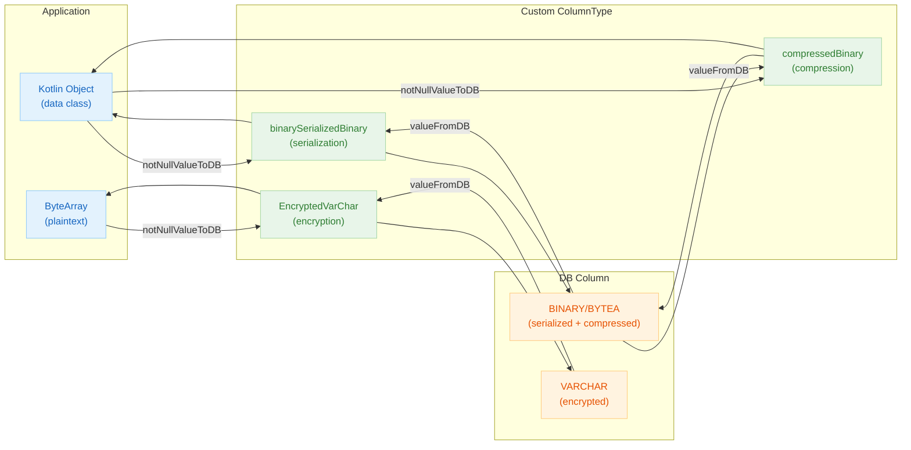
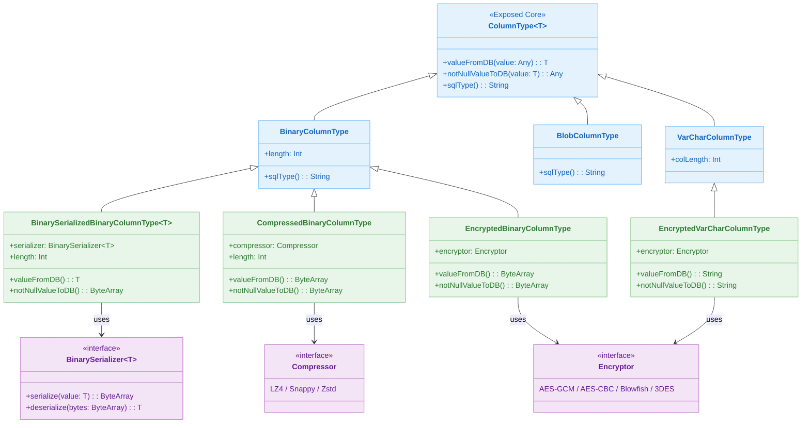

# 06 Advanced: Custom Columns (06)

English | [한국어](./README.ko.md)

A module for implementing custom column types tailored to domain requirements. Covers patterns for encapsulating serialization/compression/encryption transformation logic at the column layer.

## Overview

By extending Exposed's `ColumnType`, you can create custom columns that automatically perform transformations (serialization, compression, encryption) during DB storage.
Through extension functions provided by the `bluetape4k-exposed` library, you can store Kotlin objects in BINARY columns or store data in compressed form.

## Learning Objectives

- Understand the custom `ColumnType` implementation structure (`valueFromDB`, `notNullValueToDB`).
- Safely separate read/write transformation logic at the column layer.
- Use serialization/compression/encryption columns in both DSL and DAO.
- Validate transformation loss and compatibility issues through tests.

## Prerequisites

- [`../../05-exposed-dml/README.md`](../../05-exposed-dml/README.md)

## Architecture Flow



## Custom ColumnType Hierarchy



## Custom Column Type List

| Extension Function              | Storage Column Type | Transform | Serialization Engine             | Description                           |
|---------------------------------|--------------------|-----------|---------------------------------|---------------------------------------|
| `binarySerializedBinary<T>()` | `BINARY`/`BYTEA`   | Serialization | Fory LZ4/Zstd, Kryo LZ4/Zstd | Kotlin object -> serialized byte array storage |
| `binarySerializedBlob<T>()`   | `BLOB`             | Serialization | Fory LZ4/Zstd, Kryo LZ4/Zstd | Kotlin object -> BLOB storage         |
| `compressedBinary()`          | `BINARY`/`BYTEA`   | Compression | LZ4, Snappy, Zstd             | ByteArray compressed storage          |
| `compressedBlob()`            | `BLOB`             | Compression | LZ4, Snappy, Zstd             | ByteArray compressed BLOB storage     |
| `encryptedBinary()`           | `BINARY`/`BYTEA`   | Encryption | AES-GCM, AES-CBC, Blowfish, 3DES | ByteArray encrypted storage        |
| `encryptedVarChar()`          | `VARCHAR`          | Encryption | AES-GCM, AES-CBC, Blowfish, 3DES | String encrypted storage           |

## Key Concepts

### Serialization Column (binarySerializedBinary)

```kotlin
object T1: IntIdTable() {
    val name = varchar("name", 50)

    // Fory + LZ4 serialization -> stored in BINARY column
    val lz4Fory = binarySerializedBinary<Embeddable>(
        "lz4_fory", 4096, BinarySerializers.LZ4Fory
    ).nullable()

    // Kryo + Zstd serialization
    val zstdKryo = binarySerializedBinary<Embeddable2>(
        "zstd_kryo", 4096, BinarySerializers.ZstdKryo
    ).nullable()
}

data class Embeddable(
    val name: String,
    val age: Int,
    val address: String,
): Serializable
```

Generated DDL (PostgreSQL):

```sql
CREATE TABLE IF NOT EXISTS t1
(
    id        SERIAL PRIMARY KEY,
    name      VARCHAR(50) NOT NULL,
    lz4_fory  BYTEA       NULL, -- Serialized byte array
    zstd_kryo BYTEA       NULL
)
```

DSL usage:

```kotlin
val embedded = Embeddable("Alice", 20, "Seoul")

val id = T1.insertAndGetId {
    it[T1.name] = "Alice"
    it[T1.lz4Fory] = embedded    // Auto-serialization
}

val row = T1.selectAll().where { T1.id eq id }.single()
row[T1.lz4Fory] shouldBeEqualTo embedded   // Auto-deserialization
```

### Compression Column (compressedBinary)

```kotlin
object T1: IntIdTable() {
    val lzData = compressedBinary("lz4_data", 4096, Compressors.LZ4).nullable()
    val snappyData = compressedBinary("snappy_data", 4096, Compressors.Snappy).nullable()
    val zstdData = compressedBinary("zstd_data", 4096, Compressors.Zstd).nullable()
}

// Usage — transparent ByteArray compression/decompression
val text = "repeating long string...".repeat(100)
val id = T1.insertAndGetId {
    it[T1.lzData] = text.toByteArray()   // Auto LZ4 compression
    it[T1.snappyData] = text.toByteArray()   // Auto Snappy compression
    it[T1.zstdData] = text.toByteArray()   // Auto Zstd compression
}

val row = T1.selectAll().where { T1.id eq id }.single()
row[T1.lzData]!!.toUtf8String() shouldBeEqualTo text  // Auto decompression
```

### Client Default Functions (CustomClientDefaultFunctions)

```kotlin
// Auto-generate default values on client side at DB INSERT time
object T1: IntIdTable() {
    val createdAt = datetime("created_at").clientDefault { LocalDateTime.now() }
    val uuid = uuid("uuid").clientDefault { UUID.randomUUID() }
}
```

## Example Files

| File                                                    | Description                                         |
|---------------------------------------------------------|-----------------------------------------------------|
| `CustomClientDefaultFunctionsTest.kt`                   | Default value auto-generation using `clientDefault`  |
| `serialization/BinarySerializedBinaryColumnTypeTest.kt` | Fory/Kryo serialization BINARY column DSL/DAO tests |
| `serialization/BinarySerializedBlobColumnTypeTest.kt`   | Fory/Kryo serialization BLOB column tests           |
| `compress/CompressedBinaryColumnTypeTest.kt`            | LZ4/Snappy/Zstd compression BINARY column DSL/DAO tests |
| `compress/CompressedBlobColumnTypeTest.kt`              | LZ4/Snappy/Zstd compression BLOB column tests      |
| `encrypt/EncryptedBinaryColumnTypeTest.kt`              | AES/Blowfish/3DES BINARY encryption column tests    |
| `encrypt/EncryptedVarCharColumnTypeTest.kt`             | AES/Blowfish/3DES VARCHAR encryption column tests   |

## How to Run Tests

```bash
# Full test
./gradlew :06-advanced:06-custom-columns:test

# Quick test targeting H2 only
./gradlew :06-advanced:06-custom-columns:test -PuseFastDB=true

# Run serialization tests only
./gradlew :06-advanced:06-custom-columns:test \
    --tests "exposed.examples.custom.columns.serialization.*"

# Run compression tests only
./gradlew :06-advanced:06-custom-columns:test \
    --tests "exposed.examples.custom.columns.compress.*"
```

## Practice Checklist

- Add boundary value (null/empty/max length) transformation tests.
- Verify compatibility with previous format data.
- Consider cache/batch strategies for high-cost transformations.
- Prepare error recovery paths for deserialization failures.

## Next Module

- [`../07-custom-entities/README.md`](../07-custom-entities/README.md)
