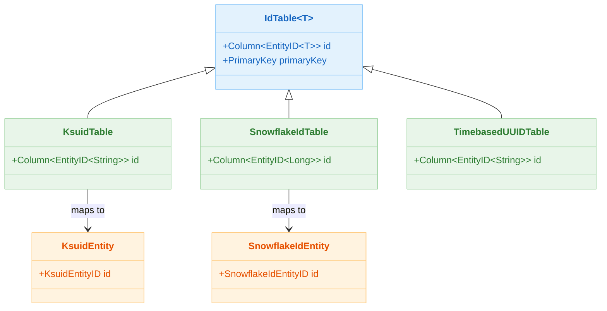
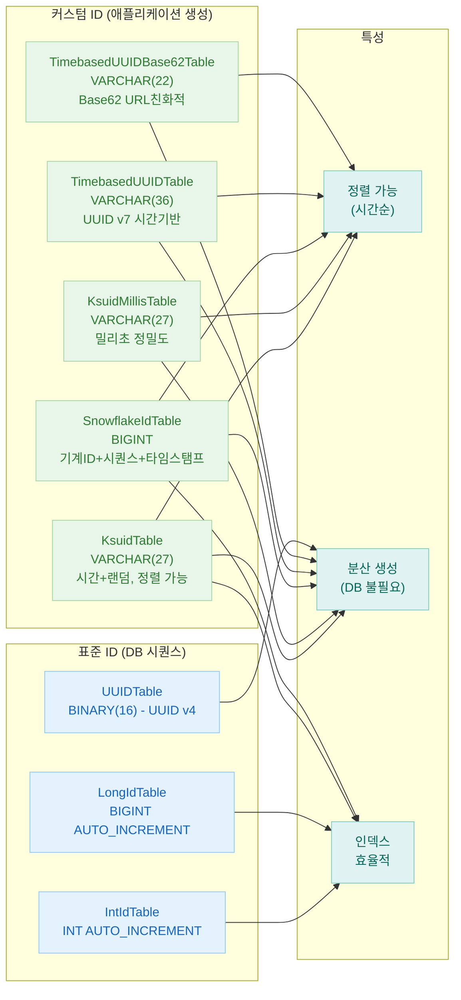

# 06 Advanced: Custom Entities (07)

[English](./README.md) | 한국어

기본 `Int`/`Long`/`UUID` 이외의 ID 전략을 사용하는 Entity 패턴을 다루는 모듈입니다. 도메인별 ID 생성 규칙을 Exposed 모델에 반영하는 방법을 학습합니다.

## 개요

Exposed의 `IdTable`을 확장하여 KSUID, Snowflake, Timebased UUID 등 커스텀 ID 전략을 구현합니다. `bluetape4k-exposed` 라이브러리가 제공하는
`KsuidTable`, `SnowflakeIdTable`, `TimebasedUUIDTable` 등을 사용하여 도메인 요구에 맞는 ID를 자동 생성합니다.

## 학습 목표

- `IdTable<T>`를 상속하는 커스텀 ID 테이블 구조를 이해한다.
- KSUID, Snowflake, Timebased UUID 각 전략의 특성을 비교한다.
- 동기/코루틴 환경에서 커스텀 ID Entity를 생성·조회한다.
- 배치 INSERT와 코루틴 병렬 처리에서 ID 충돌 없음을 검증한다.

## 선수 지식

- [`../../05-exposed-dml/README.md`](../../05-exposed-dml/README.md)

## 커스텀 ID 전략 비교

| ID 전략                      | 저장 타입         | 정렬 가능    | 분산 생성       | 길이       | 설명                                |
|----------------------------|---------------|----------|-------------|----------|-----------------------------------|
| `KsuidTable`               | `VARCHAR(27)` | 가능 (시간순) | 가능          | 27자      | K-Sortable Unique ID, 시간+랜덤 조합    |
| `KsuidMillisTable`         | `VARCHAR(27)` | 가능 (시간순) | 가능          | 27자      | 밀리초 정밀도 KSUID                     |
| `SnowflakeIdTable`         | `BIGINT`      | 가능 (시간순) | 가능          | 64비트 정수  | Twitter Snowflake, 기계ID+시퀀스+타임스탬프 |
| `TimebasedUUIDTable`       | `VARCHAR(36)` | 가능 (시간순) | 가능          | 36자 UUID | 시간 기반 UUID v7                     |
| `TimebasedUUIDBase62Table` | `VARCHAR(22)` | 가능 (시간순) | 가능          | 22자      | Base62 인코딩 시간 기반 UUID (URL 친화적)   |
| `IntIdTable`               | `INT`         | 가능       | 불가 (DB 시퀀스) | 32비트 정수  | 기본 자동 증가 정수 ID                    |
| `LongIdTable`              | `BIGINT`      | 가능       | 불가 (DB 시퀀스) | 64비트 정수  | 기본 자동 증가 Long ID                  |
| `UUIDTable`                | `BINARY(16)`  | 불가       | 가능          | 16바이트    | 표준 UUID v4 (랜덤)                   |

## 아키텍처 흐름



## 커스텀 ID 전략 비교 플로우



## 핵심 개념

### KSUID 기반 Entity

```kotlin
// 테이블 정의 — VARCHAR(27) PK 자동 생성
object T1: KsuidTable("t_ksuid") {
    val name = varchar("name", 255)
    val age = integer("age")
}

// Entity 정의
class E1(id: KsuidEntityID): KsuidEntity(id) {
    companion object: KsuidEntityClass<E1>(T1)

    var name by T1.name
    var age by T1.age
}
```

생성되는 DDL (PostgreSQL):

```sql
CREATE TABLE IF NOT EXISTS t_ksuid (
    id   VARCHAR(27) PRIMARY KEY,   -- "2h9cJNfVHDsYm7X5Qp..." 형태
    name VARCHAR(255) NOT NULL,
    age  INT NOT NULL
)
```

사용:

```kotlin
withTables(testDB, T1) {
    // INSERT — KSUID 자동 생성
    T1.insert {
        it[T1.name] = "Alice"
        it[T1.age] = 30
    }

    // DAO 방식
    val entity = E1.new {
        name = "Bob"
        age = 25
    }
    println(entity.id.value)  // "2h9cJNfVHDsYm7X5Qp..." (27자 KSUID)
}
```

### Snowflake ID 기반 Entity

```kotlin
// 테이블 정의 — BIGINT PK, 분산 환경에서 고유성 보장
object T1: SnowflakeIdTable("t_snowflake") {
    val name = varchar("name", 255)
    val age = integer("age")
}

class E1(id: SnowflakeIdEntityID): SnowflakeIdEntity(id) {
    companion object: SnowflakeIdEntityClass<E1>(T1)

    var name by T1.name
    var age by T1.age
}
```

생성되는 DDL (PostgreSQL):

```sql
CREATE TABLE IF NOT EXISTS t_snowflake
(
    id   BIGINT PRIMARY KEY, -- 1234567890123456789 형태 (64비트)
    name VARCHAR(255) NOT NULL,
    age  INT          NOT NULL
)
```

### 코루틴 병렬 배치 INSERT

```kotlin
// 코루틴 환경에서 배치 병렬 INSERT — ID 충돌 없음 검증
runSuspendIO {
    withSuspendedTables(testDB, T1) {
        val records = List(1000) { Record(faker.name().fullName(), Random.nextInt(10, 80)) }

        records.chunked(100).map { chunk ->
            suspendedTransactionAsync(Dispatchers.IO) {
                T1.batchInsert(chunk, shouldReturnGeneratedValues = false) {
                    this[T1.name] = it.name
                    this[T1.age] = it.age
                }
            }
        }.awaitAll()

        T1.selectAll().count() shouldBeEqualTo 1000L
    }
}
```

### insertIgnore + Flow 패턴

```kotlin
// Flow 기반 스트리밍 INSERT (MySQL/PostgreSQL)
entities.asFlow()
    .buffer(16)
    .take(entityCount)
    .flatMapMerge(16) { (name, age) ->
        flow {
            val insertCount = T1.insertIgnore {
                it[T1.name] = name
                it[T1.age] = age
            }
            emit(insertCount)
        }
    }
    .collect()
```

## 예제 구성

| 파일                                | 설명                                     |
|-----------------------------------|----------------------------------------|
| `AbstractCustomIdTableTest.kt`    | 공통 테스트 픽스처 (faker, recordCount 파라미터)   |
| `KsuidTableTest.kt`               | KSUID 기반 DSL/DAO CRUD, 배치/코루틴/Flow 테스트 |
| `KsuidMillisTableTest.kt`         | 밀리초 정밀도 KSUID 테스트                      |
| `SnowflakeIdTableTest.kt`         | Snowflake ID 기반 DSL/DAO, 배치/코루틴 테스트    |
| `TimebasedUUIDTableTest.kt`       | 시간 기반 UUID v7 테스트                      |
| `TimebasedUUIDBase62TableTest.kt` | Base62 인코딩 시간 기반 UUID 테스트              |

## 테스트 실행 방법

```bash
# 전체 테스트
./gradlew :06-advanced:07-custom-entities:test

# H2만 대상으로 빠른 테스트
./gradlew :06-advanced:07-custom-entities:test -PuseFastDB=true

# 특정 테스트 클래스만 실행
./gradlew :06-advanced:07-custom-entities:test \
    --tests "exposed.examples.custom.entities.SnowflakeIdTableTest"
```

## 실습 체크리스트

- 동시 생성 상황에서 ID 충돌 가능성을 검증한다.
- 정렬 가능한 ID 전략(KSUID, Snowflake)과 비정렬 UUID를 비교한다.
- ID 길이 증가에 따른 인덱스 비용을 검토한다.
- 생성기 시계 의존성(시간 역행 등) 리스크를 확인한다.

## 다음 모듈

- [`../08-exposed-jackson/README.md`](../08-exposed-jackson/README.md)
