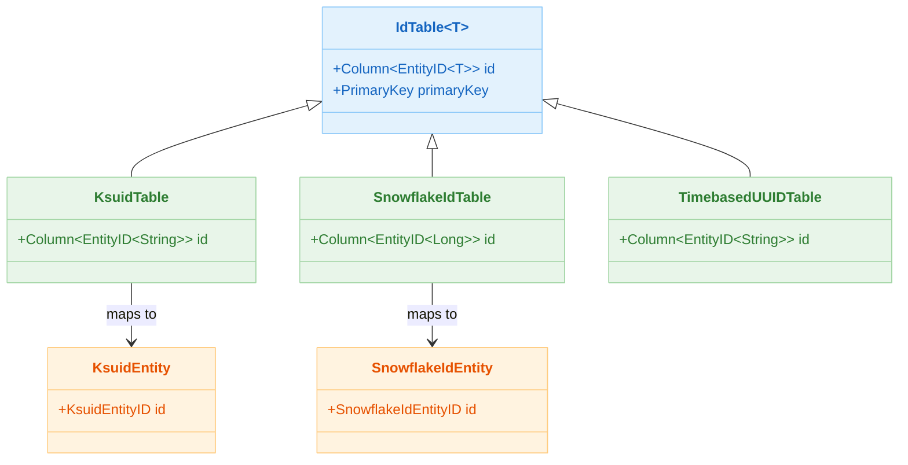
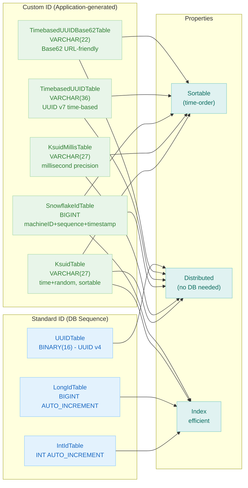

# 06 Advanced: Custom Entities (07)

English | [한국어](./README.ko.md)

A module covering Entity patterns that use ID strategies beyond the default `Int`/`Long`/`UUID`. Learn how to incorporate domain-specific ID generation rules into your Exposed models.

## Overview

Extends Exposed's `IdTable` to implement custom ID strategies such as KSUID, Snowflake, and Timebased UUID. Uses `KsuidTable`, `SnowflakeIdTable`, `TimebasedUUIDTable`, and similar classes provided by the `bluetape4k-exposed` library to auto-generate IDs that meet domain requirements.

## Learning Objectives

- Understand the structure of custom ID tables that inherit from `IdTable<T>`.
- Compare the characteristics of KSUID, Snowflake, and Timebased UUID strategies.
- Create and query custom ID Entities in both synchronous and coroutine environments.
- Verify that no ID collisions occur during batch INSERT and parallel coroutine processing.

## Prerequisites

- [`../../05-exposed-dml/README.md`](../../05-exposed-dml/README.md)

## Custom ID Strategy Comparison

| ID Strategy                | Storage Type  | Sortable        | Distributed     | Length     | Description                                          |
|----------------------------|---------------|-----------------|-----------------|------------|------------------------------------------------------|
| `KsuidTable`               | `VARCHAR(27)` | Yes (time-order) | Yes             | 27 chars   | K-Sortable Unique ID, time + random combination      |
| `KsuidMillisTable`         | `VARCHAR(27)` | Yes (time-order) | Yes             | 27 chars   | Millisecond-precision KSUID                          |
| `SnowflakeIdTable`         | `BIGINT`      | Yes (time-order) | Yes             | 64-bit int | Twitter Snowflake, machine ID + sequence + timestamp |
| `TimebasedUUIDTable`       | `VARCHAR(36)` | Yes (time-order) | Yes             | 36-char UUID | Time-based UUID v7                                 |
| `TimebasedUUIDBase62Table` | `VARCHAR(22)` | Yes (time-order) | Yes             | 22 chars   | Base62-encoded time-based UUID (URL-friendly)        |
| `IntIdTable`               | `INT`         | Yes             | No (DB sequence) | 32-bit int | Standard auto-increment integer ID                   |
| `LongIdTable`              | `BIGINT`      | Yes             | No (DB sequence) | 64-bit int | Standard auto-increment Long ID                      |
| `UUIDTable`                | `BINARY(16)`  | No              | Yes             | 16 bytes   | Standard UUID v4 (random)                            |

## Architecture Flow



## Custom ID Strategy Comparison Flow



## Key Concepts

### KSUID-based Entity

```kotlin
// Table definition — VARCHAR(27) PK auto-generated
object T1: KsuidTable("t_ksuid") {
    val name = varchar("name", 255)
    val age = integer("age")
}

// Entity definition
class E1(id: KsuidEntityID): KsuidEntity(id) {
    companion object: KsuidEntityClass<E1>(T1)

    var name by T1.name
    var age by T1.age
}
```

Generated DDL (PostgreSQL):

```sql
CREATE TABLE IF NOT EXISTS t_ksuid (
    id   VARCHAR(27) PRIMARY KEY,   -- "2h9cJNfVHDsYm7X5Qp..." format
    name VARCHAR(255) NOT NULL,
    age  INT NOT NULL
)
```

Usage:

```kotlin
withTables(testDB, T1) {
    // INSERT — KSUID auto-generated
    T1.insert {
        it[T1.name] = "Alice"
        it[T1.age] = 30
    }

    // DAO style
    val entity = E1.new {
        name = "Bob"
        age = 25
    }
    println(entity.id.value)  // "2h9cJNfVHDsYm7X5Qp..." (27-char KSUID)
}
```

### Snowflake ID-based Entity

```kotlin
// Table definition — BIGINT PK, guarantees uniqueness in distributed environments
object T1: SnowflakeIdTable("t_snowflake") {
    val name = varchar("name", 255)
    val age = integer("age")
}

class E1(id: SnowflakeIdEntityID): SnowflakeIdEntity(id) {
    companion object: SnowflakeIdEntityClass<E1>(T1)

    var name by T1.name
    var age by T1.age
}
```

Generated DDL (PostgreSQL):

```sql
CREATE TABLE IF NOT EXISTS t_snowflake
(
    id   BIGINT PRIMARY KEY, -- 1234567890123456789 format (64-bit)
    name VARCHAR(255) NOT NULL,
    age  INT          NOT NULL
)
```

### Parallel Batch INSERT with Coroutines

```kotlin
// Parallel batch INSERT in coroutine environment — verifies no ID collisions
runSuspendIO {
    withSuspendedTables(testDB, T1) {
        val records = List(1000) { Record(faker.name().fullName(), Random.nextInt(10, 80)) }

        records.chunked(100).map { chunk ->
            suspendedTransactionAsync(Dispatchers.IO) {
                T1.batchInsert(chunk, shouldReturnGeneratedValues = false) {
                    this[T1.name] = it.name
                    this[T1.age] = it.age
                }
            }
        }.awaitAll()

        T1.selectAll().count() shouldBeEqualTo 1000L
    }
}
```

### insertIgnore + Flow Pattern

```kotlin
// Flow-based streaming INSERT (MySQL/PostgreSQL)
entities.asFlow()
    .buffer(16)
    .take(entityCount)
    .flatMapMerge(16) { (name, age) ->
        flow {
            val insertCount = T1.insertIgnore {
                it[T1.name] = name
                it[T1.age] = age
            }
            emit(insertCount)
        }
    }
    .collect()
```

## Example Files

| File                                | Description                                              |
|-------------------------------------|----------------------------------------------------------|
| `AbstractCustomIdTableTest.kt`      | Common test fixtures (faker, recordCount parameters)     |
| `KsuidTableTest.kt`                 | KSUID-based DSL/DAO CRUD, batch/coroutine/Flow tests     |
| `KsuidMillisTableTest.kt`           | Millisecond-precision KSUID tests                        |
| `SnowflakeIdTableTest.kt`           | Snowflake ID-based DSL/DAO, batch/coroutine tests        |
| `TimebasedUUIDTableTest.kt`         | Time-based UUID v7 tests                                 |
| `TimebasedUUIDBase62TableTest.kt`   | Base62-encoded time-based UUID tests                     |

## Running Tests

```bash
# Run all tests
./gradlew :06-advanced:07-custom-entities:test

# Fast test targeting H2 only
./gradlew :06-advanced:07-custom-entities:test -PuseFastDB=true

# Run a specific test class
./gradlew :06-advanced:07-custom-entities:test \
    --tests "exposed.examples.custom.entities.SnowflakeIdTableTest"
```

## Practice Checklist

- Verify that no ID collisions occur under concurrent generation.
- Compare sortable ID strategies (KSUID, Snowflake) against non-sortable UUID.
- Review index cost as ID length increases.
- Investigate risks from generator clock dependency (e.g., clock rollback).

## Next Module

- [`../08-exposed-jackson/README.md`](../08-exposed-jackson/README.md)
