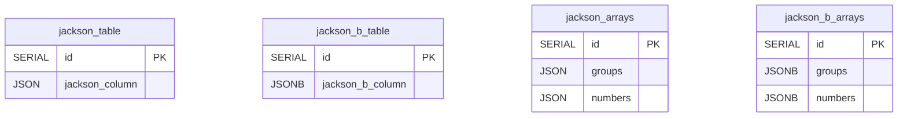
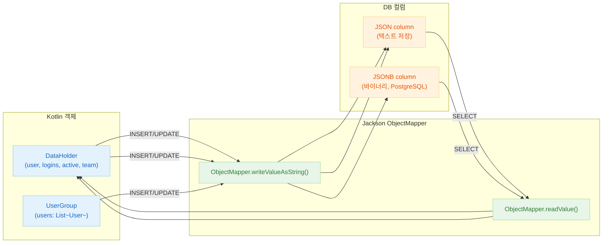

# 06 Advanced: exposed-jackson (08)

[English](./README.md) | 한국어

Jackson 기반으로 JSON 컬럼을 직렬화/역직렬화하는 모듈입니다. 기존 Jackson 생태계를 사용하는 프로젝트에 적합한 통합 예제를 제공합니다.

## 학습 목표

- Jackson ObjectMapper 기반 JSON 매핑을 익힌다.
- JSON 컬럼 CRUD 및 쿼리 패턴을 이해한다.
- 직렬화 설정 변화에 따른 호환성을 관리한다.

## 선수 지식

- [`../04-exposed-json/README.md`](../04-exposed-json/README.md)

## 테이블 구조



## Jackson 직렬화 흐름



## 핵심 개념

### Jackson ObjectMapper 설정

```kotlin
// 특정 설정이 적용된 ObjectMapper
val objectMapper = ObjectMapper()
    .registerModule(KotlinModule.Builder().build())
    .setSerializationInclusion(JsonInclude.Include.NON_NULL)
    .disable(DeserializationFeature.FAIL_ON_UNKNOWN_PROPERTIES)

data class DataHolder(
    val user: String,
    val logins: Int,
    val active: Boolean,
    val team: String?,
)

object JacksonTable : IntIdTable("jackson_table") {
    val name = varchar("name", 50)
    // Jackson으로 Kotlin 객체를 JSON으로 저장
    val data = json<DataHolder>("data", objectMapper).nullable()
}
```

생성된 DDL (PostgreSQL):

```sql
CREATE TABLE IF NOT EXISTS jackson_table (
    id    SERIAL PRIMARY KEY,
    name  VARCHAR(50) NOT NULL,
    data  JSON        NULL
)
```

### Jackson을 사용한 CRUD

```kotlin
withTables(testDB, JacksonTable) {
    // INSERT — Jackson 직렬화 자동 적용
    val id = JacksonTable.insertAndGetId {
        it[name] = "example"
        it[data] = DataHolder("Alice", 5, true, "Team A")
    }

    // SELECT는 역직렬화된 객체 반환
    val row = JacksonTable.selectAll().where { JacksonTable.id eq id }.single()
    val dataObject = row[JacksonTable.data]  // DataHolder 인스턴스
    println("User: ${dataObject?.user}, Logins: ${dataObject?.logins}")

    // UPDATE — 새 객체로 갱신
    JacksonTable.update({ JacksonTable.id eq id }) {
        it[data] = DataHolder("Bob", 10, false, "Team B")
    }
}
```

### DAO 패턴과 Jackson

```kotlin
class DataEntity(id: EntityID<Int>) : IntEntity(id) {
    companion object : IntEntityClass<DataEntity>(JacksonTable)
    var name by JacksonTable.name
    var data by JacksonTable.data
}

val entity = DataEntity.new {
    name = "test"
    data = DataHolder("Charlie", 3, true, null)
}
println("Entity data: ${entity.data}")
```

### JSON 쿼리 — extract (PostgreSQL)

```kotlin
// JSON 필드를 추출해 필터링
JacksonTable.selectAll()
    .where { JacksonTable.data.extract<String>("$.user") eq "Alice" }
```

## 고급 시나리오

- **커스텀 직렬화기**: 특수 타입(LocalDateTime, UUID 등)을 위한 모듈 등록
- **버전 호환성**: Jackson 버전 업그레이드 시 직렬화 포맷 검증
- **성능**: 대량 배치 작업 시 JSON 파싱 오버헤드 모니터링
- **Null 처리**: FAIL_ON_UNKNOWN_PROPERTIES와 포함 정책 올바르게 설정

## 실행 방법

```bash
./gradlew :08-exposed-jackson:test
```

## 실습 체크리스트

- 날짜/enum/nullable 필드 직렬화 동작을 검증한다.
- ObjectMapper 옵션 변경 시 회귀 테스트를 추가한다.

## 성능·안정성 체크포인트

- 과도한 폴리모픽 설정은 보안/성능 리스크가 있음
- 직렬화 포맷 계약을 API/저장소에서 일관되게 유지

## 다음 모듈

- [`../09-exposed-fastjson2/README.md`](../09-exposed-fastjson2/README.md)
