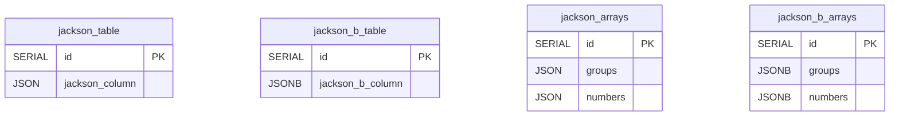
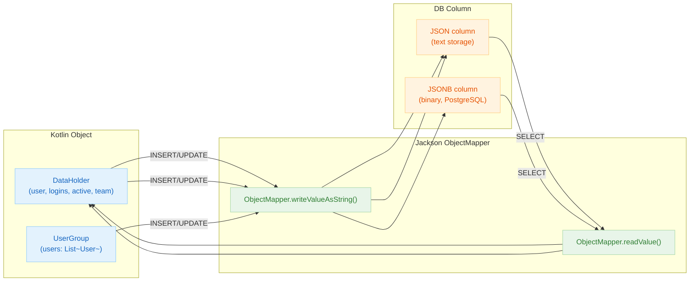

# 06 Advanced: exposed-jackson (08)

English | [한국어](./README.ko.md)

A module for serializing and deserializing JSON columns using Jackson. Provides integration examples suited for projects already using the Jackson ecosystem.

## Learning Objectives

- Learn JSON mapping based on the Jackson ObjectMapper.
- Understand JSON column CRUD and query patterns.
- Manage compatibility when serialization settings change.

## Prerequisites

- [`../04-exposed-json/README.md`](../04-exposed-json/README.md)

## Table Structure



## Jackson Serialization Flow



## Key Concepts

### Jackson ObjectMapper Configuration

```kotlin
// Custom ObjectMapper with specific configuration
val objectMapper = ObjectMapper()
    .registerModule(KotlinModule.Builder().build())
    .setSerializationInclusion(JsonInclude.Include.NON_NULL)
    .disable(DeserializationFeature.FAIL_ON_UNKNOWN_PROPERTIES)

@Serializable
data class DataHolder(
    val user: String,
    val logins: Int,
    val active: Boolean,
    val team: String?,
)

object JacksonTable : IntIdTable("jackson_table") {
    val name = varchar("name", 50)
    // Store Kotlin object as JSON using Jackson
    val data = json<DataHolder>("data", objectMapper).nullable()
}
```

Generated DDL (PostgreSQL):

```sql
CREATE TABLE IF NOT EXISTS jackson_table (
    id    SERIAL PRIMARY KEY,
    name  VARCHAR(50) NOT NULL,
    data  JSON        NULL
)
```

### CRUD Operations with Jackson

```kotlin
withTables(testDB, JacksonTable) {
    // INSERT with Jackson serialization
    val id = JacksonTable.insertAndGetId {
        it[name] = "example"
        it[data] = DataHolder("Alice", 5, true, "Team A")
    }

    // SELECT returns deserialized object
    val row = JacksonTable.selectAll().where { JacksonTable.id eq id }.single()
    val dataObject = row[JacksonTable.data]  // DataHolder instance
    println("User: ${dataObject?.user}, Logins: ${dataObject?.logins}")

    // UPDATE with new object
    JacksonTable.update({ JacksonTable.id eq id }) {
        it[data] = DataHolder("Bob", 10, false, "Team B")
    }
}
```

### DAO Pattern with Jackson

```kotlin
class DataEntity(id: EntityID<Int>) : IntEntity(id) {
    companion object : IntEntityClass<DataEntity>(JacksonTable)
    var name by JacksonTable.name
    var data by JacksonTable.data
}

val entity = DataEntity.new {
    name = "test"
    data = DataHolder("Charlie", 3, true, null)
}
println("Entity data: ${entity.data}")
```

### JSON Query with extract (PostgreSQL)

```kotlin
// Extract specific JSON field for filtering
JacksonTable.selectAll()
    .where { JacksonTable.data.extract<String>("$.user") eq "Alice" }
```

## Advanced Scenarios

- **Custom Serializers**: Register additional modules for special types (LocalDateTime, UUID, etc.)
- **Version Compatibility**: Test serialization format when upgrading Jackson versions
- **Performance**: Monitor JSON parsing overhead during large batch operations
- **Null Handling**: Properly configure FAIL_ON_UNKNOWN_PROPERTIES and inclusion policies

## Running Tests

```bash
./gradlew :08-exposed-jackson:test
```

## Practice Checklist

- Verify serialization behavior for date/enum/nullable fields.
- Add regression tests when ObjectMapper options change.

## Performance and Stability Checkpoints

- Excessive polymorphic configuration poses security and performance risks.
- Maintain the serialization format contract consistently across API and storage layers.

## Next Module

- [`../09-exposed-fastjson2/README.md`](../09-exposed-fastjson2/README.md)
