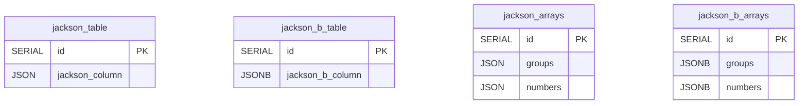
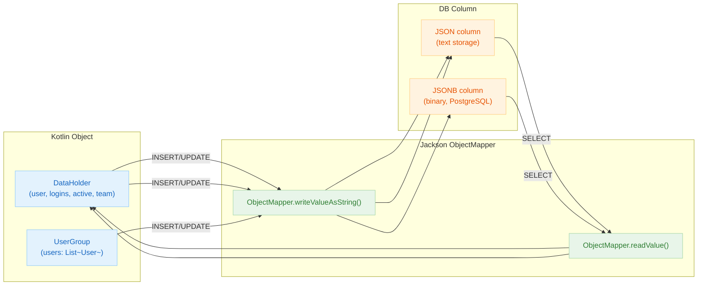

# 06 Advanced: exposed-jackson (08)

English | [한국어](./README.ko.md)

A module for serializing and deserializing JSON columns using Jackson. Provides integration examples suited for projects already using the Jackson ecosystem.

## Learning Objectives

- Learn JSON mapping based on the Jackson ObjectMapper.
- Understand JSON column CRUD and query patterns.
- Manage compatibility when serialization settings change.

## Prerequisites

- [`../04-exposed-json/README.md`](../04-exposed-json/README.md)

## Table Structure



## Jackson Serialization Flow



## Key Concepts

- ObjectMapper configuration
- JSON column mapping
- Version compatibility

## Running Tests

```bash
./gradlew :08-exposed-jackson:test
```

## Practice Checklist

- Verify serialization behavior for date/enum/nullable fields.
- Add regression tests when ObjectMapper options change.

## Performance and Stability Checkpoints

- Excessive polymorphic configuration poses security and performance risks.
- Maintain the serialization format contract consistently across API and storage layers.

## Next Module

- [`../09-exposed-fastjson2/README.md`](../09-exposed-fastjson2/README.md)
