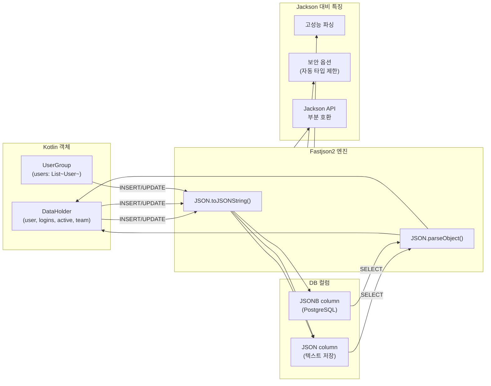

# 06 Advanced: exposed-fastjson2 (09)

Fastjson2 기반 JSON 컬럼 처리를 다루는 모듈입니다. Jackson 대안 직렬화 스택이 필요한 환경에서의 통합 패턴을 제공합니다.

## 학습 목표

- Fastjson2 기반 JSON 매핑을 익힌다.
- 기존 JSON 모듈 대비 차이점을 이해한다.
- 직렬화 설정/보안 옵션을 검증한다.

## 선수 지식

- [`../04-exposed-json/README.md`](../04-exposed-json/README.md)

## Fastjson2 처리 흐름



## 핵심 개념

- Fastjson2 직렬화/역직렬화
- JSON 컬럼 매핑
- 라이브러리별 호환성

## 실행 방법

```bash
./gradlew :09-exposed-fastjson2:test
```

## 실습 체크리스트

- 동일 데이터의 Jackson/Fastjson2 직렬화 결과를 비교한다.
- 보안 관련 옵션(자동 타입 등)을 점검한다.

## 성능·안정성 체크포인트

- 직렬화 라이브러리 변경 시 데이터 호환성 테스트 필수
- 외부 입력 JSON 파싱 경로의 보안 정책을 강화

## 다음 모듈

- [`../10-exposed-jasypt/README.md`](../10-exposed-jasypt/README.md)
