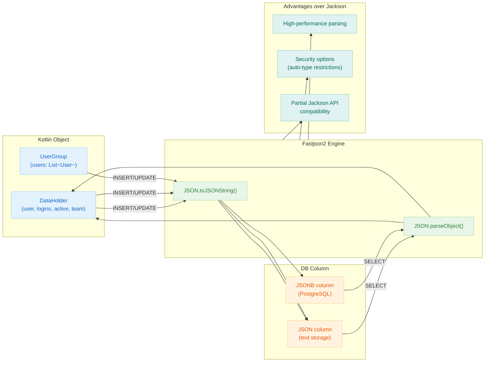

# 06 Advanced: exposed-fastjson2 (09)

English | [한국어](./README.ko.md)

A module for handling JSON columns using Fastjson2. Provides integration patterns for environments that require an alternative serialization stack to Jackson.

## Learning Objectives

- Learn JSON mapping based on Fastjson2.
- Understand the differences compared to existing JSON modules.
- Validate serialization configuration and security options.

## Prerequisites

- [`../04-exposed-json/README.md`](../04-exposed-json/README.md)

## Fastjson2 Processing Flow



## Key Concepts

### Fastjson2 Configuration and JSON Column

```kotlin
@Data
data class DataHolder(
    val user: String,
    val logins: Int,
    val active: Boolean,
    val team: String?,
)

object Fastjson2Table : IntIdTable("fastjson2_table") {
    val name = varchar("name", 50)
    // Fastjson2 serialization for JSON columns
    val data = json<DataHolder>("data", JsonFormat.DefaultJsonFormat).nullable()
}
```

Generated DDL (PostgreSQL):

```sql
CREATE TABLE IF NOT EXISTS fastjson2_table (
    id    SERIAL PRIMARY KEY,
    name  VARCHAR(50) NOT NULL,
    data  JSON        NULL
)
```

### CRUD Operations with Fastjson2

```kotlin
withTables(testDB, Fastjson2Table) {
    // INSERT — automatic Fastjson2 serialization
    val id = Fastjson2Table.insertAndGetId {
        it[name] = "example"
        it[data] = DataHolder("Alice", 5, true, "Team A")
    }

    // SELECT returns deserialized object
    val row = Fastjson2Table.selectAll().where { Fastjson2Table.id eq id }.single()
    val dataObject = row[Fastjson2Table.data]  // DataHolder instance
    println("User: ${dataObject?.user}, Logins: ${dataObject?.logins}")

    // UPDATE with new object
    Fastjson2Table.update({ Fastjson2Table.id eq id }) {
        it[data] = DataHolder("Bob", 10, false, "Team B")
    }
}
```

### DAO Pattern with Fastjson2

```kotlin
class DataEntity(id: EntityID<Int>) : IntEntity(id) {
    companion object : IntEntityClass<DataEntity>(Fastjson2Table)
    var name by Fastjson2Table.name
    var data by Fastjson2Table.data
}

val entity = DataEntity.new {
    name = "test"
    data = DataHolder("Charlie", 3, true, null)
}
println("Entity data: ${entity.data}")
```

### Comparing Jackson and Fastjson2 Output

```kotlin
// Compare serialization for the same object
val obj = DataHolder("test", 1, true, "team")

// Jackson output (with ObjectMapper)
val jacksonOutput = jacksonObjectMapper.writeValueAsString(obj)

// Fastjson2 output
val fastjsonOutput = JSON.toJSONString(obj)

println("Jackson: $jacksonOutput")
println("Fastjson2: $fastjsonOutput")
// Note: Differences in field ordering, null handling, may appear
```

## Advanced Scenarios

- **Security Configuration**: Review auto-type restrictions and JSON parsing options
- **Performance Comparison**: Benchmark Fastjson2 vs Jackson for large objects
- **Data Format Compatibility**: Ensure serialized format is compatible with Jackson when migrating
- **Custom Type Handling**: Register custom serializers for domain-specific types

## Running Tests

```bash
./gradlew :09-exposed-fastjson2:test
```

## Practice Checklist

- Compare Jackson and Fastjson2 serialization output for the same data.
- Review security-related options (e.g., auto-type).

## Performance and Stability Checkpoints

- Data compatibility testing is mandatory when changing serialization libraries.
- Strengthen the security policy for external JSON input parsing paths.

## Next Module

- [`../10-exposed-jasypt/README.md`](../10-exposed-jasypt/README.md)
