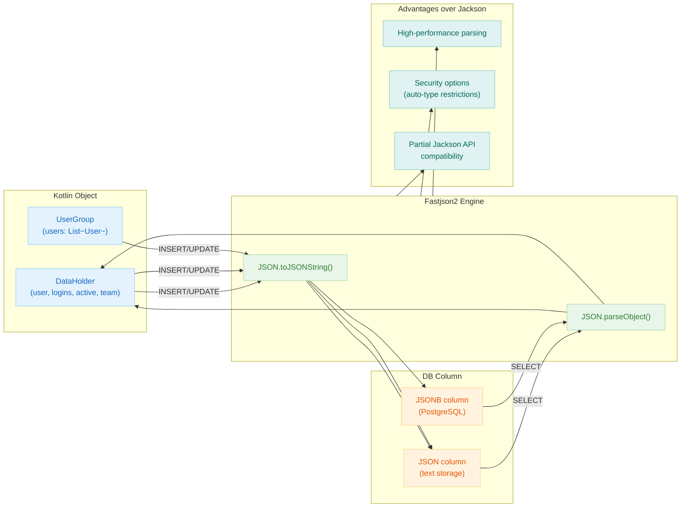

# 06 Advanced: exposed-fastjson2 (09)

English | [한국어](./README.ko.md)

A module for handling JSON columns using Fastjson2. Provides integration patterns for environments that require an alternative serialization stack to Jackson.

## Learning Objectives

- Learn JSON mapping based on Fastjson2.
- Understand the differences compared to existing JSON modules.
- Validate serialization configuration and security options.

## Prerequisites

- [`../04-exposed-json/README.md`](../04-exposed-json/README.md)

## Fastjson2 Processing Flow



## Key Concepts

- Fastjson2 serialization/deserialization
- JSON column mapping
- Per-library compatibility

## Running Tests

```bash
./gradlew :09-exposed-fastjson2:test
```

## Practice Checklist

- Compare Jackson and Fastjson2 serialization output for the same data.
- Review security-related options (e.g., auto-type).

## Performance and Stability Checkpoints

- Data compatibility testing is mandatory when changing serialization libraries.
- Strengthen the security policy for external JSON input parsing paths.

## Next Module

- [`../10-exposed-jasypt/README.md`](../10-exposed-jasypt/README.md)
