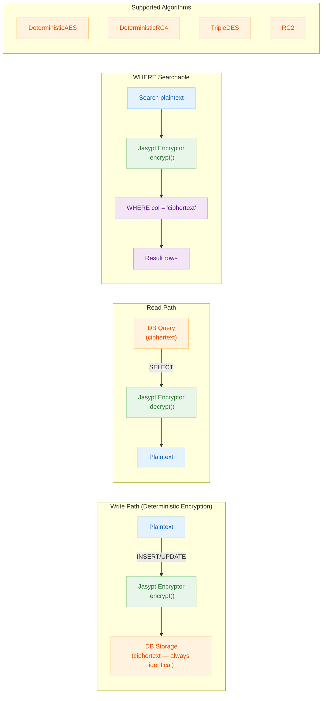

# 06 Advanced: exposed-jasypt (10)

English | [한국어](./README.ko.md)

> **⚠️ Deprecated**: This module is deprecated. For new development, use [`bluetape4k-exposed-tink`](../12-exposed-tink/README.md) instead.

A module covering deterministic encryption columns using Jasypt. Learn to balance security and queryability in domains that require searchable encryption.

## Learning Objectives

- Understand how deterministic encryption columns work.
- Learn to design encryption fields that support `WHERE` clause searches.
- Understand the security trade-offs compared to standard encryption.

## Prerequisites

- [`../01-exposed-crypt/README.md`](../01-exposed-crypt/README.md)

## Jasypt Encryption Processing Flow



## Key Concepts

- Deterministic encryption
- Searchable encrypted columns
- Key/salt management strategy

## Running Tests

```bash
./gradlew :10-exposed-jasypt:test
```

## Practice Checklist

- Verify that identical plaintext input always produces the same ciphertext.
- Validate that search conditions work correctly on encrypted fields.

## Performance and Stability Checkpoints

- Deterministic encryption risks pattern exposure, so apply only where necessary.
- Prepare a key rotation plan and data re-encryption strategy.

## Next Module

- [`../11-exposed-jackson3/README.md`](../11-exposed-jackson3/README.md)
