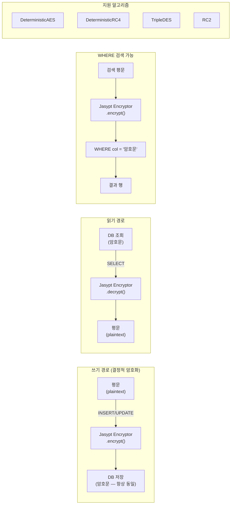

# 06 Advanced: exposed-jasypt (10)

> **⚠️ Deprecated**: 이 모듈은 deprecated 되었습니다. 신규 개발에서는 [`bluetape4k-exposed-tink`](../12-exposed-tink/README.md)를 사용하세요.

Jasypt 기반 결정적 암호화 컬럼을 다루는 모듈입니다. 검색 가능한 암호화가 필요한 도메인에서 보안과 조회 가능성의 균형을 학습합니다.

## 학습 목표

- 결정적 암호화 컬럼의 동작을 이해한다.
- `WHERE` 검색 가능한 암호화 필드 설계를 익힌다.
- 일반 암호화 대비 보안 트레이드오프를 이해한다.

## 선수 지식

- [`../01-exposed-crypt/README.md`](../01-exposed-crypt/README.md)

## Jasypt 암호화 처리 흐름



## 핵심 개념

- 결정적 암호화
- 검색 가능 암호화 컬럼
- 키/솔트 관리 전략

## 실행 방법

```bash
./gradlew :10-exposed-jasypt:test
```

## 실습 체크리스트

- 동일 평문 입력 시 암호문 동일성 여부를 확인한다.
- 검색 조건이 암호화 필드에서 정상 동작하는지 검증한다.

## 성능·안정성 체크포인트

- 결정적 암호화는 패턴 노출 리스크가 있으므로 최소 적용
- 키 회전 계획과 데이터 재암호화 전략을 준비

## 다음 모듈

- [`../11-exposed-jackson3/README.md`](../11-exposed-jackson3/README.md)
