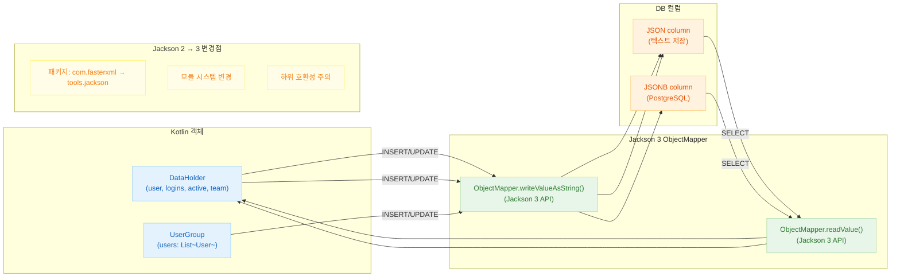

# 06 Advanced: exposed-jackson3 (11)

[English](./README.md) | 한국어

Jackson 3 기반 JSON 컬럼 연동 모듈입니다. Jackson 2에서 3으로 이행할 때 필요한 직렬화 호환성 검증 포인트를 다룹니다.

## 학습 목표

- Jackson 3 기반 매핑 패턴을 익힌다.
- Jackson 2 대비 변경점의 영향을 파악한다.
- JSON 저장 포맷 호환성을 테스트로 검증한다.

## 선수 지식

- [`../08-exposed-jackson/README.md`](../08-exposed-jackson/README.md)

## Jackson3 처리 흐름



## 핵심 개념

### Jackson 3 ObjectMapper 구성

```kotlin
// Kotlin 모듈이 포함된 Jackson 3
val jacksonObjectMapper = ObjectMapper()
    .registerModule(KotlinModule.Builder().build())
    .setSerializationInclusion(JsonInclude.Include.NON_NULL)
    .disable(DeserializationFeature.FAIL_ON_UNKNOWN_PROPERTIES)

data class DataHolder(
    val user: String,
    val logins: Int,
    val active: Boolean,
    val team: String?,
)

object Jackson3Table : IntIdTable("jackson3_table") {
    val name = varchar("name", 50)
    // Jackson 3 ObjectMapper로 Kotlin 객체 저장
    val data = json<DataHolder>("data", jacksonObjectMapper).nullable()
}
```

### Jackson 3로 CRUD

```kotlin
withTables(testDB, Jackson3Table) {
    // INSERT — Jackson 3 직렬화
    val id = Jackson3Table.insertAndGetId {
        it[name] = "example"
        it[data] = DataHolder("Alice", 5, true, "Team A")
    }

    // SELECT — Jackson 3 역직렬화
    val row = Jackson3Table.selectAll().where { Jackson3Table.id eq id }.single()
    val dataObject = row[Jackson3Table.data]  // DataHolder 인스턴스
    println("User: ${dataObject?.user}")

    // UPDATE
    Jackson3Table.update({ Jackson3Table.id eq id }) {
        it[data] = DataHolder("Bob", 10, false, "Team B")
    }
}
```

### Jackson 2 → 3 호환성 테스트

```kotlin
// Jackson 2 와 3이 호환 가능한 JSON을 생성하는지 검증
val jackson2ObjectMapper = ObjectMapper().registerModule(KotlinModule.Builder().build())
val jackson3ObjectMapper = ObjectMapper().registerModule(KotlinModule.Builder().build())

val testData = DataHolder("test", 1, true, "team")

// 직렬화 결과 비교
val j2Output = jackson2ObjectMapper.writeValueAsString(testData)
val j3Output = jackson3ObjectMapper.writeValueAsString(testData)

// Jackson 2 출력을 Jackson 3로 역직렬화 및 역
val readViaJ3 = jackson3ObjectMapper.readValue<DataHolder>(j2Output)
val readViaJ2 = jackson2ObjectMapper.readValue<DataHolder>(j3Output)

println("교차 버전 호환성: $readViaJ3 == $testData")
```

### DAO 패턴과 Jackson 3

```kotlin
class DataEntity(id: EntityID<Int>) : IntEntity(id) {
    companion object : IntEntityClass<DataEntity>(Jackson3Table)
    var name by Jackson3Table.name
    var data by Jackson3Table.data
}

val entity = DataEntity.new {
    name = "test"
    data = DataHolder("Charlie", 3, true, null)
}
```

## 고급 시나리오

- **패키지 마이그레이션**: `com.fasterxml.jackson` → `tools.jackson` 임포트 갱신
- **모듈 시스템 변경**: Java 모듈 시스템 적용 시 동작 검증
- **직렬화 포맷**: 버전 업그레이드 시 JSON 출력 포맷 호환성 확인
- **회귀 테스트**: 버전 간 날짜/enum 직렬화 차이 고정

## 실행 방법

```bash
./gradlew :11-exposed-jackson3:test
```

## 실습 체크리스트

- Jackson 2/3 직렬화 결과 호환 여부를 비교한다.
- 마이그레이션 시 실패 케이스를 테스트로 고정한다.

## 성능·안정성 체크포인트

- 라이브러리 메이저 업그레이드 시 데이터 계약 테스트 필수
- 직렬화 설정을 중앙화해 모듈 간 일관성 유지

## 다음 챕터

- [`../../07-jpa/README.md`](../../07-jpa/README.md)
