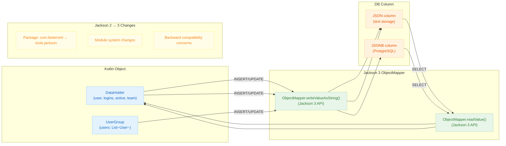

# 06 Advanced: exposed-jackson3 (11)

English | [한국어](./README.ko.md)

A module for integrating JSON columns using Jackson 3. Covers the serialization compatibility verification points needed when migrating from Jackson 2 to Jackson 3.

## Learning Objectives

- Learn Jackson 3-based mapping patterns.
- Understand the impact of breaking changes compared to Jackson 2.
- Verify JSON storage format compatibility through tests.

## Prerequisites

- [`../08-exposed-jackson/README.md`](../08-exposed-jackson/README.md)

## Jackson 3 Processing Flow



## Key Concepts

- Jackson 3 ObjectMapper configuration
- JSON column serialization contract
- Migration regression testing

## Running Tests

```bash
./gradlew :11-exposed-jackson3:test
```

## Practice Checklist

- Compare Jackson 2 and Jackson 3 serialization output for compatibility.
- Pin failing migration cases as regression tests.

## Performance and Stability Checkpoints

- Data contract testing is mandatory on major library upgrades.
- Centralize serialization configuration to maintain consistency across modules.

## Next Chapter

- [`../../07-jpa/README.md`](../../07-jpa/README.md)
