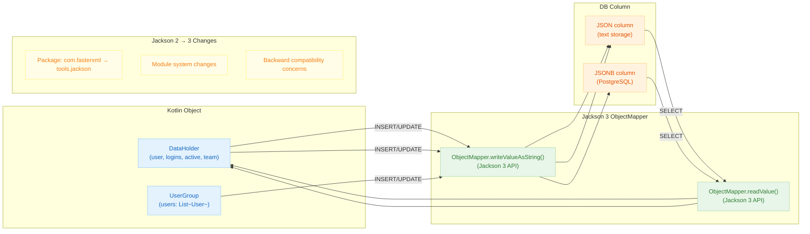

# 06 Advanced: exposed-jackson3 (11)

English | [한국어](./README.ko.md)

A module for integrating JSON columns using Jackson 3. Covers the serialization compatibility verification points needed when migrating from Jackson 2 to Jackson 3.

## Learning Objectives

- Learn Jackson 3-based mapping patterns.
- Understand the impact of breaking changes compared to Jackson 2.
- Verify JSON storage format compatibility through tests.

## Prerequisites

- [`../08-exposed-jackson/README.md`](../08-exposed-jackson/README.md)

## Jackson 3 Processing Flow



## Key Concepts

### Jackson 3 ObjectMapper Configuration

```kotlin
// Jackson 3 with Kotlin module
val jacksonObjectMapper = ObjectMapper()
    .registerModule(KotlinModule.Builder().build())
    .setSerializationInclusion(JsonInclude.Include.NON_NULL)
    .disable(DeserializationFeature.FAIL_ON_UNKNOWN_PROPERTIES)

@Serializable
data class DataHolder(
    val user: String,
    val logins: Int,
    val active: Boolean,
    val team: String?,
)

object Jackson3Table : IntIdTable("jackson3_table") {
    val name = varchar("name", 50)
    // Store Kotlin object using Jackson 3 ObjectMapper
    val data = json<DataHolder>("data", jacksonObjectMapper).nullable()
}
```

### CRUD with Jackson 3

```kotlin
withTables(testDB, Jackson3Table) {
    // INSERT — Jackson 3 serialization
    val id = Jackson3Table.insertAndGetId {
        it[name] = "example"
        it[data] = DataHolder("Alice", 5, true, "Team A")
    }

    // SELECT — Jackson 3 deserialization
    val row = Jackson3Table.selectAll().where { Jackson3Table.id eq id }.single()
    val dataObject = row[Jackson3Table.data]  // DataHolder instance
    println("User: ${dataObject?.user}")

    // UPDATE
    Jackson3Table.update({ Jackson3Table.id eq id }) {
        it[data] = DataHolder("Bob", 10, false, "Team B")
    }
}
```

### Jackson 2 → 3 Compatibility Testing

```kotlin
// Test that Jackson 2 and Jackson 3 produce compatible JSON
val jackson2ObjectMapper = ObjectMapper().registerModule(KotlinModule.Builder().build())
val jackson3ObjectMapper = ObjectMapper().registerModule(KotlinModule.Builder().build())

val testData = DataHolder("test", 1, true, "team")

// Compare serialization output
val j2Output = jackson2ObjectMapper.writeValueAsString(testData)
val j3Output = jackson3ObjectMapper.writeValueAsString(testData)

// Deserialize Jackson 2 output with Jackson 3 and vice versa
val readViaJ3 = jackson3ObjectMapper.readValue<DataHolder>(j2Output)
val readViaJ2 = jackson2ObjectMapper.readValue<DataHolder>(j3Output)

println("Cross-version compatibility: $readViaJ3 == $testData")
```

### DAO Pattern with Jackson 3

```kotlin
class DataEntity(id: EntityID<Int>) : IntEntity(id) {
    companion object : IntEntityClass<DataEntity>(Jackson3Table)
    var name by Jackson3Table.name
    var data by Jackson3Table.data
}

val entity = DataEntity.new {
    name = "test"
    data = DataHolder("Charlie", 3, true, null)
}
```

## Advanced Scenarios

- **Package Migration**: Ensure `com.fasterxml.jackson` → `tools.jackson` imports are updated
- **Module System Changes**: Test behavior under Java module system if applicable
- **Serialization Format**: Verify JSON output format compatibility when upgrading versions
- **Regression Tests**: Pin any differences in date/enum serialization between versions

## Running Tests

```bash
./gradlew :11-exposed-jackson3:test
```

## Practice Checklist

- Compare Jackson 2 and Jackson 3 serialization output for compatibility.
- Pin failing migration cases as regression tests.

## Performance and Stability Checkpoints

- Data contract testing is mandatory on major library upgrades.
- Centralize serialization configuration to maintain consistency across modules.

## Next Chapter

- [`../../07-jpa/README.md`](../../07-jpa/README.md)
