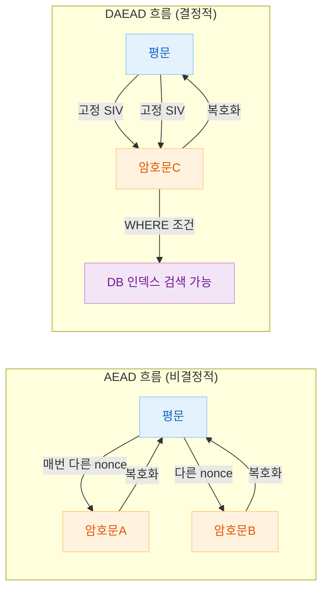
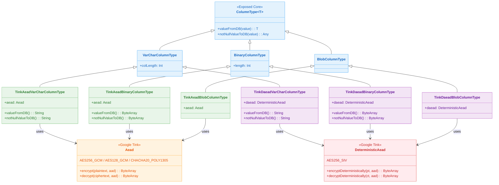

# 06 Advanced: exposed-tink (12)

[English](./README.md) | 한국어

Google Tink 라이브러리를 활용하여 Exposed 컬럼 데이터를 투명하게 암호화/복호화하는 모듈입니다. AEAD(비결정적)와 DAEAD(결정적) 두 가지 암호화 방식을 지원하며, DAEAD 컬럼은 암호화된 상태에서도 WHERE 절 검색이 가능합니다.

## 개요

`bluetape4k-exposed-tink`가 제공하는 확장 함수로 컬럼을 선언하면, INSERT 시 자동 암호화, SELECT 시 자동 복호화가 이루어집니다. Google Tink의 표준 AEAD 인터페이스를 기반으로 하여 무결성 검증(인증 태그)도 함께 수행합니다.

## 학습 목표

- Google Tink의 AEAD와 DAEAD 차이를 이해한다.
- `bluetape4k-exposed-tink` 확장 함수로 암호화 컬럼을 선언한다.
- DSL/DAO 양쪽에서 암호화 컬럼을 사용한다.
- DAEAD 컬럼으로 암호화된 상태에서 WHERE 절 검색을 수행한다.

## 선수 지식

- [`../01-exposed-crypt/README.md`](../01-exposed-crypt/README.md)

## AEAD vs DAEAD 비교

| 항목       | AEAD                                            | DAEAD                   |
|----------|-------------------------------------------------|-------------------------|
| 암호화 방식   | 비결정적 — 같은 평문도 매번 다른 암호문                         | 결정적 — 같은 평문은 항상 같은 암호문  |
| WHERE 검색 | 불가능                                             | 가능 (내부적으로 평문을 암호화하여 비교) |
| 무결성 검증   | 있음 (GCM 인증 태그)                                  | 있음 (SIV 인증)             |
| 권장 알고리즘  | `AES256_GCM`, `AES128_GCM`, `CHACHA20_POLY1305` | `AES256_SIV`            |
| 주요 용도    | 패스워드, 주민번호 등 검색 불필요 개인정보                        | 이메일, 전화번호 등 검색 필요 필드    |
| 인덱스 활용   | 불가                                              | 가능 (동일 암호문으로 인덱스 스캔)    |

## 암호화 흐름



## Tink 암호화 계층 구조



## 제공 컬럼 확장 함수

### AEAD 컬럼

| 함수                                            | 컬럼 타입     | 설명                 |
|-----------------------------------------------|-----------|--------------------|
| `tinkAeadVarChar(name, length, keyTemplate?)` | `VARCHAR` | 문자열 AEAD 암호화 컬럼    |
| `tinkAeadBinary(name, length, keyTemplate?)`  | `BINARY`  | 바이트 배열 AEAD 암호화 컬럼 |
| `tinkAeadBlob(name, keyTemplate?)`            | `BLOB`    | BLOB AEAD 암호화 컬럼   |

### DAEAD 컬럼 (검색 가능)

| 함수                                             | 컬럼 타입     | 설명                             |
|------------------------------------------------|-----------|--------------------------------|
| `tinkDaeadVarChar(name, length, keyTemplate?)` | `VARCHAR` | 문자열 DAEAD 암호화 컬럼 (WHERE 검색 가능) |
| `tinkDaeadBinary(name, length, keyTemplate?)`  | `BINARY`  | 바이트 배열 DAEAD 암호화 컬럼 (검색 가능)    |
| `tinkDaeadBlob(name, keyTemplate?)`            | `BLOB`    | BLOB DAEAD 암호화 컬럼 (검색 가능)      |

> `keyTemplate` 파라미터를 생략하면 각 방식의 기본 알고리즘(`AES256_GCM` / `AES256_SIV`)이 사용됩니다.

## 지원 알고리즘

### AEAD 알고리즘

| 상수                            | 설명                    |
|-------------------------------|-----------------------|
| `TinkAeads.AES256_GCM`        | 256비트 AES-GCM (기본 권장) |
| `TinkAeads.AES128_GCM`        | 128비트 AES-GCM         |
| `TinkAeads.CHACHA20_POLY1305` | ChaCha20-Poly1305     |

### DAEAD 알고리즘

| 상수                      | 설명                             |
|-------------------------|--------------------------------|
| `TinkDaeads.AES256_SIV` | AES-SIV (Synthetic IV) 결정적 암호화 |

## 핵심 개념

### AEAD 컬럼 정의 및 CRUD (DSL)

```kotlin
val secretTable = object: IntIdTable("tink_aead_table") {
    val secret = tinkAeadVarChar("secret", 512, TinkAeads.AES256_GCM).nullable()
    val data = tinkAeadBinary("data", 512, TinkAeads.AES256_GCM).nullable()
    val blob = tinkAeadBlob("blob", TinkAeads.AES256_GCM).nullable()
}

withTables(testDB, secretTable) {
    // INSERT — 자동 암호화
    val id = secretTable.insertAndGetId {
        it[secret] = "민감한 문자열"
        it[data] = "바이트 데이터".toUtf8Bytes()
        it[blob] = "BLOB 데이터".toUtf8Bytes()
    }

    // SELECT — 자동 복호화
    val row = secretTable.selectAll().where { secretTable.id eq id }.single()
    row[secretTable.secret]  // "민감한 문자열"
}
```

### DAEAD 컬럼 — WHERE 절 검색

```kotlin
val searchableTable = object: IntIdTable("tink_daead_table") {
    // .index() 추가 — 동일 암호문으로 인덱스 스캔 가능
    val email = tinkDaeadVarChar("email", 512, TinkDaeads.AES256_SIV).nullable().index()
}

withTables(testDB, searchableTable) {
    searchableTable.insertAndGetId {
        it[email] = "user@example.com"   // 결정적 암호화로 저장
    }

    // WHERE 검색 — 내부적으로 "user@example.com"을 암호화하여 비교
    val count = searchableTable.selectAll()
        .where { searchableTable.email eq "user@example.com" }
        .count()
    // count == 1L
}
```

### UPDATE

```kotlin
secretTable.update({ secretTable.id eq id }) {
    it[secret] = "변경된 문자열"   // 자동 암호화
    it[data] = "변경된 데이터".toUtf8Bytes()
}
```

### Nullable 컬럼

```kotlin
val id = nullableTable.insertAndGetId {
    it[aeadSecret] = null   // null 저장 가능
    it[daeadSecret] = null
}
// null 값도 정상 저장/조회
```

### 다양한 알고리즘 사용

```kotlin
val multiAlgoTable = object: IntIdTable("tink_multi_algo_table") {
    val aes256 = tinkAeadVarChar("aes256", 512, TinkAeads.AES256_GCM)
    val aes128 = tinkAeadVarChar("aes128", 512, TinkAeads.AES128_GCM)
    val chacha20 = tinkAeadVarChar("chacha20", 512, TinkAeads.CHACHA20_POLY1305)
}
```

### DAO 방식

```kotlin
object T1: IntIdTable() {
    val secret = tinkDaeadVarChar("secret", 255, TinkDaeads.AES256_SIV).index()
    val data = tinkDaeadBinary("data", 512, TinkDaeads.AES256_SIV)
}

class E1(id: EntityID<Int>): IntEntity(id) {
    companion object: IntEntityClass<E1>(T1)
    var secret by T1.secret
    var data by T1.data
}

// 저장 — 자동 암호화
val entity = E1.new {
    secret = "홍길동"
    data = "서울시 강남구".toUtf8Bytes()
}

// 조회 — 자동 복호화
val saved = E1.findById(entity.id)!!
println(saved.secret)  // "홍길동"

// DAEAD DAO 검색
E1.find { T1.secret eq "홍길동" }.single()
```

## Jasypt vs Google Tink 비교

| 항목       | Jasypt (`10-exposed-jasypt`) | Google Tink (`12-exposed-tink`)     |
|----------|------------------------------|-------------------------------------|
| 암호화 방식   | 대칭 키 (PBE 기반)                | AEAD / DAEAD                        |
| 결정적 암호화  | 기본 동작 (항상 같은 암호문)            | DAEAD 방식으로 선택 가능                    |
| WHERE 검색 | 가능                           | DAEAD 컬럼만 가능                        |
| 무결성 검증   | 없음                           | 있음 (GCM 인증 태그)                      |
| 표준화      | Java 생태계                     | Google 오픈소스 암호화 표준                  |
| 알고리즘 다양성 | PBE (PBKDF2, bcrypt 등)       | AES-GCM, AES-SIV, ChaCha20-Poly1305 |

## 테스트 파일

| 파일                         | 설명                                   |
|----------------------------|--------------------------------------|
| `TinkColumnTypeTest.kt`    | DSL 방식 AEAD/DAEAD 컬럼 CRUD 및 WHERE 검색 |
| `TinkColumnTypeDaoTest.kt` | DAO 방식 DAEAD 컬럼 저장/조회/검색             |

## 테스트 실행 방법

```bash
# 전체 테스트
./gradlew :06-advanced:12-exposed-tink:test

# H2만 대상으로 빠른 테스트
./gradlew :06-advanced:12-exposed-tink:test -PuseFastDB=true

# 특정 테스트 클래스만 실행
./gradlew :06-advanced:12-exposed-tink:test \
    --tests "exposed.examples.tink.TinkColumnTypeTest"
```

## 알려진 제약 사항

- **컬럼 길이는 반드시 0보다 커야 합니다.** `tinkAeadVarChar("col", 0)` 등은 `IllegalArgumentException`을 발생시킵니다.
- **AEAD 컬럼은 WHERE 절 검색이 불가능합니다.** 같은 평문도 암호화할 때마다 다른 값이 생성되기 때문입니다.
- **DAO 이중 복호화 버그 (Exposed 1.1.0, 1.1.1)
  **: DAO 방식으로 Binary 컬럼을 WHERE 조건으로 조회할 때 복호화가 이중으로 호출되는 버그가 있습니다. DSL 방식으로 우회하세요.

## 다음 단계

- [07-jpa](../../07-jpa/README.md): JPA 코드를 Exposed로 마이그레이션하는 실전 패턴을 학습합니다.
