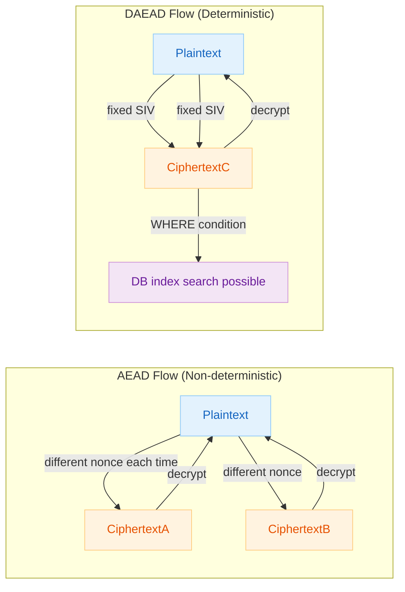
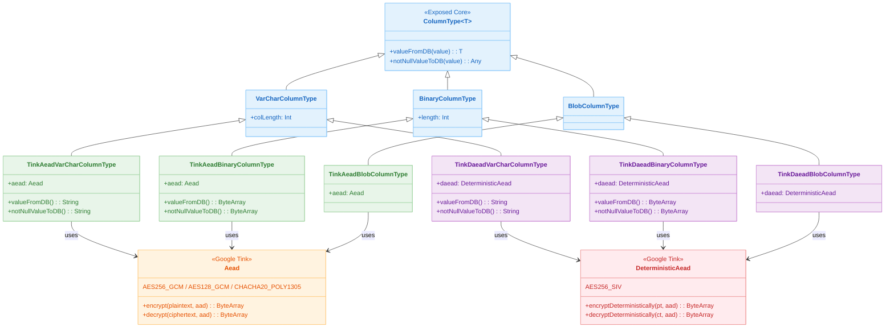

# 06 Advanced: exposed-tink (12)

English | [한국어](./README.ko.md)

A module that uses the Google Tink library to transparently encrypt and decrypt Exposed column data. Supports two encryption modes — AEAD (non-deterministic) and DAEAD (deterministic) — with DAEAD columns supporting WHERE clause searches even in the encrypted state.

## Overview

Declaring a column with extension functions provided by `bluetape4k-exposed-tink` enables automatic encryption on INSERT and automatic decryption on SELECT. Built on Google Tink's standard AEAD interface, it also performs integrity verification via authentication tags.

## Learning Objectives

- Understand the difference between AEAD and DAEAD in Google Tink.
- Declare encrypted columns using `bluetape4k-exposed-tink` extension functions.
- Use encrypted columns in both DSL and DAO styles.
- Perform WHERE clause searches on DAEAD columns while data remains encrypted.

## Prerequisites

- [`../01-exposed-crypt/README.md`](../01-exposed-crypt/README.md)

## AEAD vs DAEAD Comparison

| Item              | AEAD                                            | DAEAD                                         |
|-------------------|-------------------------------------------------|-----------------------------------------------|
| Encryption mode   | Non-deterministic — same plaintext produces different ciphertext each time | Deterministic — same plaintext always produces the same ciphertext |
| WHERE search      | Not possible                                    | Possible (internally encrypts the plaintext for comparison) |
| Integrity check   | Yes (GCM authentication tag)                    | Yes (SIV authentication)                      |
| Recommended alg.  | `AES256_GCM`, `AES128_GCM`, `CHACHA20_POLY1305` | `AES256_SIV`                                  |
| Primary use case  | Passwords, SSNs and other PII that don't need searching | Emails, phone numbers and other searchable fields |
| Index support     | Not possible                                    | Possible (index scan using identical ciphertext) |

## Encryption Flow



## Tink Encryption Class Hierarchy



## Provided Column Extension Functions

### AEAD Columns

| Function                                        | Column Type | Description                           |
|-------------------------------------------------|-------------|---------------------------------------|
| `tinkAeadVarChar(name, length, keyTemplate?)`   | `VARCHAR`   | String AEAD encrypted column          |
| `tinkAeadBinary(name, length, keyTemplate?)`    | `BINARY`    | Byte array AEAD encrypted column      |
| `tinkAeadBlob(name, keyTemplate?)`              | `BLOB`      | BLOB AEAD encrypted column            |

### DAEAD Columns (Searchable)

| Function                                         | Column Type | Description                                          |
|--------------------------------------------------|-------------|------------------------------------------------------|
| `tinkDaeadVarChar(name, length, keyTemplate?)`   | `VARCHAR`   | String DAEAD encrypted column (WHERE search enabled) |
| `tinkDaeadBinary(name, length, keyTemplate?)`    | `BINARY`    | Byte array DAEAD encrypted column (searchable)       |
| `tinkDaeadBlob(name, keyTemplate?)`              | `BLOB`      | BLOB DAEAD encrypted column (searchable)             |

> Omitting the `keyTemplate` parameter uses the default algorithm for each mode (`AES256_GCM` / `AES256_SIV`).

## Supported Algorithms

### AEAD Algorithms

| Constant                        | Description                        |
|---------------------------------|------------------------------------|
| `TinkAeads.AES256_GCM`          | 256-bit AES-GCM (recommended default) |
| `TinkAeads.AES128_GCM`          | 128-bit AES-GCM                    |
| `TinkAeads.CHACHA20_POLY1305`   | ChaCha20-Poly1305                  |

### DAEAD Algorithms

| Constant                  | Description                                        |
|---------------------------|----------------------------------------------------|
| `TinkDaeads.AES256_SIV`   | AES-SIV (Synthetic IV) deterministic encryption    |

## Key Concepts

### AEAD Column Definition and CRUD (DSL)

```kotlin
val secretTable = object: IntIdTable("tink_aead_table") {
    val secret = tinkAeadVarChar("secret", 512, TinkAeads.AES256_GCM).nullable()
    val data = tinkAeadBinary("data", 512, TinkAeads.AES256_GCM).nullable()
    val blob = tinkAeadBlob("blob", TinkAeads.AES256_GCM).nullable()
}

withTables(testDB, secretTable) {
    // INSERT — auto-encrypted
    val id = secretTable.insertAndGetId {
        it[secret] = "sensitive string"
        it[data] = "byte data".toUtf8Bytes()
        it[blob] = "BLOB data".toUtf8Bytes()
    }

    // SELECT — auto-decrypted
    val row = secretTable.selectAll().where { secretTable.id eq id }.single()
    row[secretTable.secret]  // "sensitive string"
}
```

### DAEAD Column — WHERE Clause Search

```kotlin
val searchableTable = object: IntIdTable("tink_daead_table") {
    // .index() added — index scan possible using identical ciphertext
    val email = tinkDaeadVarChar("email", 512, TinkDaeads.AES256_SIV).nullable().index()
}

withTables(testDB, searchableTable) {
    searchableTable.insertAndGetId {
        it[email] = "user@example.com"   // stored with deterministic encryption
    }

    // WHERE search — internally encrypts "user@example.com" for comparison
    val count = searchableTable.selectAll()
        .where { searchableTable.email eq "user@example.com" }
        .count()
    // count == 1L
}
```

### UPDATE

```kotlin
secretTable.update({ secretTable.id eq id }) {
    it[secret] = "updated string"   // auto-encrypted
    it[data] = "updated data".toUtf8Bytes()
}
```

### Nullable Columns

```kotlin
val id = nullableTable.insertAndGetId {
    it[aeadSecret] = null   // null can be stored
    it[daeadSecret] = null
}
// null values are stored and retrieved correctly
```

### Using Multiple Algorithms

```kotlin
val multiAlgoTable = object: IntIdTable("tink_multi_algo_table") {
    val aes256 = tinkAeadVarChar("aes256", 512, TinkAeads.AES256_GCM)
    val aes128 = tinkAeadVarChar("aes128", 512, TinkAeads.AES128_GCM)
    val chacha20 = tinkAeadVarChar("chacha20", 512, TinkAeads.CHACHA20_POLY1305)
}
```

### DAO Style

```kotlin
object T1: IntIdTable() {
    val secret = tinkDaeadVarChar("secret", 255, TinkDaeads.AES256_SIV).index()
    val data = tinkDaeadBinary("data", 512, TinkDaeads.AES256_SIV)
}

class E1(id: EntityID<Int>): IntEntity(id) {
    companion object: IntEntityClass<E1>(T1)
    var secret by T1.secret
    var data by T1.data
}

// Save — auto-encrypted
val entity = E1.new {
    secret = "John Doe"
    data = "123 Main St".toUtf8Bytes()
}

// Retrieve — auto-decrypted
val saved = E1.findById(entity.id)!!
println(saved.secret)  // "John Doe"

// DAEAD DAO search
E1.find { T1.secret eq "John Doe" }.single()
```

## Jasypt vs Google Tink Comparison

| Item               | Jasypt (`10-exposed-jasypt`)       | Google Tink (`12-exposed-tink`)      |
|--------------------|------------------------------------|--------------------------------------|
| Encryption mode    | Symmetric key (PBE-based)          | AEAD / DAEAD                         |
| Deterministic enc. | Default behavior (always same ciphertext) | Available via DAEAD mode        |
| WHERE search       | Possible                           | DAEAD columns only                   |
| Integrity check    | None                               | Yes (GCM authentication tag)         |
| Standardization    | Java ecosystem                     | Google open-source encryption standard |
| Algorithm variety  | PBE (PBKDF2, bcrypt, etc.)         | AES-GCM, AES-SIV, ChaCha20-Poly1305  |

## Test Files

| File                         | Description                                              |
|------------------------------|----------------------------------------------------------|
| `TinkColumnTypeTest.kt`      | DSL-style AEAD/DAEAD column CRUD and WHERE search tests  |
| `TinkColumnTypeDaoTest.kt`   | DAO-style DAEAD column save/retrieve/search tests        |

## Running Tests

```bash
# Run all tests
./gradlew :06-advanced:12-exposed-tink:test

# Fast test targeting H2 only
./gradlew :06-advanced:12-exposed-tink:test -PuseFastDB=true

# Run a specific test class
./gradlew :06-advanced:12-exposed-tink:test \
    --tests "exposed.examples.tink.TinkColumnTypeTest"
```

## Known Constraints

- **Column length must be greater than 0.** Calls such as `tinkAeadVarChar("col", 0)` throw an `IllegalArgumentException`.
- **AEAD columns do not support WHERE clause searches.** The same plaintext produces a different ciphertext on each encryption.
- **DAO double-decryption bug (Exposed 1.1.0, 1.1.1)**: When querying Binary columns by WHERE condition in DAO style, decryption is invoked twice. Work around this by using the DSL style.

## Next Step

- [07-jpa](../../07-jpa/README.md): Learn practical patterns for migrating JPA code to Exposed.
