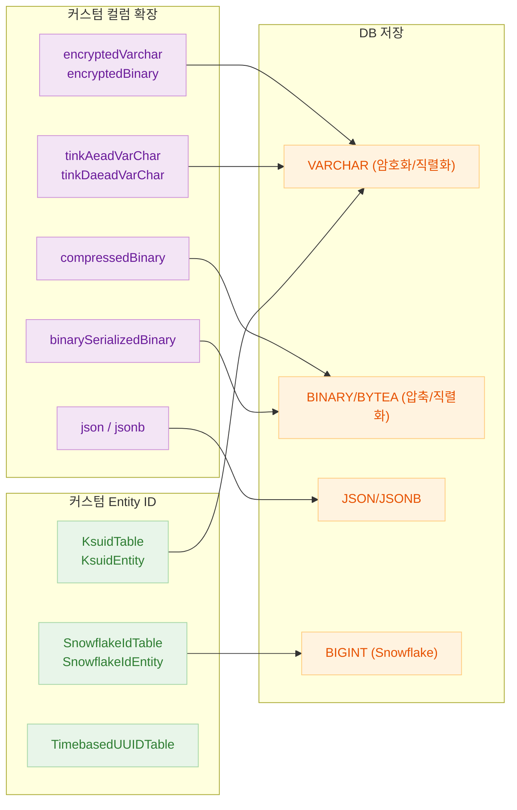

# 06 Advanced

[English](./README.md) | 한국어

실무에서 Exposed를 확장 적용할 때 필요한 커스텀 컬럼, 날짜/시간, JSON, 암복호화, 직렬화 연동 주제를 정리하는 챕터입니다.

## 개요

기본 CRUD를 넘어 실무에서 자주 마주치는 확장 시나리오를 다룹니다. 암복호화 컬럼으로 민감정보를 투명하게 보호하고, JSON 컬럼으로 유연한 스키마를 구성하며, 커스텀 컬럼 타입으로 도메인 요구에 맞는 직렬화/압축/암호화 로직을 캡슐화합니다.

## 학습 목표

- 커스텀 컬럼과 확장 포인트를 이해하고, JSON/시간 타입 처리에서 DB 간 차이를 제어한다.
- 직렬화/암복호화, 외부 라이브러리 연동 시 안정적인 데이터 흐름을 설계한다.
- 테스트를 통해 커스텀 타입/엔티티 확장 모듈을 검증한다.

## 포함 모듈

| 모듈                           | 설명                                           |
|------------------------------|----------------------------------------------|
| `01-exposed-crypt`           | `encryptedVarchar`/`encryptedBinary` 암복호화 컬럼 |
| `02-exposed-javatime`        | Java Time 타입 매핑 (`LocalDate`, `Instant` 등)   |
| `03-exposed-kotlin-datetime` | Kotlin `kotlinx-datetime` 타입 매핑              |
| `04-exposed-json`            | JSON/JSONB 컬럼 매핑 및 경로 쿼리                     |
| `05-exposed-money`           | `BigDecimal` 기반 금액 타입 모델링                    |
| `06-custom-columns`          | 압축/직렬화/암호화 커스텀 컬럼 타입                         |
| `07-custom-entities`         | KSUID/Snowflake/UUID 기반 커스텀 ID Entity        |
| `08-exposed-jackson`         | Jackson ObjectMapper 연동 JSON 컬럼              |
| `09-exposed-fastjson2`       | Fastjson2 연동 JSON 컬럼                         |
| `10-exposed-jasypt`          | Jasypt 기반 결정적 암호화 (WHERE 검색 가능)              |
| `11-exposed-jackson3`        | Jackson3 연동 JSON 컬럼                          |
| `12-exposed-tink`            | Google Tink AEAD/DAEAD 암복호화 컬럼               |

## 아키텍처 개요



## 모듈 분류

```mermaid
%%{init: {'theme': 'base', 'themeVariables': {'background': '#FAFAFA', 'fontFamily': '"Comic Mono", "goorm sans code", "JetBrains Mono", "goorm sans"'}}}%%
flowchart TD
    subgraph Crypto["암호화"]
        M01["01-exposed-crypt\nAES/Blowfish/3DES\n비결정적 암호화"]
        M10["10-exposed-jasypt\nJasypt 결정적 암호화\nWHERE 검색 가능"]
        M12["12-exposed-tink\nGoogle Tink AEAD/DAEAD\n무결성 검증 + 검색"]
    end

    subgraph DateTime["날짜/시간"]
        M02["02-exposed-javatime\njava.time 타입 매핑\nLocalDate/Instant 등"]
        M03["03-exposed-kotlin-datetime\nkotlinx.datetime 타입 매핑\nKMP 지원"]
    end

    subgraph JSON["JSON 직렬화"]
        M04["04-exposed-json\nkotlinx.serialization\nJSON/JSONB 경로 쿼리"]
        M08["08-exposed-jackson\nJackson 2 ObjectMapper\nJSON/JSONB 컬럼"]
        M09["09-exposed-fastjson2\nFastjson2\n고성능 JSON 파싱"]
        M11["11-exposed-jackson3\nJackson 3 ObjectMapper\n마이그레이션 호환성"]
    end

    subgraph Money["통화/금액"]
        M05["05-exposed-money\nJavaMoney MonetaryAmount\n복합 컬럼 매핑"]
    end

    subgraph Custom["커스텀 확장"]
        M06["06-custom-columns\nColumnType 상속\n직렬화/압축/암호화"]
        M07["07-custom-entities\nKSUID/Snowflake/UUID\n커스텀 ID 전략"]
    end

    M01 -->|"검색 필요 시"| M10
    M10 -->|"고급 암호화"| M12
    M02 -->|"KMP 환경"| M03
    M04 -->|"Jackson 생태계"| M08
    M08 -->|"Jackson 3 이행"| M11
    M04 -->|"고성능 필요"| M09
    M06 -->|"커스텀 ID"| M07

    classDef red fill:#FFEBEE,stroke:#EF9A9A,color:#C62828
    classDef blue fill:#E3F2FD,stroke:#90CAF9,color:#1565C0
    classDef purple fill:#F3E5F5,stroke:#CE93D8,color:#6A1B9A
    classDef orange fill:#FFF3E0,stroke:#FFCC80,color:#E65100
    classDef green fill:#E8F5E9,stroke:#A5D6A7,color:#2E7D32

    class M01,M10,M12 red
    class M02,M03 blue
    class M04,M08,M09,M11 purple
    class M05 orange
    class M06,M07 green
```



## 권장 학습 순서

1. `06-custom-columns` — ColumnType 확장의 기본 구조 이해
2. `04-exposed-json` — JSON/JSONB 컬럼과 경로 쿼리
3. `01-exposed-crypt` — 투명 암복호화 컬럼
4. `12-exposed-tink` — AEAD/DAEAD 고급 암호화
5. `07-custom-entities` — 커스텀 ID 전략
6. 나머지 모듈 (날짜/시간, 직렬화 라이브러리 연동)

## 선수 지식

- `05-exposed-dml` 내용
- JSON/시간 처리에 대한 기본 이해

## 테스트 실행 방법

```bash
# 개별 모듈 테스트
./gradlew :06-advanced:01-exposed-crypt:test
./gradlew :06-advanced:04-exposed-json:test
./gradlew :06-advanced:06-custom-columns:test
./gradlew :06-advanced:07-custom-entities:test
./gradlew :06-advanced:12-exposed-tink:test

# H2만 대상으로 빠른 테스트
./gradlew :06-advanced:01-exposed-crypt:test -PuseFastDB=true
```

## 테스트 포인트

- 직렬화/역직렬화 왕복 시 데이터 손실이 없는지를 확인한다.
- 커스텀 컬럼 null/기본값 처리 로직을 검증한다.
- JSON 직렬화 비용과 컬럼 크기 증가 영향까지 측정한다.
- 암복호화 컬럼 사용 시 인덱스 전략과 검색 제약을 검토한다.

## 다음 챕터

- [07-jpa](../07-jpa/README.ko.md): 기존 JPA 프로젝트를 Exposed로 전환하는 실전 패턴을 다룹니다.
