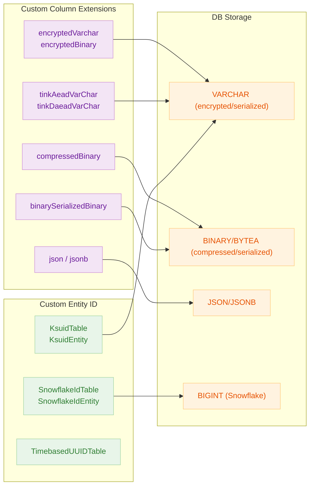

# 06 Advanced

English | [한국어](./README.ko.md)

A chapter covering custom columns, date/time, JSON, encryption/decryption, and serialization integration topics needed when applying Exposed in production environments.

## Overview

This chapter covers extension scenarios frequently encountered in production beyond basic CRUD. It demonstrates transparently protecting sensitive data with encryption columns, composing flexible schemas with JSON columns, and encapsulating serialization/compression/encryption logic in custom column types tailored to domain requirements.

## Learning Objectives

- Understand custom columns and extension points, and control cross-DB differences in JSON/time type handling.
- Design stable data flows when integrating serialization/encryption with external libraries.
- Validate custom type/entity extension modules through tests.

## Included Modules

| Module                       | Description                                              |
|------------------------------|----------------------------------------------------------|
| `01-exposed-crypt`           | `encryptedVarchar`/`encryptedBinary` encryption columns  |
| `02-exposed-javatime`        | Java Time type mapping (`LocalDate`, `Instant`, etc.)    |
| `03-exposed-kotlin-datetime` | Kotlin `kotlinx-datetime` type mapping                   |
| `04-exposed-json`            | JSON/JSONB column mapping and path queries               |
| `05-exposed-money`           | `BigDecimal`-based monetary type modeling                |
| `06-custom-columns`          | Compression/serialization/encryption custom column types  |
| `07-custom-entities`         | KSUID/Snowflake/UUID-based custom ID Entity              |
| `08-exposed-jackson`         | Jackson ObjectMapper JSON column integration             |
| `09-exposed-fastjson2`       | Fastjson2 JSON column integration                        |
| `10-exposed-jasypt`          | Jasypt-based deterministic encryption (WHERE searchable) |
| `11-exposed-jackson3`        | Jackson3 JSON column integration                         |
| `12-exposed-tink`            | Google Tink AEAD/DAEAD encryption columns                |

## Architecture Overview



## Module Classification

```mermaid
flowchart TD
    subgraph Crypto["Encryption"]
        M01["01-exposed-crypt\nAES/Blowfish/3DES\nNon-deterministic encryption"]
        M10["10-exposed-jasypt\nJasypt deterministic encryption\nWHERE searchable"]
        M12["12-exposed-tink\nGoogle Tink AEAD/DAEAD\nIntegrity verification + search"]
    end

    subgraph DateTime["Date/Time"]
        M02["02-exposed-javatime\njava.time type mapping\nLocalDate/Instant etc."]
        M03["03-exposed-kotlin-datetime\nkotlinx.datetime type mapping\nKMP support"]
    end

    subgraph JSON["JSON Serialization"]
        M04["04-exposed-json\nkotlinx.serialization\nJSON/JSONB path queries"]
        M08["08-exposed-jackson\nJackson 2 ObjectMapper\nJSON/JSONB columns"]
        M09["09-exposed-fastjson2\nFastjson2\nHigh-performance JSON parsing"]
        M11["11-exposed-jackson3\nJackson 3 ObjectMapper\nMigration compatibility"]
    end

    subgraph Money["Currency/Amount"]
        M05["05-exposed-money\nJavaMoney MonetaryAmount\nComposite column mapping"]
    end

    subgraph Custom["Custom Extensions"]
        M06["06-custom-columns\nColumnType inheritance\nSerialization/compression/encryption"]
        M07["07-custom-entities\nKSUID/Snowflake/UUID\nCustom ID strategies"]
    end

    M01 -->|"When search needed"| M10
    M10 -->|"Advanced encryption"| M12
    M02 -->|"KMP environment"| M03
    M04 -->|"Jackson ecosystem"| M08
    M08 -->|"Jackson 3 migration"| M11
    M04 -->|"High performance needed"| M09
    M06 -->|"Custom ID"| M07

    classDef red fill:#FFEBEE,stroke:#EF9A9A,color:#C62828
    classDef blue fill:#E3F2FD,stroke:#90CAF9,color:#1565C0
    classDef purple fill:#F3E5F5,stroke:#CE93D8,color:#6A1B9A
    classDef orange fill:#FFF3E0,stroke:#FFCC80,color:#E65100
    classDef green fill:#E8F5E9,stroke:#A5D6A7,color:#2E7D32

    class M01,M10,M12 red
    class M02,M03 blue
    class M04,M08,M09,M11 purple
    class M05 orange
    class M06,M07 green
```



## Recommended Learning Order

1. `06-custom-columns` — Understand the basic structure of ColumnType extensions
2. `04-exposed-json` — JSON/JSONB columns and path queries
3. `01-exposed-crypt` — Transparent encryption/decryption columns
4. `12-exposed-tink` — Advanced AEAD/DAEAD encryption
5. `07-custom-entities` — Custom ID strategies
6. Remaining modules (date/time, serialization library integration)

## Prerequisites

- Content from `05-exposed-dml`
- Basic understanding of JSON/time handling

## How to Run Tests

```bash
# Individual module tests
./gradlew :06-advanced:01-exposed-crypt:test
./gradlew :06-advanced:04-exposed-json:test
./gradlew :06-advanced:06-custom-columns:test
./gradlew :06-advanced:07-custom-entities:test
./gradlew :06-advanced:12-exposed-tink:test

# Quick test targeting H2 only
./gradlew :06-advanced:01-exposed-crypt:test -PuseFastDB=true
```

## Test Points

- Verify no data loss during serialization/deserialization round-trips.
- Validate custom column null/default value handling logic.
- Measure JSON serialization cost and column size increase impact.
- Review index strategies and search constraints when using encryption columns.

## Next Chapter

- [07-jpa](../07-jpa/README.md): Covers practical patterns for migrating existing JPA projects to Exposed.
