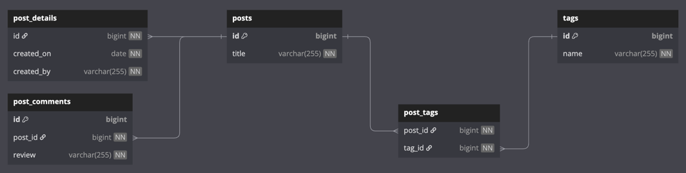
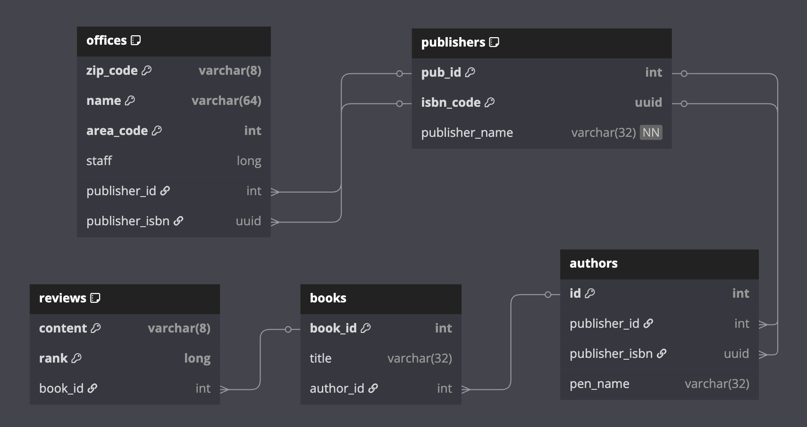

# JPA 기본 기능을 Exposed로 변환하기

JPA에서 자주 사용하는 **기본 기능들을 Exposed로 어떻게 구현하는지
** 단계별로 보여주는 예제 모음입니다. 각 예제는 JPA 개념과 대응되는 Exposed 코드를 함께 제공하여, JPA 사용자가 Exposed로 자연스럽게 전환할 수 있도록 돕습니다.

## 학습 목표

- Exposed의 두 가지 API(DSL / DAO)를 사용하여 JPA의 기본 기능을 구현하는 방법 이해
- Table 정의, Entity 정의, Record(DTO) 패턴의 차이 이해
- JPA의 연관관계 매핑(`@OneToOne`, `@OneToMany`, `@ManyToOne`, `@ManyToMany`)을 Exposed로 구현하는 방법 습득

## 예제 구성

### ex01_simple - 기본 CRUD

JPA의 `@Entity`, `@Id`, `@GeneratedValue`, `@Column`에 해당하는 Exposed 기본 사용법입니다.

| 파일                   | 설명                                                   | JPA 대응 개념                      |
|----------------------|------------------------------------------------------|--------------------------------|
| `SimpleSchema.kt`    | Table + Entity + Record 정의                           | `@Entity`, `@Table`, `@Column` |
| `Ex01_Simple_DSL.kt` | DSL 방식으로 조회 (`selectAll`, `batchInsert`, `wrapRows`) | JPQL / Criteria API            |
| `Ex02_Simple_DAO.kt` | DAO 방식으로 CRUD (`new`, `findById`, `all`)             | `EntityManager`                |

**핵심 포인트:**

- **DSL**: SQL에 가까운 타입 안전 쿼리 빌더, `ResultRow`를 직접 다룸
- **DAO**: JPA Entity와 유사한 객체 지향 접근, 자동 변경 감지(dirty checking) 지원
- **Record**: `data class` 기반 DTO, 불변 객체로 캐시나 전송에 적합

```kotlin
// Table 정의 (JPA의 @Entity + @Table)
object SimpleTable: LongIdTable("simple_entity") {
    val name = varchar("name", 255).uniqueIndex()
    val description = text("description").nullable()
}

// Entity 정의 (JPA의 Entity 클래스)
class SimpleEntity(id: EntityID<Long>): LongEntity(id) {
    companion object: LongEntityClass<SimpleEntity>(SimpleTable)

    var name by SimpleTable.name
    var description by SimpleTable.description
}

// Record 정의 (JPA의 DTO Projection)
data class SimpleRecord(val id: Long, val name: String, val description: String?)
```

### ex02_entities - 복합 엔티티 (Blog 도메인)

Post, PostDetail, PostComment, Tag 등 여러 엔티티 간의 관계를 정의합니다. JPA의 `@OneToOne`, `@OneToMany`, `@ManyToMany` 관계를 Exposed의
`reference`, `referrersOn`, `via` 등으로 구현합니다.

| 파일                | 설명                                        | JPA 대응 개념                                |
|-------------------|-------------------------------------------|------------------------------------------|
| `BlogSchema.kt`   | Post, PostDetail, PostComment, Tag 스키마 정의 | `@OneToOne`, `@OneToMany`, `@ManyToMany` |
| `PersonSchema.kt` | Person, Address 스키마 정의                    | `@ManyToOne`                             |
| `Ex01_Blog.kt`    | Blog 도메인 CRUD 및 관계 탐색                     | JPA 연관관계 탐색                              |
| `Ex02_Person.kt`  | Person-Address 관계 CRUD                    | `@JoinColumn`                            |
| `Ex03_Task.kt`    | Task 엔티티 기본 CRUD                          | 단순 엔티티                                   |

**Blog ERD**



**JPA vs Exposed 관계 매핑 비교:**

```kotlin
// JPA: @OneToOne + @JoinColumn
// Exposed: backReferencedOn (1:1 역방향 참조)
val details: PostDetail by PostDetail backReferencedOn PostDetailTable.id

// JPA: @OneToMany(mappedBy = "post")
// Exposed: referrersOn (1:N 참조)
val comments: SizedIterable<PostComment> by PostComment referrersOn PostCommentTable.postId

// JPA: @ManyToMany + @JoinTable
// Exposed: via (M:N 중간 테이블)
val tags: SizedIterable<Tag> by Tag via PostTagTable
```

### ex03_customId - 사용자 정의 ID/컬럼 타입

JPA의 `@Convert`(AttributeConverter)에 해당하는 기능입니다.
`Email`, `Ssn` 같은 Value Object를 ID나 컬럼 타입으로 사용하는 방법을 보여줍니다.

| 파일                     | 설명                             | JPA 대응 개념                        |
|------------------------|--------------------------------|----------------------------------|
| `CustomColumnTypes.kt` | `Email`, `Ssn` 커스텀 컬럼 타입 정의    | `@Convert`, `AttributeConverter` |
| `Ex01_CustomId.kt`     | 커스텀 타입 ID를 사용하는 테이블의 CRUD 및 조회 | `@EmbeddedId` + `@Convert`       |

**핵심 포인트:**

- `ColumnType`을 확장하여 DB 타입과 Kotlin 타입 간 변환 정의
- 커스텀 타입을 `entityId()`로 지정하면 Primary Key로 사용 가능
- `inList`, `eq` 등 Exposed 연산자에서 커스텀 타입 자연스럽게 사용

### ex04_compositeId - 복합 키 (Composite Key)

JPA의 `@EmbeddedId`, `@IdClass`에 해당하는 Exposed의 `CompositeIdTable` 사용법입니다.

| 파일                    | 설명                           | JPA 대응 개념                 |
|-----------------------|------------------------------|---------------------------|
| `BookSchema.kt`       | 복합 키 테이블 정의 (Author + Book)  | `@EmbeddedId`, `@IdClass` |
| `Ex01_CompositeId.kt` | `CompositeIdTable` 생성 및 주의사항 | `@EmbeddedId`             |
| `Ex02_IdClass.kt`     | `IdClass` 방식의 복합 키 사용        | `@IdClass`                |

**Book Schema**


**핵심 포인트:**

- `CompositeIdTable`에서 반드시 `.entityId()`를 호출해야 ID 컬럼으로 인식됨
- `entityId()` 없이 정의하면 `IllegalStateException` 발생

### ex05_relations - 연관관계 상세

JPA의 다양한 연관관계 매핑을 Exposed로 구현하는 **가장 핵심적인 예제**입니다.

#### ex01_one_to_one - 1:1 관계

| 파일                                       | 설명                         | JPA 대응 개념                   |
|------------------------------------------|----------------------------|-----------------------------|
| `Ex01_OneToOne_Unidirectional.kt`        | 단방향 1:1 (Cavalier → Horse) | `@OneToOne` 단방향             |
| `Ex02_OneToOne_Bidirectional.kt`         | 양방향 1:1                    | `@OneToOne(mappedBy=...)`   |
| `Ex03_OneToOne_Unidirectional_MapsId.kt` | 단방향 1:1 (PK를 FK로 공유)       | `@OneToOne` + `@MapsId`     |
| `Ex04_OneToOne_Bidirectional_MapsId.kt`  | 양방향 1:1 (PK를 FK로 공유)       | `@OneToOne` + `@MapsId` 양방향 |

**Exposed에서 1:1 관계 구현:**

```kotlin
// 단방향: FK를 optReference로 정의
object Cavaliers: IntIdTable("cavalier") {
    val horseId = optReference("horse_id", Horses)  // nullable FK
}
class Cavalier(id: EntityID<Int>): IntEntity(id) {
    var horse by Horse optionalReferencedOn Cavaliers.horseId
}

// 양방향: backReferencedOn 사용
val details: PostDetail by PostDetail backReferencedOn PostDetailTable.id
```

#### ex02_one_to_many - 1:N 관계

| 파일                                        | 설명                               | JPA 대응 개념                      |
|-------------------------------------------|----------------------------------|--------------------------------|
| `Ex01_OneToMany_Bidirectional_Batch.kt`   | 양방향 1:N + Eager Loading (`with`) | `@OneToMany` + `fetch = EAGER` |
| `Ex02_OneToMany_Unidirectional_Family.kt` | 단방향 1:N                          | `@OneToMany` 단방향               |
| `Ex03_OneToMany_N+1_Order.kt`             | N+1 문제와 Eager Loading 해결         | `@EntityGraph`, `JOIN FETCH`   |
| `Ex04_OneToMany_N+1_Restaurant.kt`        | N+1 문제 해결 (Restaurant 도메인)       | `@NamedEntityGraph`            |
| `Ex05_OneToMany_JoinTable.kt`             | 중간 테이블을 통한 1:N (`via`)           | `@OneToMany` + `@JoinTable`    |
| `Ex05_OneToMany_Via.kt`                   | `via` 키워드를 사용한 관계 정의             | `@OneToMany` + `@JoinTable`    |
| `Ex06_OneToMany_Set.kt`                   | Set 컬렉션 기반 1:N                   | `Set<Entity>`                  |
| `Ex07_OneToMany_Map.kt`                   | Map 컬렉션 기반 1:N                   | `Map<Key, Entity>`             |

**N+1 문제 해결 - Exposed의 Eager Loading:**

```kotlin
// Lazy Loading (N+1 발생)
val orders = Order.all().toList()
orders.forEach { it.items }  // 각 order마다 추가 쿼리 실행

// Eager Loading (with 사용 - N+1 해결)
val orders = Order.all().with(Order::items).toList()
orders.forEach { it.items }  // 이미 로드됨, 추가 쿼리 없음

// 단일 엔티티 Eager Loading (load 사용)
val order = Order.findById(1)?.load(Order::items)
```

#### ex03_many_to_one - N:1 관계

| 파일                   | 설명          | JPA 대응 개념     |
|----------------------|-------------|---------------|
| `ManyToOneSchema.kt` | N:1 스키마 정의  | `@ManyToOne`  |
| `Ex01_ManyToOne.kt`  | N:1 관계 CRUD | `@JoinColumn` |

#### ex04_many_to_many - M:N 관계

| 파일                          | 설명                   | JPA 대응 개념                    |
|-----------------------------|----------------------|------------------------------|
| `BankSchema.kt`             | Bank-Client M:N 스키마  | `@ManyToMany` + `@JoinTable` |
| `MemberSchema.kt`           | Member-Role M:N 스키마  | `@ManyToMany` + `@JoinTable` |
| `Ex01_ManyToMany_Bank.kt`   | Bank-Client M:N CRUD | `@ManyToMany`                |
| `Ex02_ManyToMany_Member.kt` | Member-Role M:N CRUD | `@ManyToMany`                |

**Exposed에서 M:N 관계 구현:**

```kotlin
// 중간 테이블 정의 (JPA의 @JoinTable)
object PostTagTable: LongIdTable("post_tags") {
    val postId = reference("post_id", PostTable, onDelete = CASCADE)
    val tagId = reference("tag_id", TagTable, onDelete = CASCADE)
}

// via 키워드로 M:N 관계 탐색
class Post(id: EntityID<Long>): LongEntity(id) {
    val tags by Tag via PostTagTable  // Post → Tag
}
class Tag(id: EntityID<Long>): LongEntity(id) {
    val posts by Post via PostTagTable  // Tag → Post (양방향)
}
```

## JPA vs Exposed 주요 개념 매핑 요약

| JPA                           | Exposed DSL             | Exposed DAO                         |
|-------------------------------|-------------------------|-------------------------------------|
| `@Entity`                     | `Table` / `IdTable`     | `Entity` + `EntityClass`            |
| `@Id` + `@GeneratedValue`     | `LongIdTable`           | `LongEntity`                        |
| `@Column`                     | `varchar()`, `text()` 등 | `var name by Table.name`            |
| `@Convert`                    | Custom `ColumnType`     | Custom `ColumnType`                 |
| `@EmbeddedId`                 | `CompositeIdTable`      | `CompositeEntity`                   |
| `@OneToOne`                   | `reference()`           | `referencedOn` / `backReferencedOn` |
| `@OneToMany`                  | FK `reference()`        | `referrersOn`                       |
| `@ManyToOne`                  | `reference()`           | `referencedOn`                      |
| `@ManyToMany` + `@JoinTable`  | 중간 테이블 정의               | `via`                               |
| `EntityManager.persist()`     | `Table.insert {}`       | `Entity.new {}`                     |
| `EntityManager.find()`        | `Table.selectAll()`     | `Entity.findById()`                 |
| JPQL / Criteria API           | DSL 체이닝                 | `Entity.find {}`                    |
| `@EntityGraph` / `JOIN FETCH` | `innerJoin` + `select`  | `with()` / `load()`                 |
| `@UniqueConstraint`           | `.uniqueIndex()`        | `.uniqueIndex()`                    |

## 테스트 실행

```bash
# 전체 테스트 실행
./gradlew :07-jpa:01-convert-jpa-basic:test

# 특정 예제만 실행
./gradlew :07-jpa:01-convert-jpa-basic:test --tests "exposed.examples.jpa.ex01_simple.*"
./gradlew :07-jpa:01-convert-jpa-basic:test --tests "exposed.examples.jpa.ex05_relations.*"
```

모든 테스트는 `@ParameterizedTest`로 H2, MySQL, PostgreSQL 등 여러 DB에서 실행됩니다.

## Further Reading

- [9.1 JPA 기본기능 구현하기](https://debop.notion.site/1c32744526b080458ca0f7eee791cab3?v=1c32744526b081ca8b00000c231b9b43)
