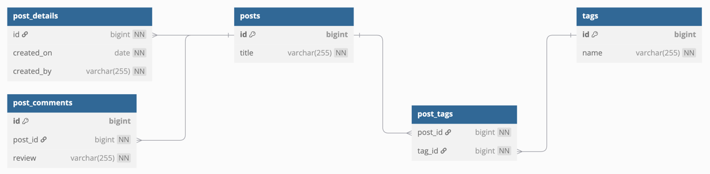
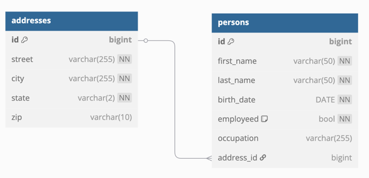
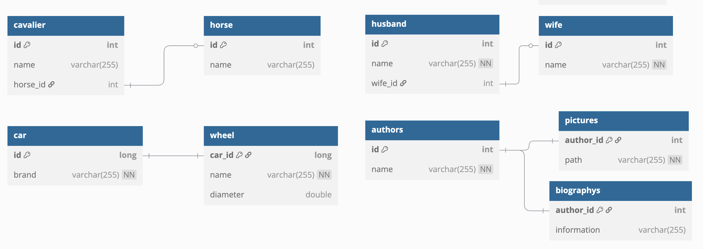
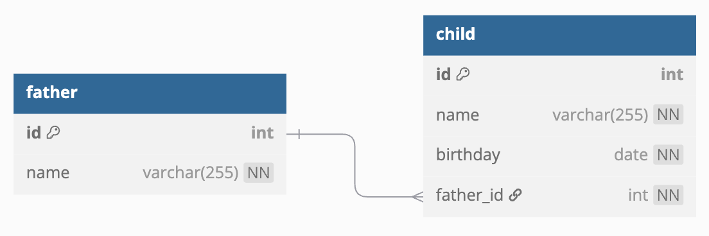
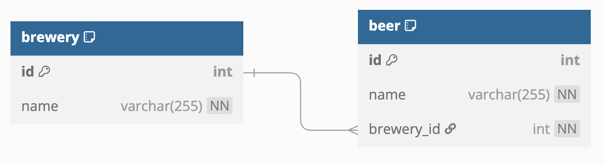
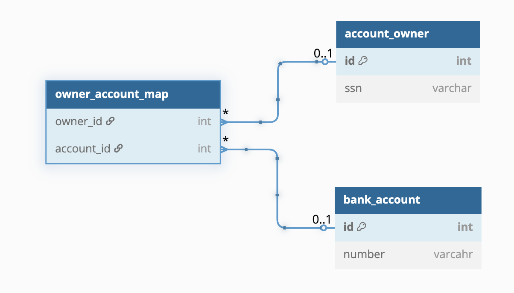

# 07 JPA Migration: 기본 전환 (01)

JPA 기본 CRUD/연관관계 코드를 Exposed로 전환하는 입문 모듈입니다. 기능 동등성을 유지하면서 의존성을 줄이는 전환 패턴을 다룹니다.

## 학습 목표

- JPA Entity 중심 코드를 Exposed DSL/DAO로 치환한다.
- 전환 전/후 결과 동등성 테스트를 작성한다.
- 점진적 전환 전략을 수립한다.

## 선수 지식

- JPA/Hibernate 기본
- [`../../05-exposed-dml/README.md`](../../05-exposed-dml/README.md)

## 핵심 개념

- CRUD 전환
- 단순 연관관계 전환
- 테스트 기반 회귀 방지

## 실행 방법

```bash
./gradlew :07-jpa:01-convert-jpa-basic:test
```

## 실습 체크리스트

- JPA 구현과 Exposed 구현의 결과를 같은 픽스처로 비교
- 예외 메시지/실패 코드가 기존 계약과 호환되는지 확인

## 성능·안정성 체크포인트

- 기본 조회에서 쿼리 수 회귀가 없는지 확인
- 트랜잭션 경계가 기존과 동일한지 검증

## JPA 엔티티 매핑 다이어그램

### Blog (One-to-One / One-to-Many / Many-to-Many)


예제 코드: [
`src/test/kotlin/exposed/examples/jpa/ex02_entities/Ex01_Blog.kt`](src/test/kotlin/exposed/examples/jpa/ex02_entities/Ex01_Blog.kt), [
`src/test/kotlin/exposed/examples/jpa/ex02_entities/BlogSchema.kt`](src/test/kotlin/exposed/examples/jpa/ex02_entities/BlogSchema.kt)

### Person-Address (Many-to-One)


예제 코드: [
`src/test/kotlin/exposed/examples/jpa/ex02_entities/Ex02_Person.kt`](src/test/kotlin/exposed/examples/jpa/ex02_entities/Ex02_Person.kt), [
`src/test/kotlin/exposed/examples/jpa/ex02_entities/PersonSchema.kt`](src/test/kotlin/exposed/examples/jpa/ex02_entities/PersonSchema.kt)

### One-to-One


예제 코드: [
`src/test/kotlin/exposed/examples/jpa/ex05_relations/ex01_one_to_one/Ex01_OneToOne_Unidirectional.kt`](src/test/kotlin/exposed/examples/jpa/ex05_relations/ex01_one_to_one/Ex01_OneToOne_Unidirectional.kt), [
`src/test/kotlin/exposed/examples/jpa/ex05_relations/ex01_one_to_one/Ex02_OneToOne_Bidirectional.kt`](src/test/kotlin/exposed/examples/jpa/ex05_relations/ex01_one_to_one/Ex02_OneToOne_Bidirectional.kt)

### One-to-Many


예제 코드: [
`src/test/kotlin/exposed/examples/jpa/ex05_relations/ex02_one_to_many/Ex01_OneToMany_Bidirectional_Batch.kt`](src/test/kotlin/exposed/examples/jpa/ex05_relations/ex02_one_to_many/Ex01_OneToMany_Bidirectional_Batch.kt), [
`src/test/kotlin/exposed/examples/jpa/ex05_relations/ex02_one_to_many/Ex02_OneToMany_Unidirectional_Family.kt`](src/test/kotlin/exposed/examples/jpa/ex05_relations/ex02_one_to_many/Ex02_OneToMany_Unidirectional_Family.kt)

### Many-to-One


예제 코드: [
`src/test/kotlin/exposed/examples/jpa/ex05_relations/ex03_many_to_one/Ex01_ManyToOne.kt`](src/test/kotlin/exposed/examples/jpa/ex05_relations/ex03_many_to_one/Ex01_ManyToOne.kt), [
`src/test/kotlin/exposed/examples/jpa/ex05_relations/ex03_many_to_one/ManyToOneSchema.kt`](src/test/kotlin/exposed/examples/jpa/ex05_relations/ex03_many_to_one/ManyToOneSchema.kt)

### Many-to-Many


예제 코드: [
`src/test/kotlin/exposed/examples/jpa/ex05_relations/ex04_many_to_many/Ex01_ManyToMany_Bank.kt`](src/test/kotlin/exposed/examples/jpa/ex05_relations/ex04_many_to_many/Ex01_ManyToMany_Bank.kt), [
`src/test/kotlin/exposed/examples/jpa/ex05_relations/ex04_many_to_many/Ex02_ManyToMany_Member.kt`](src/test/kotlin/exposed/examples/jpa/ex05_relations/ex04_many_to_many/Ex02_ManyToMany_Member.kt)

## 복잡한 시나리오

### 관계 매핑 5가지 유형

| JPA 어노테이션 | Exposed 구현 파일 |
|---|---|
| `@OneToOne` (단방향) | [`ex05_relations/ex01_one_to_one/Ex01_OneToOne_Unidirectional.kt`](src/test/kotlin/exposed/examples/jpa/ex05_relations/ex01_one_to_one/Ex01_OneToOne_Unidirectional.kt) |
| `@OneToOne` (양방향) | [`ex05_relations/ex01_one_to_one/Ex02_OneToOne_Bidirectional.kt`](src/test/kotlin/exposed/examples/jpa/ex05_relations/ex01_one_to_one/Ex02_OneToOne_Bidirectional.kt) |
| `@OneToMany` (배치/단방향) | [`ex05_relations/ex02_one_to_many/Ex01_OneToMany_Bidirectional_Batch.kt`](src/test/kotlin/exposed/examples/jpa/ex05_relations/ex02_one_to_many/Ex01_OneToMany_Bidirectional_Batch.kt) |
| `@ManyToOne` | [`ex05_relations/ex03_many_to_one/Ex01_ManyToOne.kt`](src/test/kotlin/exposed/examples/jpa/ex05_relations/ex03_many_to_one/Ex01_ManyToOne.kt) |
| `@ManyToMany` | [`ex05_relations/ex04_many_to_many/Ex01_ManyToMany_Bank.kt`](src/test/kotlin/exposed/examples/jpa/ex05_relations/ex04_many_to_many/Ex01_ManyToMany_Bank.kt) |

### CompositeId (복합 기본 키)

- JPA `@EmbeddedId`: [`ex04_compositeid/Ex01_CompositeId.kt`](src/test/kotlin/exposed/examples/jpa/ex04_compositeid/Ex01_CompositeId.kt)
- JPA `@IdClass`: [`ex04_compositeid/Ex02_IdClass.kt`](src/test/kotlin/exposed/examples/jpa/ex04_compositeid/Ex02_IdClass.kt)

### N+1 문제 해결

- Order 도메인: [`ex05_relations/ex02_one_to_many/Ex03_OneToMany_N_plus_1_Order.kt`](src/test/kotlin/exposed/examples/jpa/ex05_relations/ex02_one_to_many/Ex03_OneToMany_N_plus_1_Order.kt)
- Restaurant 도메인: [`ex05_relations/ex02_one_to_many/Ex04_OneToMany_N_plus_1_Restaurant.kt`](src/test/kotlin/exposed/examples/jpa/ex05_relations/ex02_one_to_many/Ex04_OneToMany_N_plus_1_Restaurant.kt)

## 다음 모듈

- [`../02-convert-jpa-advanced/README.md`](../02-convert-jpa-advanced/README.md)
