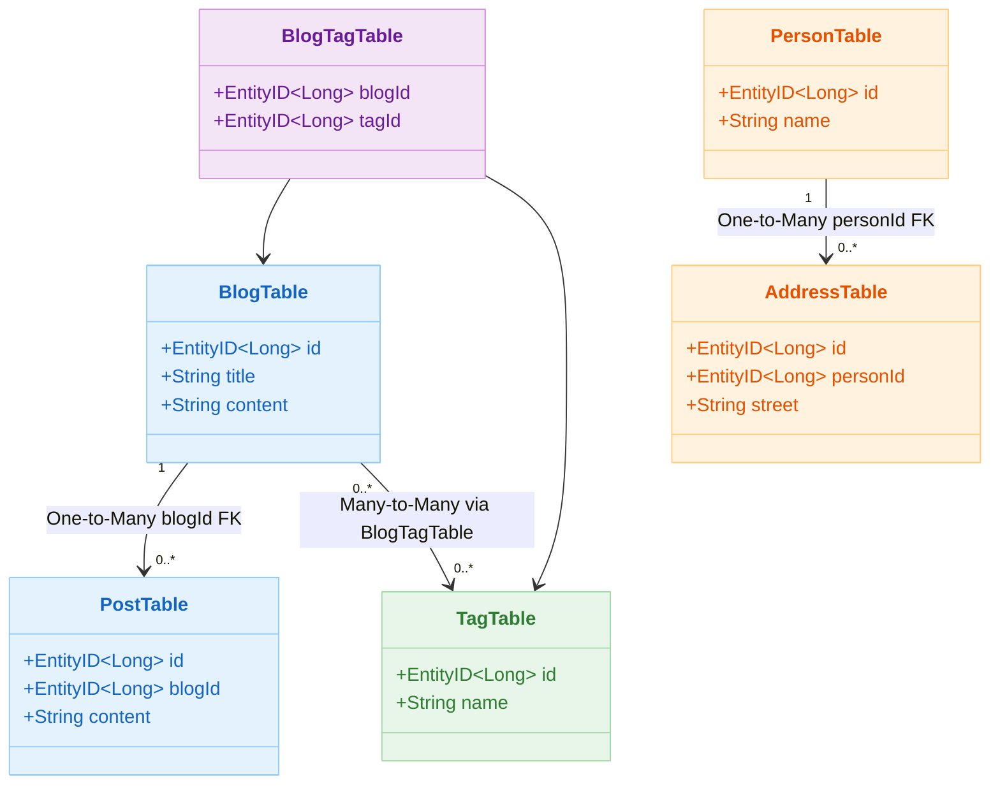
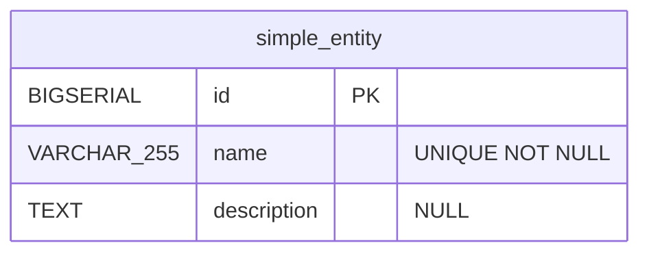
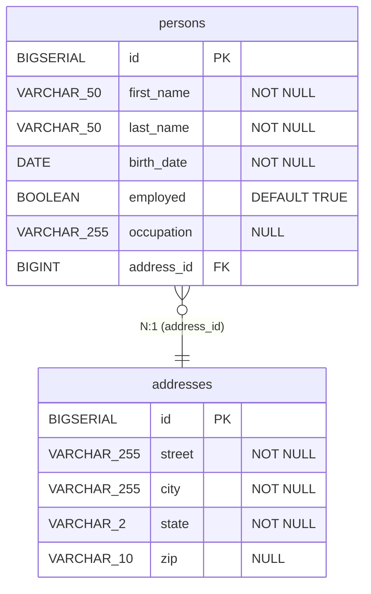
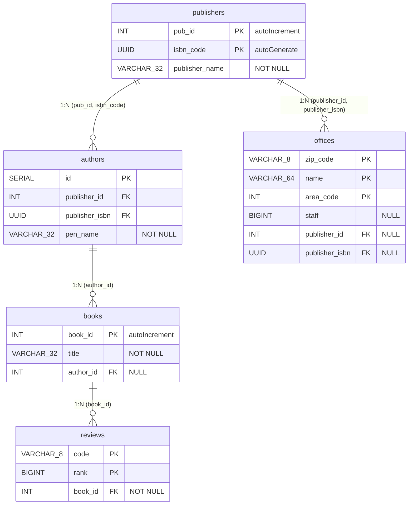
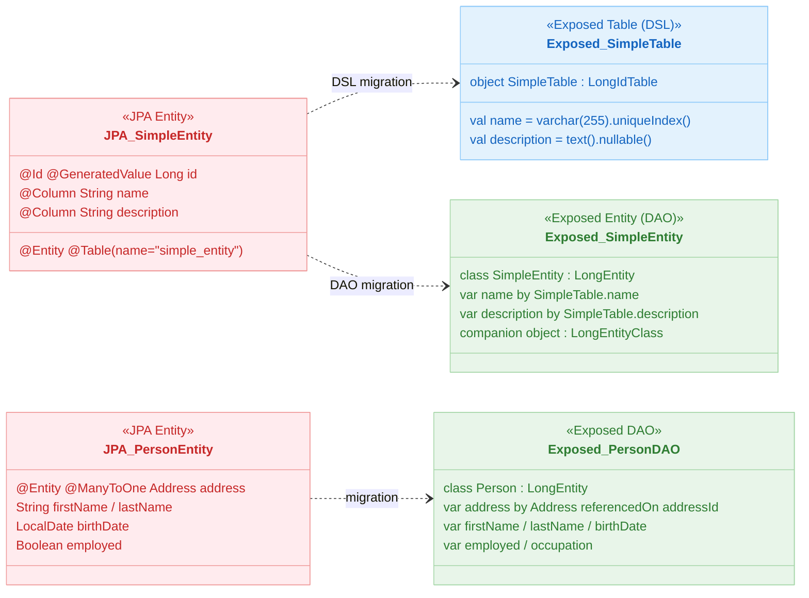

# 07 JPA Migration: Basic Migration (01-convert-jpa-basic)

English | [한국어](./README.ko.md)

An introductory module for migrating basic JPA CRUD and relationship code to Exposed. Covers migration patterns that preserve functional equivalence while reducing dependencies.

## Learning Objectives

- Replace JPA Entity-centric code with Exposed DSL/DAO.
- Write equivalence tests comparing results before and after migration.
- Build an incremental migration strategy.

## Prerequisites

- JPA/Hibernate basics
- [`../../05-exposed-dml/README.md`](../../05-exposed-dml/README.md)

## JPA ↔ Exposed Basic CRUD Conversion Reference

| Operation       | JPA                                                          | Exposed DSL                                                | Exposed DAO                                      |
|-----------------|--------------------------------------------------------------|------------------------------------------------------------|--------------------------------------------------|
| Entity definition | `@Entity @Table(name="...")` class                         | `object XxxTable : LongIdTable("...")`                     | `class Xxx(id: EntityID<Long>) : LongEntity(id)` |
| Column definition | `@Column(name="col") val field: Type`                      | `val col = varchar("col", 128)`                            | `var field by XxxTable.col`                      |
| Save            | `em.persist(entity)`                                         | `XxxTable.insert { it[col] = value }`                      | `Xxx.new { field = value }`                      |
| Find (single)   | `em.find(Xxx::class.java, id)`                               | `XxxTable.selectAll().where { id eq targetId }.single()`   | `Xxx.findById(id)`                               |
| Find (list)     | `em.createQuery("SELECT x FROM Xxx x").resultList`           | `XxxTable.selectAll().toList()`                            | `Xxx.all().toList()`                             |
| Conditional find | `em.createQuery("SELECT x FROM Xxx x WHERE x.name = :name")` | `XxxTable.selectAll().where { name eq value }`            | `Xxx.find { XxxTable.name eq value }`            |
| Update          | Field change within persistence context (dirty checking)     | `XxxTable.update({ id eq targetId }) { it[col] = newVal }` | `entity.field = newVal`                          |
| Delete          | `em.remove(entity)`                                          | `XxxTable.deleteWhere { id eq targetId }`                  | `entity.delete()`                                |
| Transaction     | `@Transactional` / `em.transaction.begin()`                  | `transaction { ... }`                                      | `transaction { ... }`                            |
| Batch insert    | Repeated `em.persist()` + `flush()`                          | `XxxTable.batchInsert(list) { ... }`                       | Repeated `Xxx.new { ... }` then `flushCache()`   |
| Pagination      | `query.setFirstResult(offset).setMaxResults(limit)`          | `.limit(limit).offset(offset)`                             | `.limit(limit, offset)`                          |

## Key Concepts

### DSL Style (Direct SQL Control)

```kotlin
// Table definition
object SimpleTable : LongIdTable("simple_entity") {
    val name        = varchar("name", 255).uniqueIndex()
    val description = text("description").nullable()
}

// Insert
SimpleTable.batchInsert(names) { name ->
    this[SimpleTable.name] = name
    this[SimpleTable.description] = faker.lorem().sentence()
}

// Query + pagination
val names: List<String> = SimpleTable
    .select(SimpleTable.name)
    .limit(2).offset(2)
    .map { it[SimpleTable.name] }
```

### DAO Style (Object-centric)

```kotlin
// Entity class
class SimpleEntity(id: EntityID<Long>) : LongEntity(id) {
    companion object : LongEntityClass<SimpleEntity>(SimpleTable)
    var name        by SimpleTable.name
    var description by SimpleTable.description
}

// CRUD
transaction {
    val entity = SimpleEntity.new {
        name = "example"
        description = "test"
    }
    val found = SimpleEntity.findById(entity.id)
    found?.name = "updated"
}
```

## Relationship Mapping Conversion Diagram



## Domain ERDs

### SimpleSchema ERD



### PersonSchema ERD



### BlogSchema ERD


### BookSchema ERD (Composite PK)



### Entity Class Diagram — JPA Entity vs Exposed DAO



## JPA Annotation → Exposed Mapping Reference

| JPA Annotation        | Exposed Implementation                                    | Notes                          |
|-----------------------|-----------------------------------------------------------|--------------------------------|
| `@OneToOne` (unidirectional) | `reference("col", OtherTable)` + `referencedOn`  | `reference` on FK-owning side  |
| `@OneToOne` (bidirectional) | Unidirectional + `optionalReferrersOn`             | `referrersOn` on back-reference side |
| `@OneToOne @MapsId`   | `IdTable` + `override val id = reference("id", Parent)`  | Shared PK pattern              |
| `@OneToMany`          | `referrersOn` (back-reference)                            | FK defined on child table      |
| `@ManyToOne`          | `reference("fk", ParentTable)` + `referencedOn`          | FK defined on child table      |
| `@ManyToMany`         | `via` + junction table                                    | Junction table explicitly defined |
| `@JoinColumn`         | FK column name specified directly                         | `reference("col_name", ...)`   |
| `@EmbeddedId`         | `CompositeIdTable`                                        | Composite PK table             |
| `@IdClass`            | `CompositeIdTable` + `addIdColumn`                        | Alternative composite PK       |
| `cascade = PERSIST`   | `SchemaUtils` + `ReferenceOption`                         | DB-level CASCADE configuration |
| `FetchType.EAGER`     | `.load(relation)` or `JOIN` query                         | Explicit eager loading         |
| `FetchType.LAZY`      | Default behavior (loaded on access within transaction)    | Mind transaction scope         |

## Example Map

Source location: `src/test/kotlin/exposed/examples/jpa`

| Directory          | Files                                                     | Description                         |
|--------------------|-----------------------------------------------------------|-------------------------------------|
| `ex01_simple`      | `Ex01_Simple_DSL.kt`, `Ex02_Simple_DAO.kt`                | DSL/DAO basic CRUD comparison        |
| `ex02_entities`    | `Ex01_Blog.kt`, `Ex02_Person.kt`, `Ex03_Task.kt`          | Compound Entity relationship examples |
| `ex03_customId`    | `Ex01_CustomId.kt`                                        | Custom ID type definition            |
| `ex04_compositeId` | `Ex01_CompositeId.kt`, `Ex02_IdClass.kt`                  | Composite PK (`@EmbeddedId`, `@IdClass`) |
| `ex05_relations`   | One-to-One, One-to-Many, Many-to-One, Many-to-Many examples | Relationship mapping migration     |

## JPA Entity Mapping Diagrams

### Blog (One-to-One / One-to-Many / Many-to-Many)


Example code: [`ex02_entities/Ex01_Blog.kt`](src/test/kotlin/exposed/examples/jpa/ex02_entities/Ex01_Blog.kt), [
`ex02_entities/BlogSchema.kt`](src/test/kotlin/exposed/examples/jpa/ex02_entities/BlogSchema.kt)

### Person-Address (Many-to-One)


Example code: [`ex02_entities/Ex02_Person.kt`](src/test/kotlin/exposed/examples/jpa/ex02_entities/Ex02_Person.kt)

### One-to-One


Example code: [
`ex05_relations/ex01_one_to_one/Ex01_OneToOne_Unidirectional.kt`](src/test/kotlin/exposed/examples/jpa/ex05_relations/ex01_one_to_one/Ex01_OneToOne_Unidirectional.kt)

### One-to-Many


Example code: [
`ex05_relations/ex02_one_to_many/Ex01_OneToMany_Bidirectional_Batch.kt`](src/test/kotlin/exposed/examples/jpa/ex05_relations/ex02_one_to_many/Ex01_OneToMany_Bidirectional_Batch.kt)

### Many-to-One


Example code: [
`ex05_relations/ex03_many_to_one/Ex01_ManyToOne.kt`](src/test/kotlin/exposed/examples/jpa/ex05_relations/ex03_many_to_one/Ex01_ManyToOne.kt)

### Many-to-Many


Example code: [
`ex05_relations/ex04_many_to_many/Ex01_ManyToMany_Bank.kt`](src/test/kotlin/exposed/examples/jpa/ex05_relations/ex04_many_to_many/Ex01_ManyToMany_Bank.kt)

## Running Tests

```bash
./gradlew :07-jpa:01-convert-jpa-basic:test
```

## Practice Checklist

- Compare JPA and Exposed implementations with the same test fixtures.
- Verify that exception messages and failure codes are compatible with the existing contract.

## Performance and Stability Checkpoints

- Confirm there is no query count regression on basic queries.
- Verify that transaction boundaries are identical to the original.

## Complex Scenarios

### 5 Relationship Mapping Types

| JPA Annotation | Exposed Implementation File |
|---|---|
| `@OneToOne` (unidirectional) | [`ex05_relations/ex01_one_to_one/Ex01_OneToOne_Unidirectional.kt`](src/test/kotlin/exposed/examples/jpa/ex05_relations/ex01_one_to_one/Ex01_OneToOne_Unidirectional.kt) |
| `@OneToOne` (bidirectional) | [`ex05_relations/ex01_one_to_one/Ex02_OneToOne_Bidirectional.kt`](src/test/kotlin/exposed/examples/jpa/ex05_relations/ex01_one_to_one/Ex02_OneToOne_Bidirectional.kt) |
| `@OneToMany` (batch/unidirectional) | [`ex05_relations/ex02_one_to_many/Ex01_OneToMany_Bidirectional_Batch.kt`](src/test/kotlin/exposed/examples/jpa/ex05_relations/ex02_one_to_many/Ex01_OneToMany_Bidirectional_Batch.kt) |
| `@ManyToOne` | [`ex05_relations/ex03_many_to_one/Ex01_ManyToOne.kt`](src/test/kotlin/exposed/examples/jpa/ex05_relations/ex03_many_to_one/Ex01_ManyToOne.kt) |
| `@ManyToMany` | [`ex05_relations/ex04_many_to_many/Ex01_ManyToMany_Bank.kt`](src/test/kotlin/exposed/examples/jpa/ex05_relations/ex04_many_to_many/Ex01_ManyToMany_Bank.kt) |

### CompositeId (Composite Primary Key)

- JPA `@EmbeddedId`: [
  `ex04_compositeId/Ex01_CompositeId.kt`](src/test/kotlin/exposed/examples/jpa/ex04_compositeId/Ex01_CompositeId.kt)
- JPA `@IdClass`: [
  `ex04_compositeId/Ex02_IdClass.kt`](src/test/kotlin/exposed/examples/jpa/ex04_compositeId/Ex02_IdClass.kt)

### Solving the N+1 Problem

In Exposed, N+1 is resolved using `load()` / `with()` or DSL JOIN queries.

- Order domain: [`ex05_relations/ex02_one_to_many/Ex03_OneToMany_N_plus_1_Order.kt`](src/test/kotlin/exposed/examples/jpa/ex05_relations/ex02_one_to_many/Ex03_OneToMany_N_plus_1_Order.kt)
- Restaurant domain: [`ex05_relations/ex02_one_to_many/Ex04_OneToMany_N_plus_1_Restaurant.kt`](src/test/kotlin/exposed/examples/jpa/ex05_relations/ex02_one_to_many/Ex04_OneToMany_N_plus_1_Restaurant.kt)

## Next Module

- [`../02-convert-jpa-advanced/README.md`](../02-convert-jpa-advanced/README.md)
