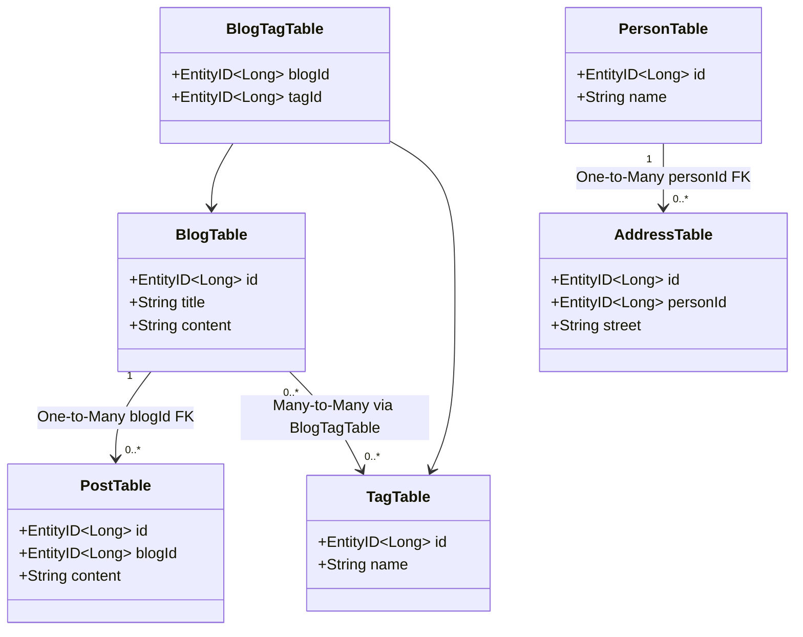
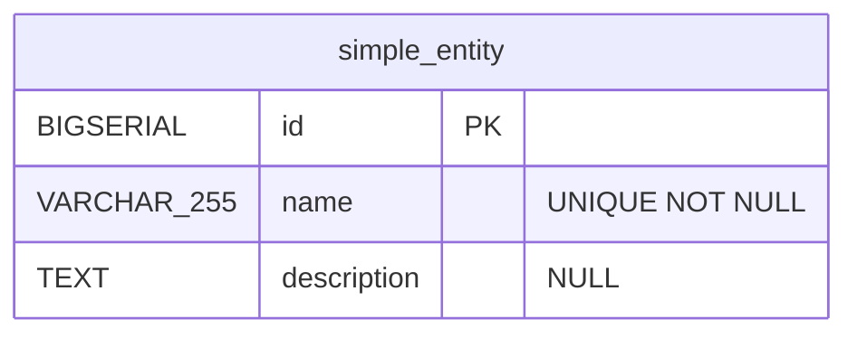
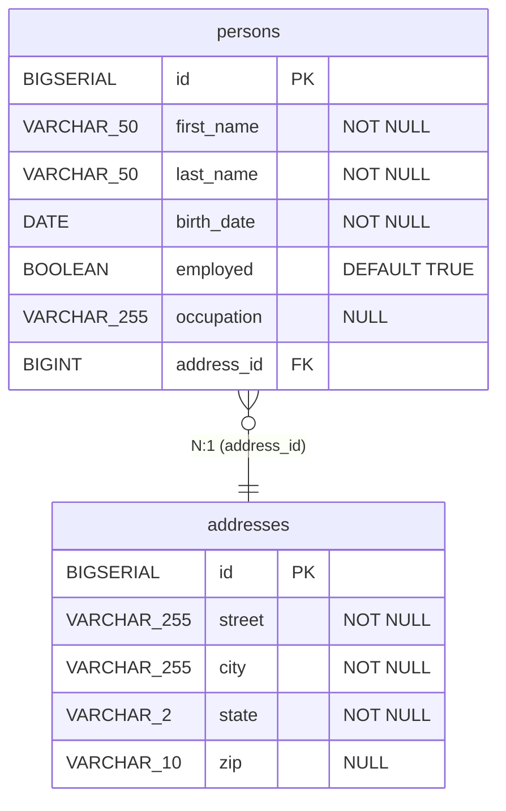
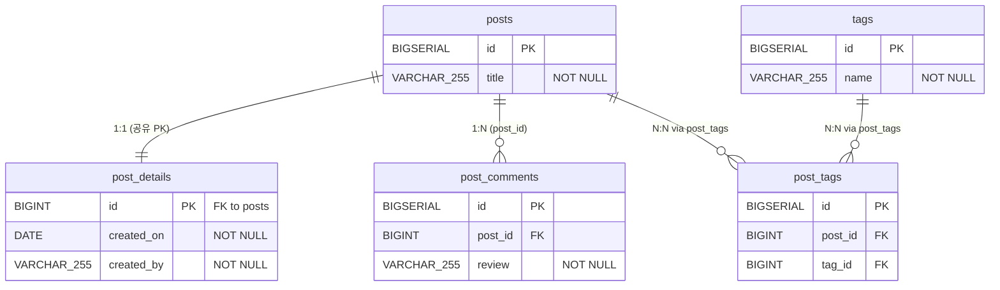
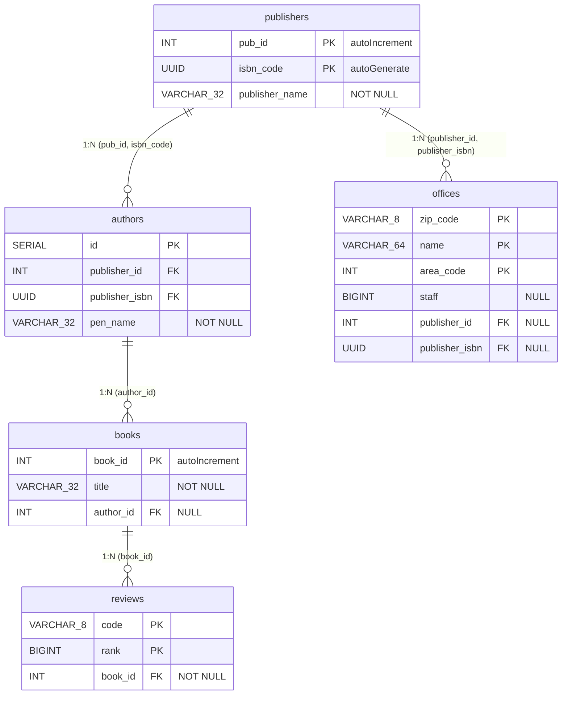
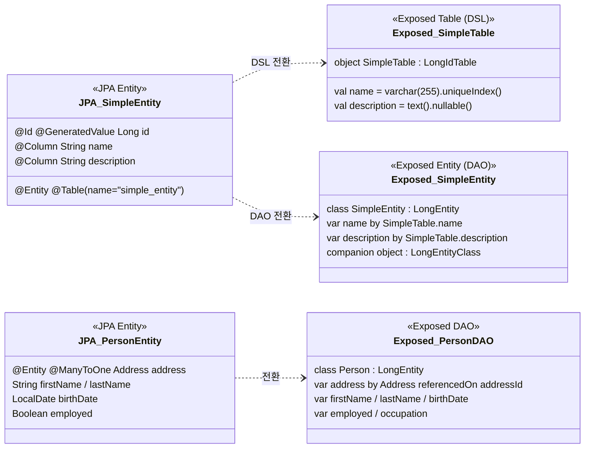

# 07 JPA Migration: 기본 전환 (01-convert-jpa-basic)

JPA 기본 CRUD/연관관계 코드를 Exposed로 전환하는 입문 모듈입니다. 기능 동등성을 유지하면서 의존성을 줄이는 전환 패턴을 다룹니다.

## 학습 목표

- JPA Entity 중심 코드를 Exposed DSL/DAO로 치환한다.
- 전환 전/후 결과 동등성 테스트를 작성한다.
- 점진적 전환 전략을 수립한다.

## 선수 지식

- JPA/Hibernate 기본
- [`../../05-exposed-dml/README.md`](../../05-exposed-dml/README.md)

## JPA ↔ Exposed 기본 CRUD 변환 대비표

| 작업      | JPA                                                          | Exposed DSL                                                | Exposed DAO                                      |
|---------|--------------------------------------------------------------|------------------------------------------------------------|--------------------------------------------------|
| 엔티티 정의  | `@Entity @Table(name="...")` 클래스                             | `object XxxTable : LongIdTable("...")`                     | `class Xxx(id: EntityID<Long>) : LongEntity(id)` |
| 컬럼 정의   | `@Column(name="col") val field: Type`                        | `val col = varchar("col", 128)`                            | `var field by XxxTable.col`                      |
| 저장      | `em.persist(entity)`                                         | `XxxTable.insert { it[col] = value }`                      | `Xxx.new { field = value }`                      |
| 조회 (단건) | `em.find(Xxx::class.java, id)`                               | `XxxTable.selectAll().where { id eq targetId }.single()`   | `Xxx.findById(id)`                               |
| 조회 (목록) | `em.createQuery("SELECT x FROM Xxx x").resultList`           | `XxxTable.selectAll().toList()`                            | `Xxx.all().toList()`                             |
| 조건 조회   | `em.createQuery("SELECT x FROM Xxx x WHERE x.name = :name")` | `XxxTable.selectAll().where { name eq value }`             | `Xxx.find { XxxTable.name eq value }`            |
| 수정      | 영속성 컨텍스트 내 필드 변경 (dirty checking)                            | `XxxTable.update({ id eq targetId }) { it[col] = newVal }` | `entity.field = newVal`                          |
| 삭제      | `em.remove(entity)`                                          | `XxxTable.deleteWhere { id eq targetId }`                  | `entity.delete()`                                |
| 트랜잭션    | `@Transactional` / `em.transaction.begin()`                  | `transaction { ... }`                                      | `transaction { ... }`                            |
| 배치 삽입   | `em.persist()` 반복 + `flush()`                                | `XxxTable.batchInsert(list) { ... }`                       | `Xxx.new { ... }` 반복 후 `flushCache()`            |
| 페이징     | `query.setFirstResult(offset).setMaxResults(limit)`          | `.limit(limit).offset(offset)`                             | `.limit(limit, offset)`                          |

## 핵심 개념

### DSL 방식 (직접 SQL 제어)

```kotlin
// 테이블 정의
object SimpleTable : LongIdTable("simple_entity") {
    val name        = varchar("name", 128)
    val description = text("description")
}

// 삽입
SimpleTable.batchInsert(names) { name ->
    this[SimpleTable.name] = name
    this[SimpleTable.description] = faker.lorem().sentence()
}

// 조회 + 페이징
val names: List<String> = SimpleTable
    .select(SimpleTable.name)
    .limit(2).offset(2)
    .map { it[SimpleTable.name] }
```

### DAO 방식 (객체 중심)

```kotlin
// Entity 클래스
class SimpleEntity(id: EntityID<Long>) : LongEntity(id) {
    companion object : LongEntityClass<SimpleEntity>(SimpleTable)
    var name        by SimpleTable.name
    var description by SimpleTable.description
}

// CRUD
transaction {
    val entity = SimpleEntity.new {
        name = "example"
        description = "test"
    }
    val found = SimpleEntity.findById(entity.id)
    found?.name = "updated"
}
```

## 관계 매핑 변환 다이어그램



## 도메인 ERD

### SimpleSchema ERD



### PersonSchema ERD



### BlogSchema ERD



### BookSchema ERD (복합 PK)



### Entity 클래스 다이어그램 — JPA Entity vs Exposed DAO



## JPA 어노테이션 → Exposed 매핑 대비표

| JPA 어노테이션           | Exposed 구현                                              | 비고                           |
|---------------------|---------------------------------------------------------|------------------------------|
| `@OneToOne` (단방향)   | `reference("col", OtherTable)` + `referencedOn`         | FK 컬럼 소유측에 `reference`       |
| `@OneToOne` (양방향)   | 단방향 + `optionalReferrersOn`                             | 역참조 측에 `referrersOn`         |
| `@OneToOne @MapsId` | `IdTable` + `override val id = reference("id", Parent)` | 공유 PK 패턴                     |
| `@OneToMany`        | `referrersOn` (역참조)                                     | 소유측은 자식 테이블의 FK              |
| `@ManyToOne`        | `reference("fk", ParentTable)` + `referencedOn`         | 자식 테이블에 FK 정의                |
| `@ManyToMany`       | `via` + 중간 테이블                                          | 중간 테이블 명시 정의                 |
| `@JoinColumn`       | FK 컬럼 이름 직접 지정                                          | `reference("col_name", ...)` |
| `@EmbeddedId`       | `CompositeIdTable`                                      | 복합 PK 테이블                    |
| `@IdClass`          | `CompositeIdTable` + `addIdColumn`                      | 복합 PK 대안                     |
| `cascade = PERSIST` | `SchemaUtils` + `ReferenceOption`                       | DB 레벨 CASCADE 설정             |
| `FetchType.EAGER`   | `.load(relation)` 또는 `JOIN` 쿼리                          | 명시적 eager loading            |
| `FetchType.LAZY`    | 기본 동작 (트랜잭션 내 접근 시 로드)                                  | 트랜잭션 범위 주의                   |

## 예제 지도

소스 위치: `src/test/kotlin/exposed/examples/jpa`

| 디렉터리               | 파일                                                      | 설명                                |
|--------------------|---------------------------------------------------------|-----------------------------------|
| `ex01_simple`      | `Ex01_Simple_DSL.kt`, `Ex02_Simple_DAO.kt`              | DSL/DAO 기본 CRUD 비교                |
| `ex02_entities`    | `Ex01_Blog.kt`, `Ex02_Person.kt`, `Ex03_Task.kt`        | 복합 Entity 관계 예제                   |
| `ex03_customId`    | `Ex01_CustomId.kt`                                      | 커스텀 ID 타입 정의                      |
| `ex04_compositeId` | `Ex01_CompositeId.kt`, `Ex02_IdClass.kt`                | 복합 PK (`@EmbeddedId`, `@IdClass`) |
| `ex05_relations`   | One-to-One, One-to-Many, Many-to-One, Many-to-Many 각 예제 | 관계 매핑 전환                          |

## JPA 엔티티 매핑 다이어그램

### Blog (One-to-One / One-to-Many / Many-to-Many)


예제 코드: [`ex02_entities/Ex01_Blog.kt`](src/test/kotlin/exposed/examples/jpa/ex02_entities/Ex01_Blog.kt), [
`ex02_entities/BlogSchema.kt`](src/test/kotlin/exposed/examples/jpa/ex02_entities/BlogSchema.kt)

### Person-Address (Many-to-One)


예제 코드: [`ex02_entities/Ex02_Person.kt`](src/test/kotlin/exposed/examples/jpa/ex02_entities/Ex02_Person.kt)

### One-to-One


예제 코드: [
`ex05_relations/ex01_one_to_one/Ex01_OneToOne_Unidirectional.kt`](src/test/kotlin/exposed/examples/jpa/ex05_relations/ex01_one_to_one/Ex01_OneToOne_Unidirectional.kt)

### One-to-Many


예제 코드: [
`ex05_relations/ex02_one_to_many/Ex01_OneToMany_Bidirectional_Batch.kt`](src/test/kotlin/exposed/examples/jpa/ex05_relations/ex02_one_to_many/Ex01_OneToMany_Bidirectional_Batch.kt)

### Many-to-One


예제 코드: [
`ex05_relations/ex03_many_to_one/Ex01_ManyToOne.kt`](src/test/kotlin/exposed/examples/jpa/ex05_relations/ex03_many_to_one/Ex01_ManyToOne.kt)

### Many-to-Many


예제 코드: [
`ex05_relations/ex04_many_to_many/Ex01_ManyToMany_Bank.kt`](src/test/kotlin/exposed/examples/jpa/ex05_relations/ex04_many_to_many/Ex01_ManyToMany_Bank.kt)

## 실행 방법

```bash
./gradlew :07-jpa:01-convert-jpa-basic:test
```

## 실습 체크리스트

- JPA 구현과 Exposed 구현의 결과를 같은 픽스처로 비교
- 예외 메시지/실패 코드가 기존 계약과 호환되는지 확인

## 성능·안정성 체크포인트

- 기본 조회에서 쿼리 수 회귀가 없는지 확인
- 트랜잭션 경계가 기존과 동일한지 검증

## 복잡한 시나리오

### 관계 매핑 5가지 유형

| JPA 어노테이션 | Exposed 구현 파일 |
|---|---|
| `@OneToOne` (단방향) | [`ex05_relations/ex01_one_to_one/Ex01_OneToOne_Unidirectional.kt`](src/test/kotlin/exposed/examples/jpa/ex05_relations/ex01_one_to_one/Ex01_OneToOne_Unidirectional.kt) |
| `@OneToOne` (양방향) | [`ex05_relations/ex01_one_to_one/Ex02_OneToOne_Bidirectional.kt`](src/test/kotlin/exposed/examples/jpa/ex05_relations/ex01_one_to_one/Ex02_OneToOne_Bidirectional.kt) |
| `@OneToMany` (배치/단방향) | [`ex05_relations/ex02_one_to_many/Ex01_OneToMany_Bidirectional_Batch.kt`](src/test/kotlin/exposed/examples/jpa/ex05_relations/ex02_one_to_many/Ex01_OneToMany_Bidirectional_Batch.kt) |
| `@ManyToOne` | [`ex05_relations/ex03_many_to_one/Ex01_ManyToOne.kt`](src/test/kotlin/exposed/examples/jpa/ex05_relations/ex03_many_to_one/Ex01_ManyToOne.kt) |
| `@ManyToMany` | [`ex05_relations/ex04_many_to_many/Ex01_ManyToMany_Bank.kt`](src/test/kotlin/exposed/examples/jpa/ex05_relations/ex04_many_to_many/Ex01_ManyToMany_Bank.kt) |

### CompositeId (복합 기본 키)

- JPA `@EmbeddedId`: [
  `ex04_compositeId/Ex01_CompositeId.kt`](src/test/kotlin/exposed/examples/jpa/ex04_compositeId/Ex01_CompositeId.kt)
- JPA `@IdClass`: [
  `ex04_compositeId/Ex02_IdClass.kt`](src/test/kotlin/exposed/examples/jpa/ex04_compositeId/Ex02_IdClass.kt)

### N+1 문제 해결

Exposed에서는 `load()` / `with()` 를 사용하거나 DSL JOIN 쿼리로 N+1을 해결합니다.

- Order 도메인: [`ex05_relations/ex02_one_to_many/Ex03_OneToMany_N_plus_1_Order.kt`](src/test/kotlin/exposed/examples/jpa/ex05_relations/ex02_one_to_many/Ex03_OneToMany_N_plus_1_Order.kt)
- Restaurant 도메인: [`ex05_relations/ex02_one_to_many/Ex04_OneToMany_N_plus_1_Restaurant.kt`](src/test/kotlin/exposed/examples/jpa/ex05_relations/ex02_one_to_many/Ex04_OneToMany_N_plus_1_Restaurant.kt)

## 다음 모듈

- [`../02-convert-jpa-advanced/README.md`](../02-convert-jpa-advanced/README.md)
