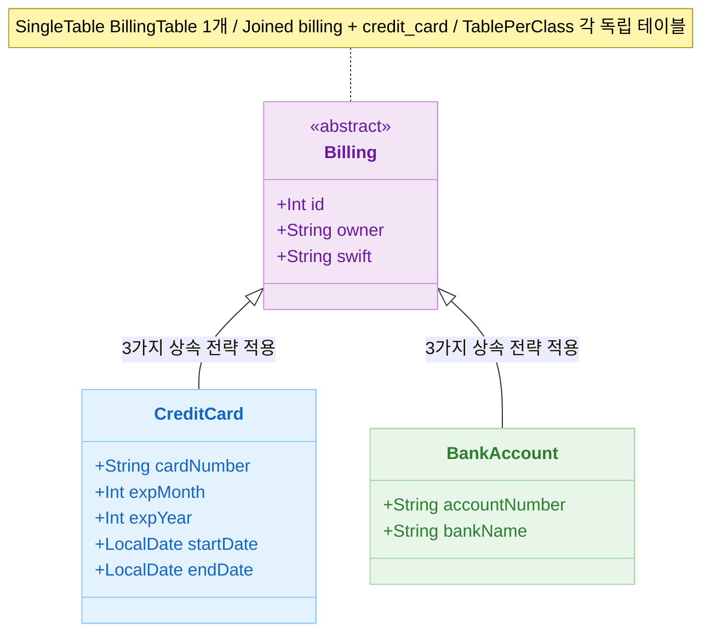
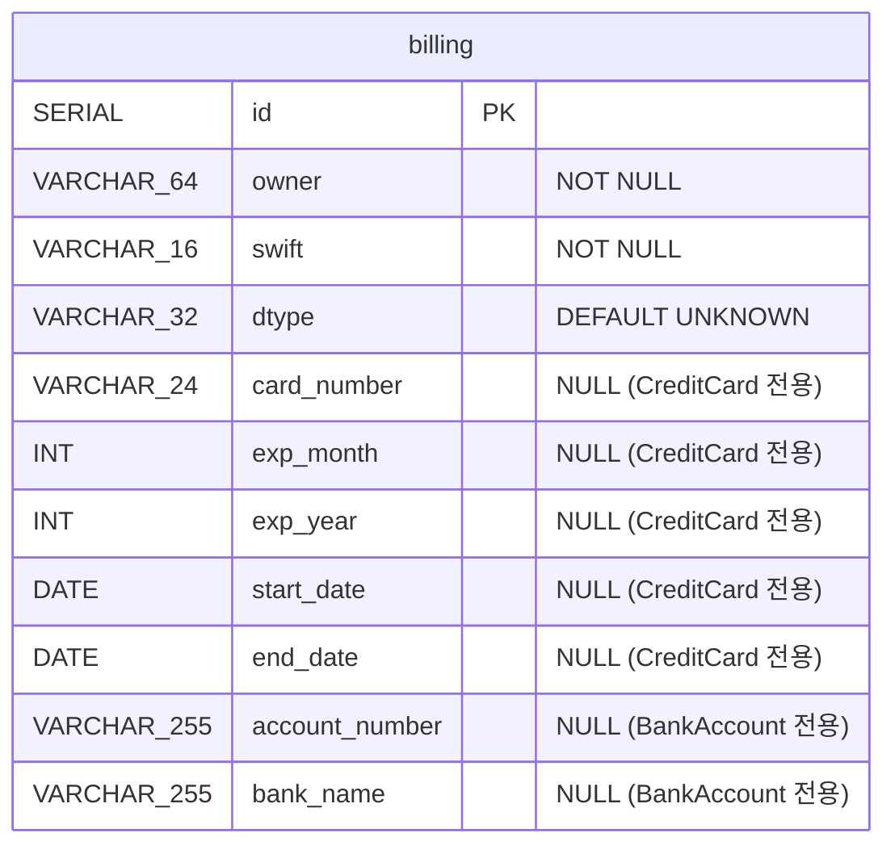
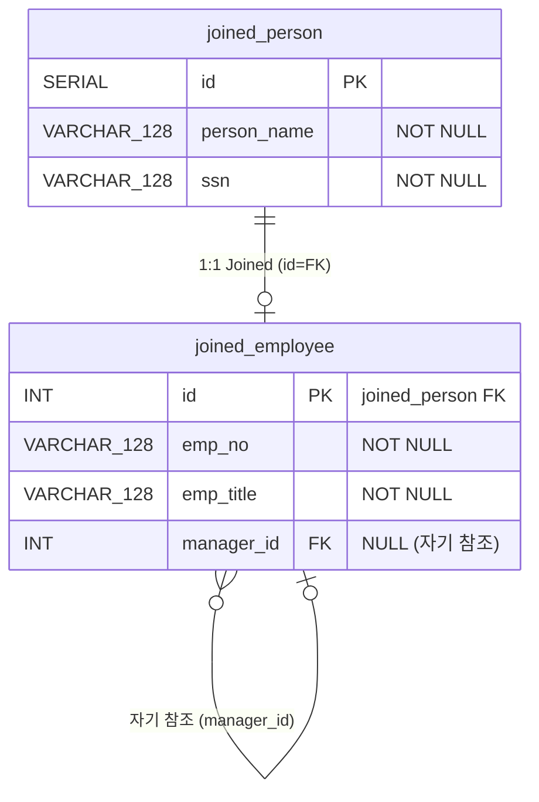
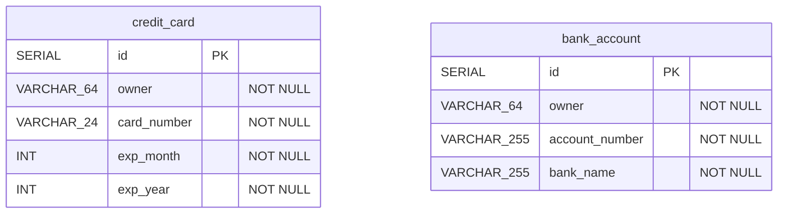
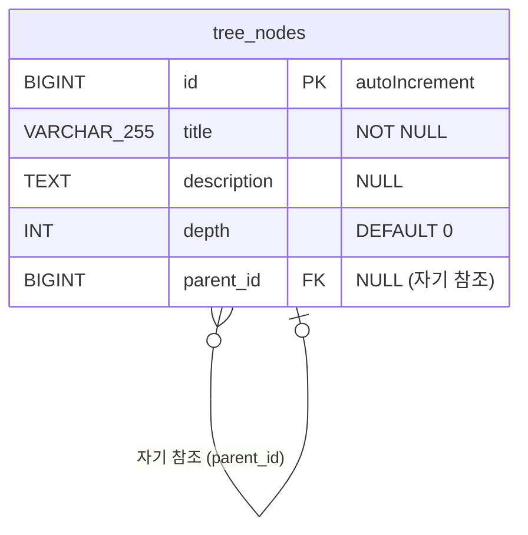
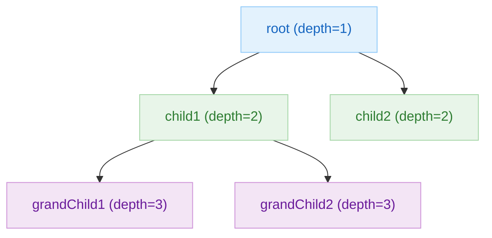
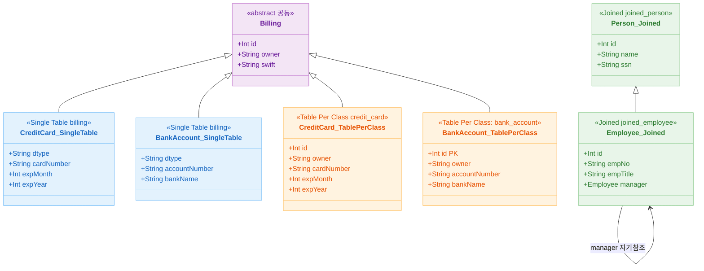

# 07 JPA Migration: 고급 전환 (02-convert-jpa-advanced)

[English](./README.md) | 한국어

복잡한 연관관계, 상속/감사, 잠금 전략 등 고급 JPA 기능을 Exposed로 전환하는 모듈입니다. 전환 과정에서 가장 자주 발생하는 성능/정합성 리스크를 다룹니다.

## 학습 목표

- 고급 매핑/쿼리의 Exposed 치환 전략을 익힌다.
- 낙관적 잠금/감사 필드 전환 시 주의점을 이해한다.
- 회귀 테스트와 성능 계측 기준을 수립한다.

## 선수 지식

- [`../01-convert-jpa-basic/README.md`](../01-convert-jpa-basic/README.md)

## 상속 매핑 전략 비교표

| 전략              | JPA 설정                          | 테이블 수 | Exposed 구현 방식                              | 장점                     | 단점                      |
|-----------------|---------------------------------|-------|--------------------------------------------|------------------------|-------------------------|
| Single Table    | `@Inheritance(SINGLE_TABLE)`    | 1     | 단일 `IntIdTable` + `dtype` 컬럼 + nullable 컬럼 | 조인 없이 빠른 조회            | 많은 nullable 컬럼, 테이블 비대화 |
| Joined Table    | `@Inheritance(JOINED)`          | 1+n   | 부모 `IntIdTable` + 자식 `IdTable` (FK=PK)     | 정규화된 스키마, 컬럼 비대화 없음    | 조인 필요, 삽입 시 여러 테이블 기록   |
| Table Per Class | `@Inheritance(TABLE_PER_CLASS)` | n     | 독립 `IntIdTable` 각각 정의                      | 각 테이블 독립성, 조인 없는 단일 조회 | 공통 쿼리 어려움, 스키마 중복       |

## 상속 전략별 Exposed 구현 패턴

### Single Table Inheritance

```kotlin
// 한 테이블에 dtype 컬럼으로 서브타입 구분
object BillingTable : IntIdTable("billing") {
    val owner    = varchar("owner", 64).index()
    val swift    = varchar("swift", 16)
    val dtype    = enumerationByName<BillingType>("dtype", 32).default(BillingType.UNKNOWN)

    // CreditCard 전용 컬럼 (nullable)
    val cardNumber  = varchar("card_number", 24).nullable()
    val expMonth    = integer("exp_month").nullable()
    val expYear     = integer("exp_year").nullable()

    // BankAccount 전용 컬럼 (nullable)
    val accountNumber = varchar("account_number", 255).nullable()
    val bankName      = varchar("bank_name", 255).nullable()
}

// 서브타입 조회
BillingTable.selectAll()
    .where { BillingTable.dtype eq BillingType.CREDIT_CARD }
```

### Joined Table Inheritance

```kotlin
// 부모 테이블
object PersonTable : IntIdTable("joined_person") {
    val name = varchar("person_name", 128)
    val ssn  = varchar("ssn", 128)
    init { uniqueIndex(name, ssn) }
}

// 자식 테이블 — PK = FK to PersonTable
object EmployeeTable : IdTable<Int>("joined_employee") {
    override val id: Column<EntityID<Int>> = reference("id", PersonTable, onDelete = CASCADE)
    val empNo   = varchar("emp_no", 128)
    val empTitle = varchar("emp_title", 128)
    val managerId = reference("manager_id", EmployeeTable).nullable()  // self-reference
}

// 조회 시 JOIN 필요
(PersonTable innerJoin EmployeeTable)
    .selectAll()
    .where { PersonTable.name eq "John" }
```

### Table Per Class Inheritance

```kotlin
// 각 서브타입마다 독립 테이블 (공통 컬럼 반복)
object CreditCardTable : IntIdTable("credit_card") {
    val owner      = varchar("owner", 64)
    val cardNumber = varchar("card_number", 24)
    val expMonth   = integer("exp_month")
}

object BankAccountTable : IntIdTable("bank_account") {
    val owner         = varchar("owner", 64)
    val accountNumber = varchar("account_number", 255)
}

// UNION으로 전체 조회
CreditCardTable.selectAll()
    .union(BankAccountTable.selectAll())
```

## 상속 전략 classDiagram



## 도메인 ERD

### Single Table Inheritance ERD



### Joined Table Inheritance ERD



### Table Per Class Inheritance ERD



### TreeNode ERD (자기 참조 트리 구조)



### 트리 구조 계층 예시



## 상속 전략 비교 classDiagram



## 고급 기능 JPA ↔ Exposed 변환 대비표

| 기능             | JPA 구현                                       | Exposed 구현                                          |
|----------------|----------------------------------------------|-----------------------------------------------------|
| Auditable 생성일  | `@CreatedDate` + `@EntityListeners`          | `EntityHook.subscribe` 또는 `by Delegates.observable` |
| Auditable 수정일  | `@LastModifiedDate` + `@EntityListeners`     | `EntityHook` `EntityChangeType.Updated` 구독          |
| 낙관적 잠금         | `@Version val version: Int`                  | 버전 컬럼 수동 관리 + `update where version = N`            |
| 서브쿼리           | JPQL `SELECT x FROM X x WHERE x.id IN (...)` | `inSubQuery` / `exists`                             |
| 셀프 조인 (트리)     | `@ManyToOne self` + CTE                      | `alias()` + 재귀 CTE (`WITH RECURSIVE`)               |
| Full JOIN      | `JOIN FETCH` (INNER/LEFT 만 지원)               | `fullJoin` / `crossJoin`                            |
| Covering Index | `@Index(columnList="...")` 힌트                | `addIndex(customIndexName, col1, col2)`             |

## 예제 지도

소스 위치: `src/test/kotlin/exposed/examples/jpa`

| 디렉터리               | 파일                                                                                                         | 설명                              |
|--------------------|------------------------------------------------------------------------------------------------------------|---------------------------------|
| `ex01_joins`       | `Ex01_Simple_Join.kt` ~ `Ex07_Misc_Join.kt`                                                                | INNER/FULL/LEFT/RIGHT/SELF JOIN |
| `ex02_subquery`    | `Ex01_SubQuery.kt`                                                                                         | 상관 서브쿼리, EXISTS                 |
| `ex03_inheritance` | `Ex01_SingleTable_Inheritance.kt`, `Ex02_Joined_Table_Inheritance.kt`, `Ex03_TablePerClass_Inheritance.kt` | 상속 전략 3가지                       |
| `ex04_tree`        | `Ex01_TreeNode.kt`, `TreeNodeSchema.kt`                                                                    | Self-Reference + CTE            |
| `ex05_auditable`   | `Ex01_AuditableEntity.kt`, `AuditableEntity.kt`                                                            | 생성/수정 타임스탬프 자동 관리               |
| `ex06_cte`         | `Ex01_CTE.kt`                                                                                              | CTE (Common Table Expression)   |
| `ex07_version`     | `Ex01_Version.kt`                                                                                          | 낙관적 잠금 (@Version)               |

## JPA 엔티티 매핑 다이어그램

### Single Table Inheritance


예제 코드: [
`ex03_inheritance/Ex01_SingleTable_Inheritance.kt`](src/test/kotlin/exposed/examples/jpa/ex03_inheritance/Ex01_SingleTable_Inheritance.kt)

### Joined Table Inheritance


예제 코드: [
`ex03_inheritance/Ex02_Joined_Table_Inheritance.kt`](src/test/kotlin/exposed/examples/jpa/ex03_inheritance/Ex02_Joined_Table_Inheritance.kt)

### Table Per Class Inheritance


예제 코드: [
`ex03_inheritance/Ex03_TablePerClass_Inheritance.kt`](src/test/kotlin/exposed/examples/jpa/ex03_inheritance/Ex03_TablePerClass_Inheritance.kt)

### Tree (Self-Reference)


예제 코드: [`ex04_tree/Ex01_TreeNode.kt`](src/test/kotlin/exposed/examples/jpa/ex04_tree/Ex01_TreeNode.kt)

## 실행 방법

```bash
./gradlew :07-jpa:02-convert-jpa-advanced:test
```

## 실습 체크리스트

- 복합 조회/정렬/페이징 쿼리의 동등성 확인
- 잠금 충돌 시 예외와 재시도 정책을 검증

## 성능·안정성 체크포인트

- 지연 로딩 전제 코드를 제거해 런타임 오류 방지
- 인덱스/쿼리 플랜 회귀를 CI 지표로 추적

## 복잡한 시나리오

### 상속 전략 3가지

| JPA 전략 | Exposed 구현 파일 |
|---|---|
| `@Inheritance(SINGLE_TABLE)` | [`ex03_inheritance/Ex01_SingleTable_Inheritance.kt`](src/test/kotlin/exposed/examples/jpa/ex03_inheritance/Ex01_SingleTable_Inheritance.kt) |
| `@Inheritance(JOINED)` | [`ex03_inheritance/Ex02_Joined_Table_Inheritance.kt`](src/test/kotlin/exposed/examples/jpa/ex03_inheritance/Ex02_Joined_Table_Inheritance.kt) |
| `@Inheritance(TABLE_PER_CLASS)` | [`ex03_inheritance/Ex03_TablePerClass_Inheritance.kt`](src/test/kotlin/exposed/examples/jpa/ex03_inheritance/Ex03_TablePerClass_Inheritance.kt) |

### 서브쿼리 패턴

- 상관 서브쿼리 / EXISTS 서브쿼리: [`ex02_subquery/Ex01_SubQuery.kt`](src/test/kotlin/exposed/examples/jpa/ex02_subquery/Ex01_SubQuery.kt)

### CTE (Common Table Expression)

- Exposed CTE API 전환: [`ex04_tree/Ex01_TreeNode.kt`](src/test/kotlin/exposed/examples/jpa/ex04_tree/Ex01_TreeNode.kt)

### 감사(Audit) 및 낙관적 잠금

- `@CreatedDate/@LastModifiedDate`: [`ex05_auditable/Ex01_AuditableEntity.kt`](src/test/kotlin/exposed/examples/jpa/ex05_auditable/Ex01_AuditableEntity.kt)
- `@Version` 낙관적 잠금: [`ex07_version/Ex01_Version.kt`](src/test/kotlin/exposed/examples/jpa/ex07_version/Ex01_Version.kt)

## 다음 챕터

- [`../../08-coroutines/README.md`](../../08-coroutines/README.md)
