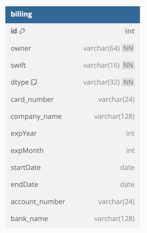
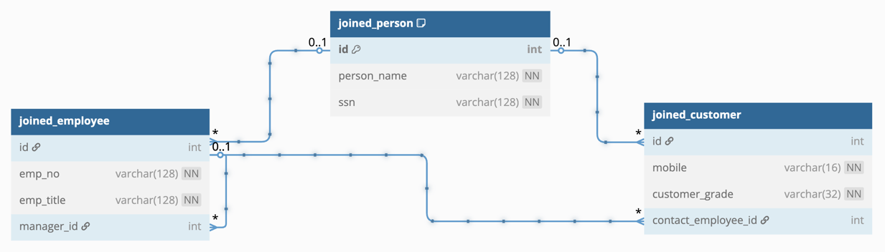
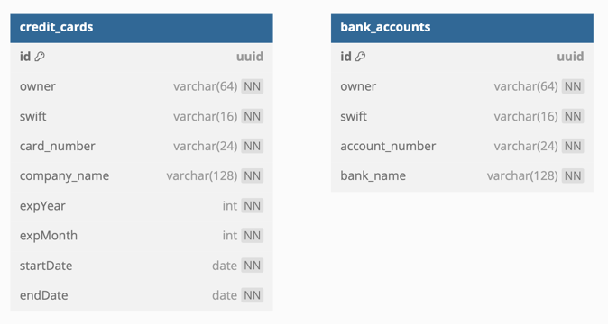
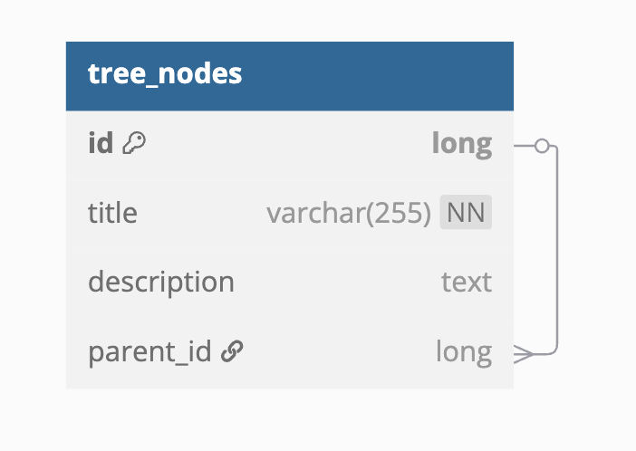

# 07 JPA Migration: 고급 전환 (02)

복잡한 연관관계, 상속/감사, 잠금 전략 등 고급 JPA 기능을 Exposed로 전환하는 모듈입니다. 전환 과정에서 가장 자주 발생하는 성능/정합성 리스크를 다룹니다.

## 학습 목표

- 고급 매핑/쿼리의 Exposed 치환 전략을 익힌다.
- 낙관적 잠금/감사 필드 전환 시 주의점을 이해한다.
- 회귀 테스트와 성능 계측 기준을 수립한다.

## 선수 지식

- [`../01-convert-jpa-basic/README.md`](../01-convert-jpa-basic/README.md)

## 핵심 개념

- 고급 관계 모델 전환
- 감사/버전 필드 처리
- 전환 검증 자동화

## 실행 방법

```bash
./gradlew :07-jpa:02-convert-jpa-advanced:test
```

## 실습 체크리스트

- 복합 조회/정렬/페이징 쿼리의 동등성 확인
- 잠금 충돌 시 예외와 재시도 정책을 검증

## 성능·안정성 체크포인트

- 지연 로딩 전제 코드를 제거해 런타임 오류 방지
- 인덱스/쿼리 플랜 회귀를 CI 지표로 추적

## JPA 엔티티 매핑 다이어그램

### Single Table Inheritance


예제 코드: [
`src/test/kotlin/exposed/examples/jpa/ex03_inheritance/Ex01_SingleTable_Inheritance.kt`](src/test/kotlin/exposed/examples/jpa/ex03_inheritance/Ex01_SingleTable_Inheritance.kt)

### Joined Table Inheritance


예제 코드: [
`src/test/kotlin/exposed/examples/jpa/ex03_inheritance/Ex02_Joined_Table_Inheritance.kt`](src/test/kotlin/exposed/examples/jpa/ex03_inheritance/Ex02_Joined_Table_Inheritance.kt)

### Table Per Class Inheritance


예제 코드: [
`src/test/kotlin/exposed/examples/jpa/ex03_inheritance/Ex03_TablePerClass_Inheritance.kt`](src/test/kotlin/exposed/examples/jpa/ex03_inheritance/Ex03_TablePerClass_Inheritance.kt)

### Tree (Self-Reference)


예제 코드: [
`src/test/kotlin/exposed/examples/jpa/ex04_tree/Ex01_TreeNode.kt`](src/test/kotlin/exposed/examples/jpa/ex04_tree/Ex01_TreeNode.kt), [
`src/test/kotlin/exposed/examples/jpa/ex04_tree/TreeNodeSchema.kt`](src/test/kotlin/exposed/examples/jpa/ex04_tree/TreeNodeSchema.kt)

## 다음 챕터

- [`../../08-coroutines/README.md`](../../08-coroutines/README.md)
