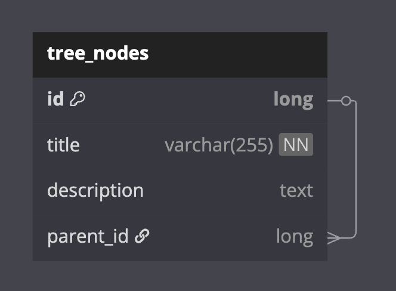

# JPA 고급 기능을 Exposed로 변환하기

JPA의 **고급 기능들을 Exposed로 어떻게 구현하는지
** 보여주는 예제 모음입니다. Join, SubQuery, 상속 매핑, Self-Reference 트리, Auditable 엔티티, CTE, Optimistic Locking 등 실무에서 자주 마주치는 고급 패턴을 다룹니다.

## 학습 목표

- 복잡한 Join과 SubQuery를 Exposed DSL로 작성하는 방법 습득
- JPA의 상속 전략(Single Table, Joined, Table Per Class)을 Exposed로 구현하는 패턴 이해
- Self-Reference 관계를 활용한 트리 구조 구현
- JPA의 `@PrePersist` / `@PreUpdate` 에 해당하는 Auditable 엔티티 구현
- Optimistic Locking(낙관적 잠금) 구현 방법

## 예제 구성

### ex01_joins - 다양한 Join 방식

JPA의 `JOIN FETCH`, `@EntityGraph`에 해당하는 Exposed의 Join 구현입니다.


| 파일                        | 설명                              | JPA 대응 개념                    |
|---------------------------|---------------------------------|------------------------------|
| `Ex01_Simple_Join.kt`     | Inner Join (Lazy/Eager Loading) | `JOIN FETCH`, `@EntityGraph` |
| `Ex02_Full_Join.kt`       | Full Outer Join                 | JPQL `FULL JOIN`             |
| `Ex03_Left_Join.kt`       | Left Join                       | JPQL `LEFT JOIN`             |
| `Ex04_Right_Join.kt`      | Right Join                      | JPQL `RIGHT JOIN`            |
| `Ex05_Self_Join.kt`       | Self Join (같은 테이블 간 Join)       | Self-referencing Join        |
| `Ex06_Convering_Index.kt` | Covering Index를 활용한 효율적 Join    | Index Hint                   |
| `Ex07_Misc_Join.kt`       | 기타 Join 패턴                      | 복합 Join                      |

**Exposed의 Join 문법:**

```kotlin
// Inner Join
val rows = orders
    .innerJoin(details) { orders.id eq details.orderId }
    .select(orders.id, orders.orderDate, details.lineNumber)
    .orderBy(orders.id)

// Alias를 사용한 Join (JPA의 엔티티 별칭과 유사)
val om = orders.alias("om")
val od = details.alias("od")
om.innerJoin(od) { om[orders.id] eq od[details.orderId] }

// 3개 이상 테이블 Multi Join
orders
    .innerJoin(orderLines) { orderLines.orderId eq orders.id }
    .innerJoin(items) { items.id eq orderLines.itemId }

// Eager Loading (N+1 해결)
Order.all().with(Order::details).toList()
```

### ex02_subquery - SubQuery 활용

JPA의 Criteria SubQuery에 해당하는 Exposed의 다양한 SubQuery 패턴입니다.

| 파일                 | 설명                                                                            | JPA 대응 개념         |
|--------------------|-------------------------------------------------------------------------------|-------------------|
| `Ex01_SubQuery.kt` | `eqSubQuery`, `notEqSubQuery`, `inSubQuery`, `notInSubQuery`, Update SubQuery | Criteria SubQuery |

**지원하는 SubQuery 연산자:**

| Exposed 연산자     | SQL                   | 설명                       |
|-----------------|-----------------------|--------------------------|
| `eqSubQuery`    | `= (SELECT ...)`      | SubQuery 결과와 같은 레코드      |
| `notEqSubQuery` | `!= (SELECT ...)`     | SubQuery 결과와 다른 레코드      |
| `inSubQuery`    | `IN (SELECT ...)`     | SubQuery 결과에 포함된 레코드     |
| `notInSubQuery` | `NOT IN (SELECT ...)` | SubQuery 결과에 포함되지 않은 레코드 |

```kotlin
// eqSubQuery: ID가 최대값인 레코드 조회
persons.selectAll().where {
    persons.id eqSubQuery persons.select(persons.id.max())
}

// inSubQuery: 성이 "Rubble"인 사람의 ID에 해당하는 레코드 조회
persons.selectAll().where {
    persons.id inSubQuery persons.select(persons.id).where { persons.lastName eq "Rubble" }
}

// Update에 SubQuery 사용 (H2)
persons.update({ persons.id eq 3L }) {
    it[addressId] = persons.select(persons.addressId.max() - 1L)
}
```

### ex03_inheritance - 상속 매핑 전략

JPA의 3가지 상속 매핑 전략을 Exposed로 구현합니다.

| 파일                                  | 설명                                  | JPA 대응 개념                                             |
|-------------------------------------|-------------------------------------|-------------------------------------------------------|
| `Ex01_SingleTable_Inheritance.kt`   | 한 테이블에 여러 엔티티 타입 저장 (`dtype` 구분 컬럼) | `@Inheritance(SINGLE_TABLE)` + `@DiscriminatorColumn` |
| `Ex02_Joined_Table_Inheritance.kt`  | 부모-자식 테이블 Join으로 상속 구현              | `@Inheritance(JOINED)`                                |
| `Ex03_TablePerClass_Inheritance.kt` | 엔티티 타입별 독립 테이블                      | `@Inheritance(TABLE_PER_CLASS)`                       |

#### Single Table Inheritance

한 테이블에 모든 서브타입의 컬럼을 모아놓고 `dtype` 컬럼으로 구분합니다.

**SingleTable Inheritance ERD**


```kotlin
// 하나의 billing 테이블에 CreditCard, BankAccount 정보를 모두 저장
object BillingTable: IntIdTable("billing") {
    val owner = varchar("owner", 64)
    val dtype = enumerationByName<BillingType>("dtype", 32)  // 구분 컬럼

    // CreditCard 전용 (nullable)
    val cardNumber = varchar("card_number", 24).nullable()

    // BankAccount 전용 (nullable)
    val accountNumber = varchar("account_number", 255).nullable()
}

// findById 오버라이드로 타입별 조회
override fun findById(id: EntityID<Int>): CreditCard? {
    return BillingTable.select(...)
        .where { BillingTable.id eq id }
        .andWhere { BillingTable.dtype eq BillingType.CREDIT_CARD }
        .let { wrapRows(it).singleOrNull() }
}
```

#### Joined Table Inheritance

부모 테이블과 자식 테이블을 각각 정의하고, 자식의 PK가 부모의 FK를 참조합니다.

**Joined Table Inheritance ERD**


```kotlin
// 부모 테이블
object PersonTable: IntIdTable("joined_person") {
    val personName = varchar("person_name", 128)
}

// 자식 테이블 (PK가 부모의 FK)
object EmployeeTable: IdTable<Int>("joined_employee") {
    override val id = reference("id", PersonTable)  // FK = PK
    val company = varchar("company", 128)
}
```

#### Table Per Class Inheritance

각 서브타입이 완전히 독립된 테이블을 가집니다. UUID 등 전역 고유 키를 사용해야 합니다.

**Table Per Class Inheritance ERD**


```kotlin
/**
 * JPA의 Table Per Class Inheritance 의 경우 다중의 테이블에서 고유한 값을 사용해야 해서,
 * UUID 같은 수형으로 전역적으로 Unique 하게 관리해야 한다.
 */
abstract class AbstractBillingTable(name: String = ""): TimebasedUUIDTable(name) {
    val owner = varchar("owner", 64).index()
    val swift = varchar("swift", 16)
}

object CreditCardTable: AbstractBillingTable("credit_card") {
    val cardNumber = varchar("card_number", 24).uniqueIndex()
    val companyName = varchar("company_name", 128)
    val expYear = integer("exp_year")
    val expMonth = integer("exp_month")
    val startDate = date("start_date")
    val endDate = date("end_date")

    init {
        index("idx_credit_card_number", false, cardNumber, owner)
    }
}

object BankAccountTable: AbstractBillingTable("bank_account") {
    val accountNumber = varchar("account_number", 24).uniqueIndex()
    val bankName = varchar("bank_name", 128)

    init {
        index("idx_bank_account_number", false, accountNumber, owner)
    }
}
```

### ex04_tree - Self-Reference 트리 구조

JPA의 `@ManyToOne` + `@OneToMany` Self-Reference에 해당하는 트리 구조 구현입니다.

| 파일                  | 설명                                      | JPA 대응 개념               |
|---------------------|-----------------------------------------|-------------------------|
| `TreeNodeSchema.kt` | Self-Reference 테이블 및 엔티티 정의             | `@ManyToOne` Self-Ref   |
| `Ex01_TreeNode.kt`  | 트리 CRUD, Self Join, SubQuery를 활용한 트리 탐색 | Self-referencing Entity |

**Tree Node ERD**



**트리 구조 구현:**

```kotlin
object TreeNodeTable: IntIdTable("tree_nodes") {
    val title = varchar("title", 128)
    val depth = integer("depth").default(0)
    val parentId = optReference("parent_id", TreeNodeTable)  // Self-Reference
}

class TreeNode(id: EntityID<Int>): IntEntity(id) {
    var parent by TreeNode optionalReferencedOn TreeNodeTable.parentId
    val children by TreeNode optionalReferrersOn TreeNodeTable.parentId
}
```

**트리 탐색 패턴:**

```kotlin
// Self Join: 부모-자식 관계 조회
val parent = TreeNodeTable.alias("parent")
val child = TreeNodeTable.alias("child")
parent.innerJoin(child) { parent[TreeNodeTable.id] eq child[TreeNodeTable.parentId] }

// SubQuery: 특정 패턴의 노드의 부모 찾기
TreeNodeTable.selectAll().where {
    TreeNodeTable.id inSubQuery sub.select(sub[TreeNodeTable.parentId])
        .where { sub[TreeNodeTable.title] like "grand%" }
}

// 재귀 삭제
fun TreeNode.deleteDescendants() {
    children.forEach { it.deleteDescendants() }
    delete()
}
```

### ex05_auditable - Auditable 엔티티

JPA의 `@PrePersist`, `@PreUpdate`, `@CreatedBy`, `@LastModifiedBy`에 해당하는 생성/수정 감사 기능을 Exposed의 `flush()` 오버라이드로 구현합니다.

| 파일                        | 설명                                   | JPA 대응 개념                                |
|---------------------------|--------------------------------------|------------------------------------------|
| `AuditableEntity.kt`      | Auditable 추상 테이블 및 엔티티 정의            | `@MappedSuperclass` + `@EntityListeners` |
| `Ex01_AuditableEntity.kt` | Auditable 엔티티 생성/수정 시 자동 감사 필드 설정 검증 | `@CreatedDate`, `@LastModifiedDate`      |

**핵심 구현:**

```kotlin
// Auditable 추상 테이블
abstract class AuditableIdTable<ID: Any>(name: String): IdTable<ID>(name) {
    val createdBy = varchar("created_by", 50).clientDefault { UserContext.getCurrentUser() }.nullable()
    val createdAt = timestamp("created_at").defaultExpression(CurrentTimestamp).nullable()
    val updatedBy = varchar("updated_by", 50).nullable()
    val updatedAt = timestamp("updatedAt_at").nullable()
}

// flush() 오버라이드로 자동 감사
abstract class AuditableEntity<ID: Any>(id: EntityID<ID>): Entity<ID>(id) {
    override fun flush(batch: EntityBatchUpdate?): Boolean {
        if (writeValues.isNotEmpty() && createdAt != null) {
            updatedAt = Instant.now()
            updatedBy = UserContext.getCurrentUser()
        }
        return super.flush(batch)
    }
}
```

- **UserContext**: Java 21의 `ScopedValue`를 사용하여 현재 사용자 정보를 전달 (ThreadLocal 대체)
- `Int`, `Long`, `UUID` 타입별 Auditable Table/Entity 추상 클래스 제공

### ex06_cte - Common Table Expression (CTE)

재귀적 CTE를 사용하여 트리 구조를 계층적으로 조회하는 예제입니다.

| 파일            | 설명                                | JPA 대응 개념        |
|---------------|-----------------------------------|------------------|
| `Ex01_CTE.kt` | Raw SQL 기반 재귀 CTE (PostgreSQL 전용) | Native Query CTE |

> **참고**: 현재 주석 처리 상태입니다. Exposed에서 CTE를 네이티브로 지원하지 않기 때문에 Raw SQL로 구현합니다.
> 재귀 CTE 예제는 `10-multitenancy/04-hierarchy-cte` 모듈에서 확인할 수 있습니다.

### ex07_version - Optimistic Locking (낙관적 잠금)

JPA의 `@Version`에 해당하는 낙관적 잠금을 Exposed로 구현합니다.

| 파일                | 설명                                            | JPA 대응 개념  |
|-------------------|-----------------------------------------------|------------|
| `Ex01_Version.kt` | DSL `update` + DAO `flush()` 오버라이드를 사용한 버전 관리 | `@Version` |

**DSL 방식 - 수동 버전 체크:**

```kotlin
// version 조건을 WHERE에 포함하여 동시 수정 감지
val updatedRows = Products.update({ Products.id eq id and (Products.version eq 0) }) {
    it[name] = "Updated Product A"
    it[version] = Products.version + 1  // 버전 증가
}
// updatedRows == 0 이면 다른 트랜잭션이 먼저 수정한 것
```

**DAO 방식 - `flush()` 오버라이드:**

```kotlin
class Product(id: EntityID<Int>): IntEntity(id) {
    override fun flush(batch: EntityBatchUpdate?): Boolean {
        if (writeValues.isNotEmpty()) {
            val matched = Product.count((Products.id eq id) and (Products.version eq version)) == 1L
            if (matched) {
                version += 1
            } else {
                throw SQLException("Version mismatch")  // 충돌 감지
            }
        }
        return super.flush(batch)
    }
}
```

**Upsert를 활용한 버전 관리 (PostgreSQL):**

```kotlin
Products.upsert(onUpdate = { it[Products.version] = Products.version + 1 }) {
    it[name] = "Product B"
    it[price] = 200.0.toBigDecimal()
    it[version] = 0
}
```

## JPA 고급 기능 vs Exposed 매핑 요약

| JPA 고급 기능                        | Exposed 구현 방식                               |
|----------------------------------|---------------------------------------------|
| `JOIN FETCH`                     | `with()` / `load()` Eager Loading           |
| Criteria SubQuery                | `eqSubQuery`, `inSubQuery` 등                |
| `@Inheritance(SINGLE_TABLE)`     | 단일 테이블 + `dtype` enum 컬럼 + `findById` 오버라이드 |
| `@Inheritance(JOINED)`           | 부모-자식 테이블 `reference()` + Join              |
| `@Inheritance(TABLE_PER_CLASS)`  | 독립 테이블 + UUID 전역 키                          |
| Self-Reference (`@ManyToOne`)    | `optReference()` + Self Table 참조            |
| `@PrePersist` / `@PreUpdate`     | `flush()` 오버라이드                             |
| `@CreatedBy` / `@LastModifiedBy` | `ScopedValue` + `clientDefault`             |
| `@Version`                       | `flush()` 오버라이드 + version 컬럼 조건부 update     |
| CTE (Native Query)               | Raw SQL `exec()`                            |

## 테스트 실행

```bash
# 전체 테스트 실행
./gradlew :07-jpa:02-convert-jpa-advanced:test

# 특정 예제만 실행
./gradlew :07-jpa:02-convert-jpa-advanced:test --tests "exposed.examples.jpa.ex01_joins.*"
./gradlew :07-jpa:02-convert-jpa-advanced:test --tests "exposed.examples.jpa.ex03_inheritance.*"
./gradlew :07-jpa:02-convert-jpa-advanced:test --tests "exposed.examples.jpa.ex07_version.*"
```

모든 테스트는 `@ParameterizedTest`로 H2, MySQL, PostgreSQL 등 여러 DB에서 실행됩니다.
`ex05_auditable`은 Java 21의 `ScopedValue`를 사용하므로 `@EnabledOnJre(JRE.JAVA_21)` 조건이 적용됩니다.

## Further Reading

- [9.2 JPA 고급 기능을 Exposed로 변환하기](https://debop.notion.site/1c32744526b0801897c4dba89f5a119e?v=1c32744526b08102a87c000c10445e4a)
