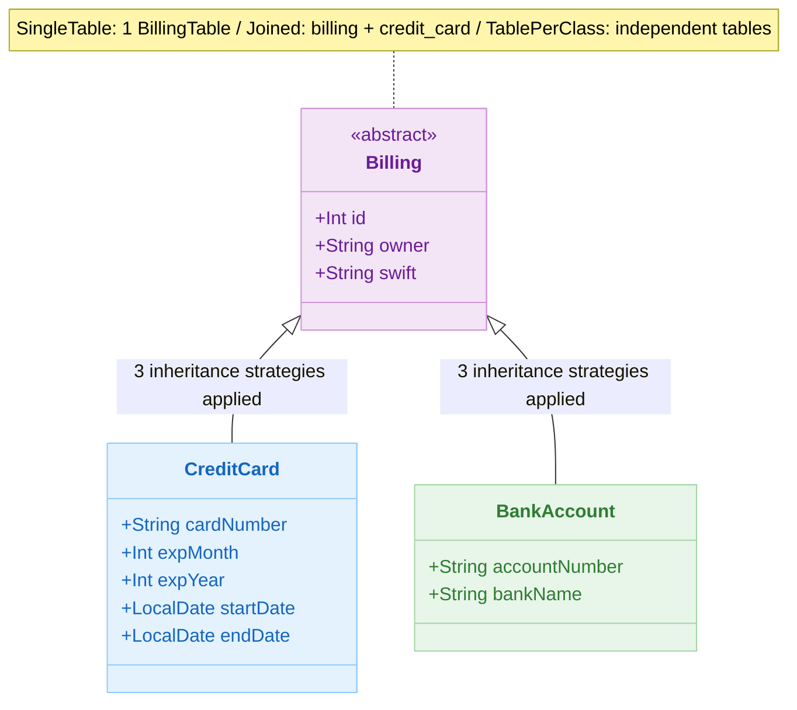
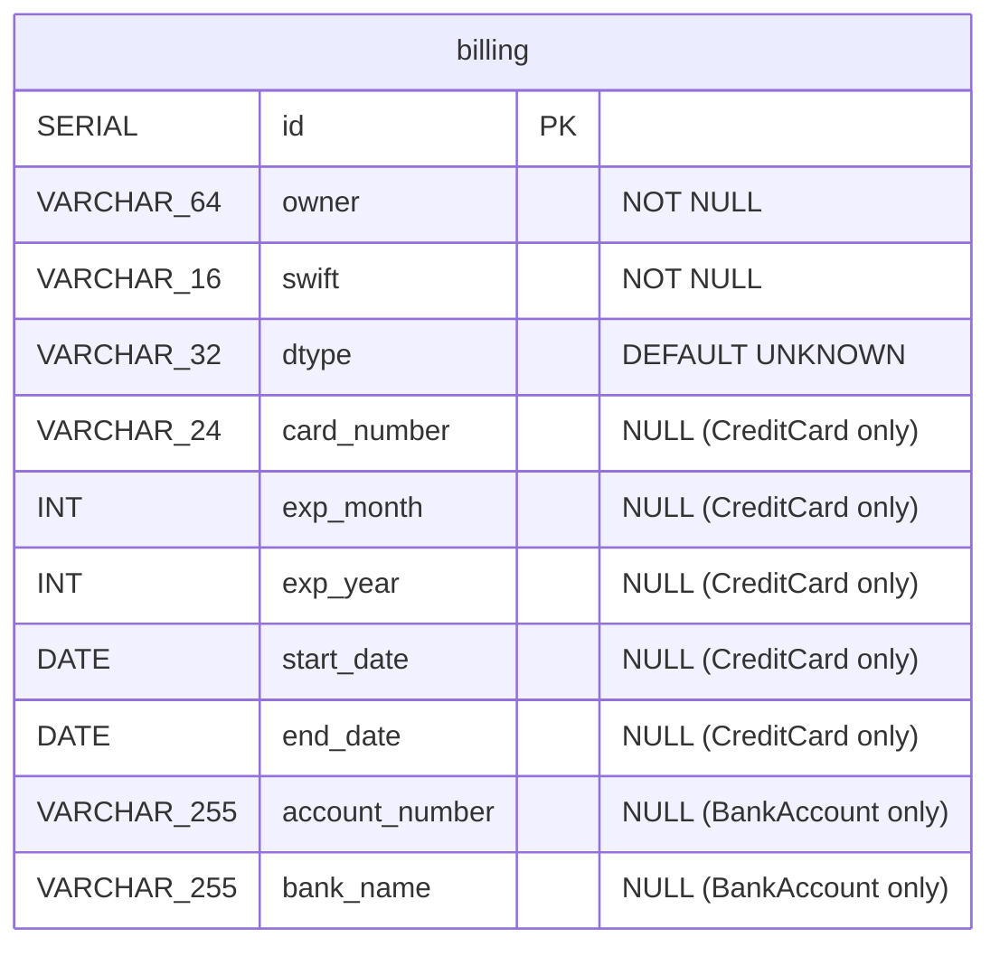
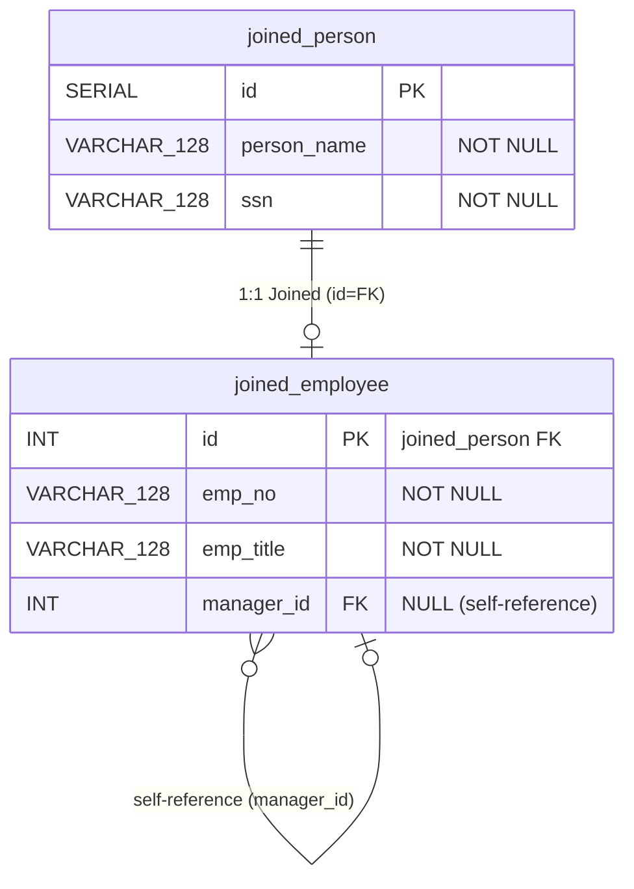
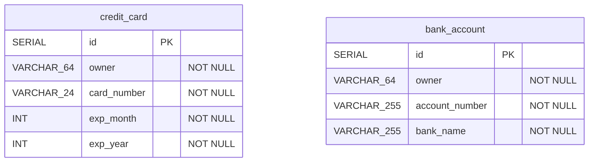
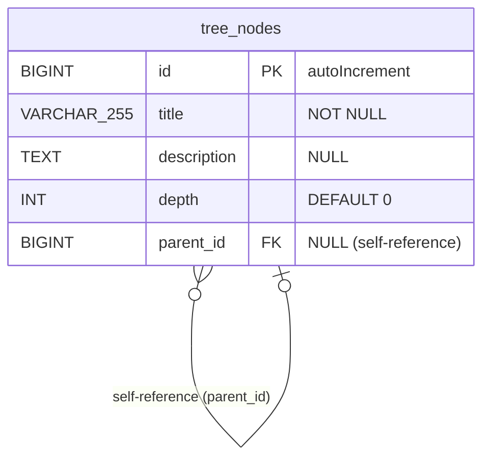
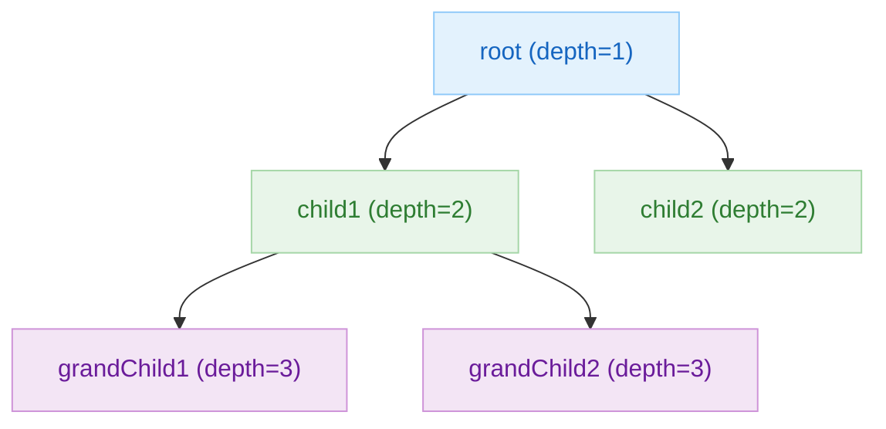
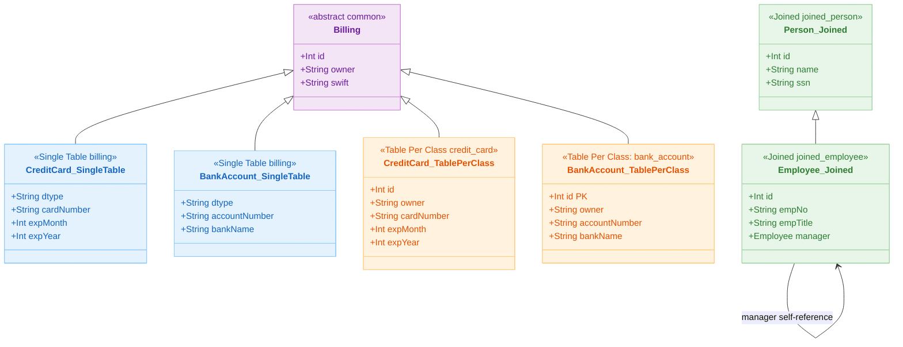

# 07 JPA Migration: Advanced Migration (02-convert-jpa-advanced)

English | [한국어](./README.ko.md)

A module for migrating advanced JPA features to Exposed, including complex relationships, inheritance/auditing, and locking strategies. Covers the most common performance and consistency risks encountered during migration.

## Learning Objectives

- Learn Exposed replacement strategies for advanced mappings and queries.
- Understand the key considerations when migrating optimistic locking and audit fields.
- Establish regression testing and performance measurement baselines.

## Prerequisites

- [`../01-convert-jpa-basic/README.md`](../01-convert-jpa-basic/README.md)

## Inheritance Mapping Strategy Comparison

| Strategy        | JPA Configuration               | Tables | Exposed Implementation                                   | Advantages                              | Disadvantages                           |
|-----------------|---------------------------------|--------|----------------------------------------------------------|-----------------------------------------|-----------------------------------------|
| Single Table    | `@Inheritance(SINGLE_TABLE)`    | 1      | Single `IntIdTable` + `dtype` column + nullable columns  | Fast queries without joins              | Many nullable columns, table bloat      |
| Joined Table    | `@Inheritance(JOINED)`          | 1+n    | Parent `IntIdTable` + child `IdTable` (FK=PK)            | Normalized schema, no column bloat      | Requires joins, multiple table writes   |
| Table Per Class | `@Inheritance(TABLE_PER_CLASS)` | n      | Independent `IntIdTable` per subtype                     | Table independence, single-table queries | Difficult cross-type queries, schema duplication |

## Exposed Implementation Patterns by Inheritance Strategy

### Single Table Inheritance

```kotlin
// Single table with dtype column to distinguish subtypes
object BillingTable : IntIdTable("billing") {
    val owner    = varchar("owner", 64).index()
    val swift    = varchar("swift", 16)
    val dtype    = enumerationByName<BillingType>("dtype", 32).default(BillingType.UNKNOWN)

    // CreditCard-only columns (nullable)
    val cardNumber  = varchar("card_number", 24).nullable()
    val expMonth    = integer("exp_month").nullable()
    val expYear     = integer("exp_year").nullable()

    // BankAccount-only columns (nullable)
    val accountNumber = varchar("account_number", 255).nullable()
    val bankName      = varchar("bank_name", 255).nullable()
}

// Query for subtype
BillingTable.selectAll()
    .where { BillingTable.dtype eq BillingType.CREDIT_CARD }
```

### Joined Table Inheritance

```kotlin
// Parent table
object PersonTable : IntIdTable("joined_person") {
    val name = varchar("person_name", 128)
    val ssn  = varchar("ssn", 128)
    init { uniqueIndex(name, ssn) }
}

// Child table — PK = FK to PersonTable
object EmployeeTable : IdTable<Int>("joined_employee") {
    override val id: Column<EntityID<Int>> = reference("id", PersonTable, onDelete = CASCADE)
    val empNo   = varchar("emp_no", 128)
    val empTitle = varchar("emp_title", 128)
    val managerId = reference("manager_id", EmployeeTable).nullable()  // self-reference
}

// JOIN required when querying
(PersonTable innerJoin EmployeeTable)
    .selectAll()
    .where { PersonTable.name eq "John" }
```

### Table Per Class Inheritance

```kotlin
// Independent table per subtype (common columns repeated)
object CreditCardTable : IntIdTable("credit_card") {
    val owner      = varchar("owner", 64)
    val cardNumber = varchar("card_number", 24)
    val expMonth   = integer("exp_month")
}

object BankAccountTable : IntIdTable("bank_account") {
    val owner         = varchar("owner", 64)
    val accountNumber = varchar("account_number", 255)
}

// UNION to query all
CreditCardTable.selectAll()
    .union(BankAccountTable.selectAll())
```

## Inheritance Strategy classDiagram



## Domain ERDs

### Single Table Inheritance ERD



### Joined Table Inheritance ERD



### Table Per Class Inheritance ERD



### TreeNode ERD (Self-reference Tree Structure)



### Tree Structure Hierarchy Example



## Inheritance Strategy Comparison classDiagram



## Advanced Feature JPA ↔ Exposed Conversion Reference

| Feature              | JPA Implementation                                     | Exposed Implementation                                        |
|----------------------|--------------------------------------------------------|---------------------------------------------------------------|
| Auditable created-at | `@CreatedDate` + `@EntityListeners`                    | `EntityHook.subscribe` or `by Delegates.observable`           |
| Auditable updated-at | `@LastModifiedDate` + `@EntityListeners`               | Subscribe to `EntityHook` `EntityChangeType.Updated`          |
| Optimistic locking   | `@Version val version: Int`                            | Manual version column + `update where version = N`            |
| Subquery             | JPQL `SELECT x FROM X x WHERE x.id IN (...)`           | `inSubQuery` / `exists`                                       |
| Self-join (tree)     | `@ManyToOne self` + CTE                                | `alias()` + recursive CTE (`WITH RECURSIVE`)                  |
| Full JOIN            | `JOIN FETCH` (INNER/LEFT only)                         | `fullJoin` / `crossJoin`                                      |
| Covering index       | `@Index(columnList="...")` hint                        | `addIndex(customIndexName, col1, col2)`                       |

## Example Map

Source location: `src/test/kotlin/exposed/examples/jpa`

| Directory          | Files                                                                                                      | Description                     |
|--------------------|------------------------------------------------------------------------------------------------------------|---------------------------------|
| `ex01_joins`       | `Ex01_Simple_Join.kt` ~ `Ex07_Misc_Join.kt`                                                                | INNER/FULL/LEFT/RIGHT/SELF JOIN |
| `ex02_subquery`    | `Ex01_SubQuery.kt`                                                                                         | Correlated subqueries, EXISTS   |
| `ex03_inheritance` | `Ex01_SingleTable_Inheritance.kt`, `Ex02_Joined_Table_Inheritance.kt`, `Ex03_TablePerClass_Inheritance.kt` | 3 inheritance strategies        |
| `ex04_tree`        | `Ex01_TreeNode.kt`, `TreeNodeSchema.kt`                                                                    | Self-Reference + CTE            |
| `ex05_auditable`   | `Ex01_AuditableEntity.kt`, `AuditableEntity.kt`                                                            | Auto-managed created/updated timestamps |
| `ex06_cte`         | `Ex01_CTE.kt`                                                                                              | CTE (Common Table Expression)   |
| `ex07_version`     | `Ex01_Version.kt`                                                                                          | Optimistic locking (@Version)   |

## JPA Entity Mapping Diagrams

### Single Table Inheritance


Example code: [
`ex03_inheritance/Ex01_SingleTable_Inheritance.kt`](src/test/kotlin/exposed/examples/jpa/ex03_inheritance/Ex01_SingleTable_Inheritance.kt)

### Joined Table Inheritance


Example code: [
`ex03_inheritance/Ex02_Joined_Table_Inheritance.kt`](src/test/kotlin/exposed/examples/jpa/ex03_inheritance/Ex02_Joined_Table_Inheritance.kt)

### Table Per Class Inheritance


Example code: [
`ex03_inheritance/Ex03_TablePerClass_Inheritance.kt`](src/test/kotlin/exposed/examples/jpa/ex03_inheritance/Ex03_TablePerClass_Inheritance.kt)

### Tree (Self-Reference)


Example code: [`ex04_tree/Ex01_TreeNode.kt`](src/test/kotlin/exposed/examples/jpa/ex04_tree/Ex01_TreeNode.kt)

## Running Tests

```bash
./gradlew :07-jpa:02-convert-jpa-advanced:test
```

## Practice Checklist

- Verify equivalence of complex query/sort/pagination results.
- Validate exception and retry policy on lock conflicts.

## Performance and Stability Checkpoints

- Remove lazy-loading-dependent code to prevent runtime errors.
- Track index/query plan regressions as CI metrics.

## Complex Scenarios

### 3 Inheritance Strategies

| JPA Strategy | Exposed Implementation File |
|---|---|
| `@Inheritance(SINGLE_TABLE)` | [`ex03_inheritance/Ex01_SingleTable_Inheritance.kt`](src/test/kotlin/exposed/examples/jpa/ex03_inheritance/Ex01_SingleTable_Inheritance.kt) |
| `@Inheritance(JOINED)` | [`ex03_inheritance/Ex02_Joined_Table_Inheritance.kt`](src/test/kotlin/exposed/examples/jpa/ex03_inheritance/Ex02_Joined_Table_Inheritance.kt) |
| `@Inheritance(TABLE_PER_CLASS)` | [`ex03_inheritance/Ex03_TablePerClass_Inheritance.kt`](src/test/kotlin/exposed/examples/jpa/ex03_inheritance/Ex03_TablePerClass_Inheritance.kt) |

### Subquery Patterns

- Correlated subquery / EXISTS subquery: [`ex02_subquery/Ex01_SubQuery.kt`](src/test/kotlin/exposed/examples/jpa/ex02_subquery/Ex01_SubQuery.kt)

### CTE (Common Table Expression)

- Exposed CTE API migration: [`ex04_tree/Ex01_TreeNode.kt`](src/test/kotlin/exposed/examples/jpa/ex04_tree/Ex01_TreeNode.kt)

### Auditing and Optimistic Locking

- `@CreatedDate/@LastModifiedDate`: [`ex05_auditable/Ex01_AuditableEntity.kt`](src/test/kotlin/exposed/examples/jpa/ex05_auditable/Ex01_AuditableEntity.kt)
- `@Version` optimistic locking: [`ex07_version/Ex01_Version.kt`](src/test/kotlin/exposed/examples/jpa/ex07_version/Ex01_Version.kt)

## Next Chapter

- [`../../08-coroutines/README.md`](../../08-coroutines/README.md)
