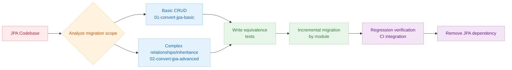
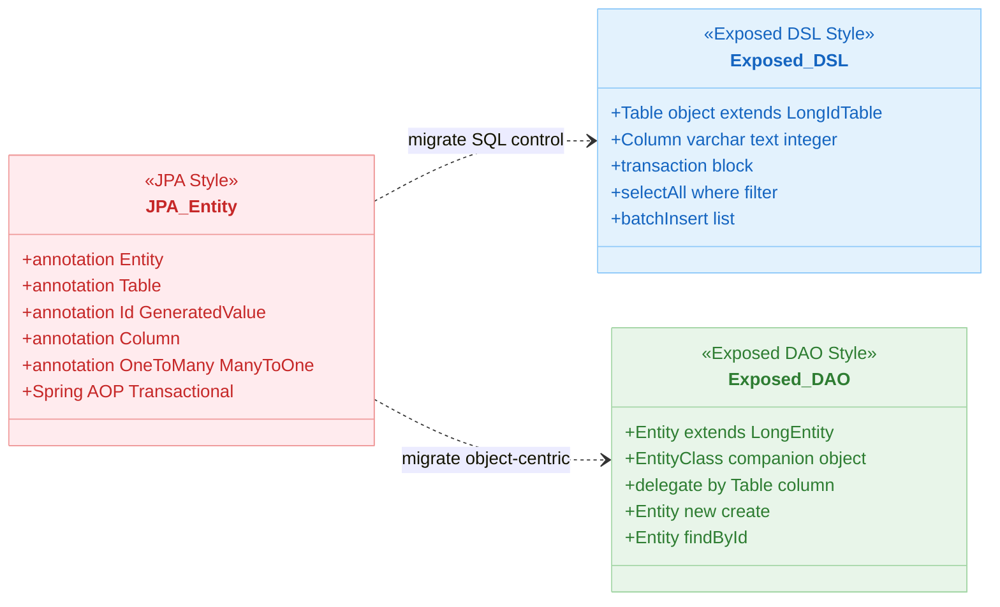
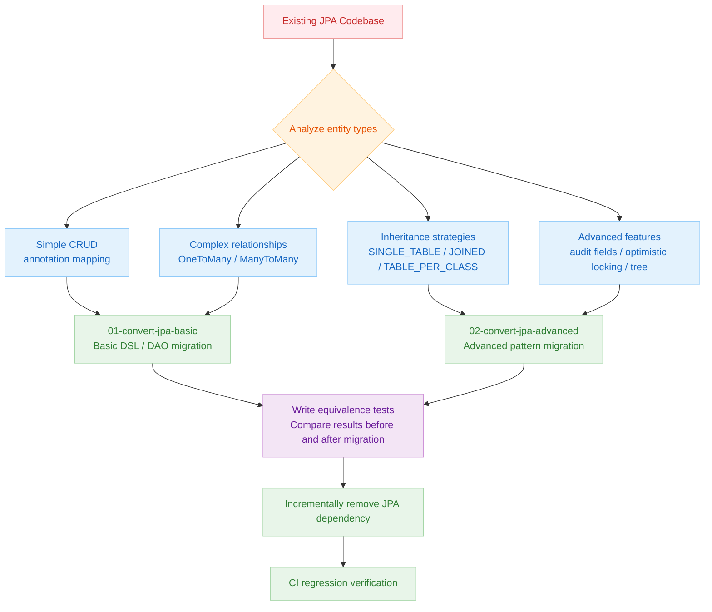

# 07 JPA Migration

English | [한국어](./README.ko.md)

A chapter that lays out step-by-step strategies for migrating an existing JPA-centric codebase to Exposed.

## Chapter Goals

- Compare the conceptual and behavioral differences between JPA and Exposed, and understand patterns that reduce migration risk.
- Build a strategy for incremental migration from basic CRUD to complex relationships and transactions.
- Establish a test-driven regression-prevention process.

## Prerequisites

- Hands-on experience with JPA/Hibernate basics
- `05-exposed-dml` content (DSL/DAO transaction flow)

## JPA vs Exposed Key Differences

| Item                | JPA / Hibernate                                     | Exposed                                     |
|---------------------|-----------------------------------------------------|---------------------------------------------|
| Mapping style       | Annotations (`@Entity`, `@Column`)                  | Kotlin DSL (`object Table`, `class Entity`) |
| Query language      | JPQL / Criteria API                                 | DSL (`selectAll().where { ... }`)           |
| Lazy loading        | Supported by default via `FetchType.LAZY`           | Requires explicit `load()` / `with()` calls |
| Transactions        | `@Transactional` (Spring AOP)                       | `transaction { }` lambda block              |
| Persistence context | EntityManager-centric                               | Entity cache within transaction scope       |
| Optimistic locking  | `@Version` annotation                               | Manual version column management            |
| Audit fields        | `@CreatedDate`, `@LastModifiedDate`                 | `EntityHook` or Property Delegate           |
| Inheritance mapping | `@Inheritance(SINGLE_TABLE/JOINED/TABLE_PER_CLASS)` | Expressed directly as table structure       |
| N+1 prevention      | `JOIN FETCH`, `@BatchSize`                          | `load()`, `with()`, JOIN queries            |
| Schema creation     | `hibernate.hbm2ddl.auto`                            | `SchemaUtils.create()`                      |

## Migration Strategy Overview



## JPA vs Exposed Concept Comparison Diagram



## Migration Approach Comparison



## Included Modules

| Module                      | Description                                                    |
|-----------------------------|----------------------------------------------------------------|
| `01-convert-jpa-basic`      | Basic CRUD migration scenarios and Entity mapping comparison   |
| `02-convert-jpa-advanced`   | Complex query/relationship/transaction and batch migration strategies |

## Recommended Learning Order

1. `01-convert-jpa-basic`
2. `02-convert-jpa-advanced`

## Running Tests

```bash
# Run submodule individually
./gradlew :07-jpa:01-convert-jpa-basic:test
./gradlew :07-jpa:02-convert-jpa-advanced:test

# Run the entire chapter
./gradlew :07-jpa:test
```

## Test Points

- Verify that results are equivalent for the same input before and after migration.
- Confirm that transaction/lock behavior is consistent with the original policy.

## Performance and Stability Checkpoints

- Check whether lazy-loading-dependent code has been removed.
- Review query count/response time regressions through measurements.

## Complex Scenario Guide

### Relationship Mapping Patterns (`01-convert-jpa-basic/ex05_relations/`)

| JPA Annotation            | Exposed Implementation File                                                                                                                                                                                   |
|---------------------------|------------------------------------------------------------------------------------------------------------------------------------------------------------------------------------------------------------|
| `@OneToOne` (unidirectional) | [`ex05_relations/ex01_one_to_one/Ex01_OneToOne_Unidirectional.kt`](01-convert-jpa-basic/src/test/kotlin/exposed/examples/jpa/ex05_relations/ex01_one_to_one/Ex01_OneToOne_Unidirectional.kt)            |
| `@OneToOne` (bidirectional) | [`ex05_relations/ex01_one_to_one/Ex02_OneToOne_Bidirectional.kt`](01-convert-jpa-basic/src/test/kotlin/exposed/examples/jpa/ex05_relations/ex01_one_to_one/Ex02_OneToOne_Bidirectional.kt)              |
| `@OneToOne @MapsId`       | [`ex05_relations/ex01_one_to_one/Ex03_OneToOne_Unidirectional_MapsId.kt`](01-convert-jpa-basic/src/test/kotlin/exposed/examples/jpa/ex05_relations/ex01_one_to_one/Ex03_OneToOne_Unidirectional_MapsId.kt) |
| `@OneToMany` (batch insert) | [`ex05_relations/ex02_one_to_many/Ex01_OneToMany_Bidirectional_Batch.kt`](01-convert-jpa-basic/src/test/kotlin/exposed/examples/jpa/ex05_relations/ex02_one_to_many/Ex01_OneToMany_Bidirectional_Batch.kt) |
| `@OneToMany` N+1 solution | [`ex05_relations/ex02_one_to_many/Ex03_OneToMany_N_plus_1_Order.kt`](01-convert-jpa-basic/src/test/kotlin/exposed/examples/jpa/ex05_relations/ex02_one_to_many/Ex03_OneToMany_N_plus_1_Order.kt)          |
| `@ManyToMany`             | [`ex05_relations/ex04_many_to_many/Ex01_ManyToMany_Bank.kt`](01-convert-jpa-basic/src/test/kotlin/exposed/examples/jpa/ex05_relations/ex04_many_to_many/Ex01_ManyToMany_Bank.kt)                          |

### JPA Inheritance Strategies vs Exposed (`02-convert-jpa-advanced/ex03_inheritance/`)

| JPA Strategy | Exposed Implementation File |
|---|---|
| `@Inheritance(SINGLE_TABLE)` | [`Ex01_SingleTable_Inheritance.kt`](02-convert-jpa-advanced/src/test/kotlin/exposed/examples/jpa/ex03_inheritance/Ex01_SingleTable_Inheritance.kt) |
| `@Inheritance(JOINED)` | [`Ex02_Joined_Table_Inheritance.kt`](02-convert-jpa-advanced/src/test/kotlin/exposed/examples/jpa/ex03_inheritance/Ex02_Joined_Table_Inheritance.kt) |
| `@Inheritance(TABLE_PER_CLASS)` | [`Ex03_TablePerClass_Inheritance.kt`](02-convert-jpa-advanced/src/test/kotlin/exposed/examples/jpa/ex03_inheritance/Ex03_TablePerClass_Inheritance.kt) |

### Subqueries and Advanced Queries (`02-convert-jpa-advanced/`)

- **Subqueries**: [`ex02_subquery/Ex01_SubQuery.kt`](02-convert-jpa-advanced/src/test/kotlin/exposed/examples/jpa/ex02_subquery/Ex01_SubQuery.kt)
- **Self-join / Tree structure**: [`ex04_tree/Ex01_TreeNode.kt`](02-convert-jpa-advanced/src/test/kotlin/exposed/examples/jpa/ex04_tree/Ex01_TreeNode.kt)
- **Auditable entities** (created/updated timestamps): [`ex05_auditable/Ex01_AuditableEntity.kt`](02-convert-jpa-advanced/src/test/kotlin/exposed/examples/jpa/ex05_auditable/Ex01_AuditableEntity.kt)
- **Optimistic Locking**: [`ex07_version/Ex01_Version.kt`](02-convert-jpa-advanced/src/test/kotlin/exposed/examples/jpa/ex07_version/Ex01_Version.kt)

## Next Chapter

- [08-coroutines](../08-coroutines/README.md): Expand into coroutine/Virtual Thread-based Exposed operation patterns.
