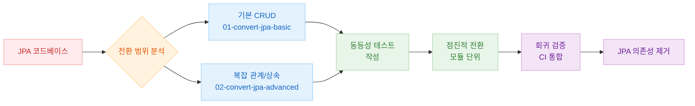
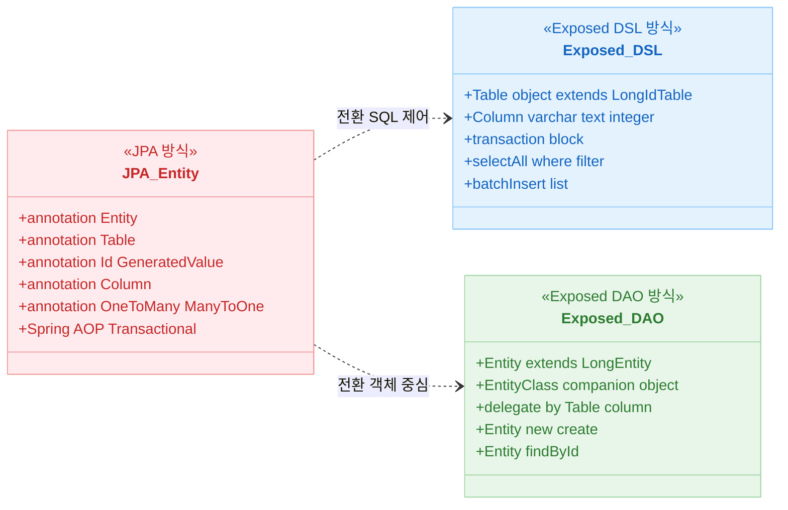
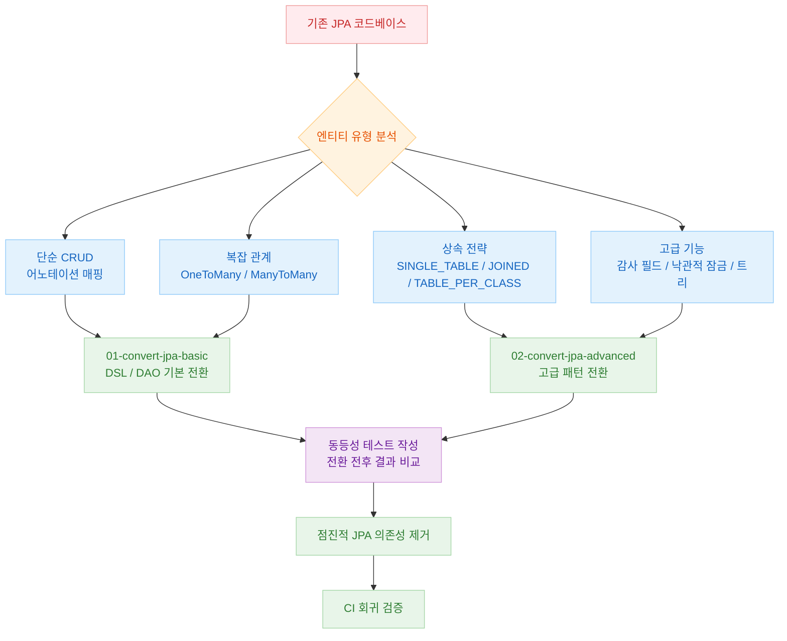

# 07 JPA Migration

기존 JPA 중심 코드베이스를 Exposed로 전환할 때 필요한 전략을 단계적으로 정리하는 챕터입니다.

## 챕터 목표

- JPA와 Exposed의 개념/동작 차이를 비교하고, 전환 리스크를 줄이는 패턴을 이해한다.
- 기본 CRUD부터 복잡한 관계/트랜잭션까지 점진적으로 전환할 수 있는 전략을 수립한다.
- 테스트 중심의 회귀 방지 절차를 정립한다.

## 선수 지식

- JPA/Hibernate 기본 사용 경험
- `05-exposed-dml` 내용 (DSL/DAO 트랜잭션 흐름)

## JPA vs Exposed 핵심 차이

| 항목       | JPA / Hibernate                                     | Exposed                                     |
|----------|-----------------------------------------------------|---------------------------------------------|
| 매핑 방식    | 어노테이션(`@Entity`, `@Column`)                         | Kotlin DSL (`object Table`, `class Entity`) |
| 쿼리 언어    | JPQL / Criteria API                                 | DSL (`selectAll().where { ... }`)           |
| 지연 로딩    | `FetchType.LAZY` 기본 지원                              | 명시적 `load()` / `with()` 호출 필요               |
| 트랜잭션     | `@Transactional` (Spring AOP)                       | `transaction { }` 람다 블록                     |
| 영속성 컨텍스트 | EntityManager 중심                                    | 트랜잭션 범위 내 Entity 캐시                         |
| 낙관적 잠금   | `@Version` 어노테이션                                    | 버전 컬럼 수동 관리                                 |
| 감사 필드    | `@CreatedDate`, `@LastModifiedDate`                 | `EntityHook` 또는 Property Delegate           |
| 상속 매핑    | `@Inheritance(SINGLE_TABLE/JOINED/TABLE_PER_CLASS)` | 테이블 구조로 직접 표현                               |
| N+1 방지   | `JOIN FETCH`, `@BatchSize`                          | `load()`, `with()`, JOIN 쿼리                 |
| 스키마 생성   | `hibernate.hbm2ddl.auto`                            | `SchemaUtils.create()`                      |

## 전환 전략 개요



## JPA vs Exposed 개념 비교 다이어그램



## 전환 접근법 비교



## 포함 모듈

| 모듈                        | 설명                             |
|---------------------------|--------------------------------|
| `01-convert-jpa-basic`    | 기본 CRUD 전환 시나리오 및 Entity 매핑 비교 |
| `02-convert-jpa-advanced` | 복잡 쿼리/관계/트랜잭션, 트리거/배치 전환 전략    |

## 권장 학습 순서

1. `01-convert-jpa-basic`
2. `02-convert-jpa-advanced`

## 실행 방법

```bash
# 서브모듈 단독 실행
./gradlew :07-jpa:01-convert-jpa-basic:test
./gradlew :07-jpa:02-convert-jpa-advanced:test

# 전체 챕터 실행
./gradlew :07-jpa:test
```

## 테스트 포인트

- 전환 전/후 동일 입력에 대해 결과가 동등한지 검증한다.
- 트랜잭션/락 동작이 기존 정책과 일관된지 확인한다.

## 성능·안정성 체크포인트

- 지연 로딩 의존 코드 제거 여부를 점검한다.
- 쿼리 수/응답 시간 회귀를 계측으로 검토한다.

## 복잡한 시나리오 가이드

### 관계 매핑 패턴 (`01-convert-jpa-basic/ex05_relations/`)

| JPA 어노테이션            | Exposed 구현 파일                                                                                                                                                                                              |
|----------------------|------------------------------------------------------------------------------------------------------------------------------------------------------------------------------------------------------------|
| `@OneToOne` (단방향)    | [`ex05_relations/ex01_one_to_one/Ex01_OneToOne_Unidirectional.kt`](01-convert-jpa-basic/src/test/kotlin/exposed/examples/jpa/ex05_relations/ex01_one_to_one/Ex01_OneToOne_Unidirectional.kt)               |
| `@OneToOne` (양방향)    | [`ex05_relations/ex01_one_to_one/Ex02_OneToOne_Bidirectional.kt`](01-convert-jpa-basic/src/test/kotlin/exposed/examples/jpa/ex05_relations/ex01_one_to_one/Ex02_OneToOne_Bidirectional.kt)                 |
| `@OneToOne @MapsId`  | [`ex05_relations/ex01_one_to_one/Ex03_OneToOne_Unidirectional_MapsId.kt`](01-convert-jpa-basic/src/test/kotlin/exposed/examples/jpa/ex05_relations/ex01_one_to_one/Ex03_OneToOne_Unidirectional_MapsId.kt) |
| `@OneToMany` (배치 삽입) | [`ex05_relations/ex02_one_to_many/Ex01_OneToMany_Bidirectional_Batch.kt`](01-convert-jpa-basic/src/test/kotlin/exposed/examples/jpa/ex05_relations/ex02_one_to_many/Ex01_OneToMany_Bidirectional_Batch.kt) |
| `@OneToMany` N+1 해결  | [`ex05_relations/ex02_one_to_many/Ex03_OneToMany_N_plus_1_Order.kt`](01-convert-jpa-basic/src/test/kotlin/exposed/examples/jpa/ex05_relations/ex02_one_to_many/Ex03_OneToMany_N_plus_1_Order.kt)           |
| `@ManyToMany`        | [`ex05_relations/ex04_many_to_many/Ex01_ManyToMany_Bank.kt`](01-convert-jpa-basic/src/test/kotlin/exposed/examples/jpa/ex05_relations/ex04_many_to_many/Ex01_ManyToMany_Bank.kt)                           |

### JPA Inheritance 전략 vs Exposed (`02-convert-jpa-advanced/ex03_inheritance/`)

| JPA 전략 | Exposed 구현 파일 |
|---|---|
| `@Inheritance(SINGLE_TABLE)` | [`Ex01_SingleTable_Inheritance.kt`](02-convert-jpa-advanced/src/test/kotlin/exposed/examples/jpa/ex03_inheritance/Ex01_SingleTable_Inheritance.kt) |
| `@Inheritance(JOINED)` | [`Ex02_Joined_Table_Inheritance.kt`](02-convert-jpa-advanced/src/test/kotlin/exposed/examples/jpa/ex03_inheritance/Ex02_Joined_Table_Inheritance.kt) |
| `@Inheritance(TABLE_PER_CLASS)` | [`Ex03_TablePerClass_Inheritance.kt`](02-convert-jpa-advanced/src/test/kotlin/exposed/examples/jpa/ex03_inheritance/Ex03_TablePerClass_Inheritance.kt) |

### 서브쿼리 및 고급 쿼리 (`02-convert-jpa-advanced/`)

- **서브쿼리**: [`ex02_subquery/Ex01_SubQuery.kt`](02-convert-jpa-advanced/src/test/kotlin/exposed/examples/jpa/ex02_subquery/Ex01_SubQuery.kt)
- **셀프 조인 / 트리 구조**: [`ex04_tree/Ex01_TreeNode.kt`](02-convert-jpa-advanced/src/test/kotlin/exposed/examples/jpa/ex04_tree/Ex01_TreeNode.kt)
- **Auditable 엔티티** (생성/수정 타임스탬프): [`ex05_auditable/Ex01_AuditableEntity.kt`](02-convert-jpa-advanced/src/test/kotlin/exposed/examples/jpa/ex05_auditable/Ex01_AuditableEntity.kt)
- **낙관적 잠금(Optimistic Lock)**: [`ex07_version/Ex01_Version.kt`](02-convert-jpa-advanced/src/test/kotlin/exposed/examples/jpa/ex07_version/Ex01_Version.kt)

## 다음 챕터

- [08-coroutines](../08-coroutines/README.md): 코루틴/Virtual Thread 기반 Exposed 운영 패턴으로 확장합니다.
