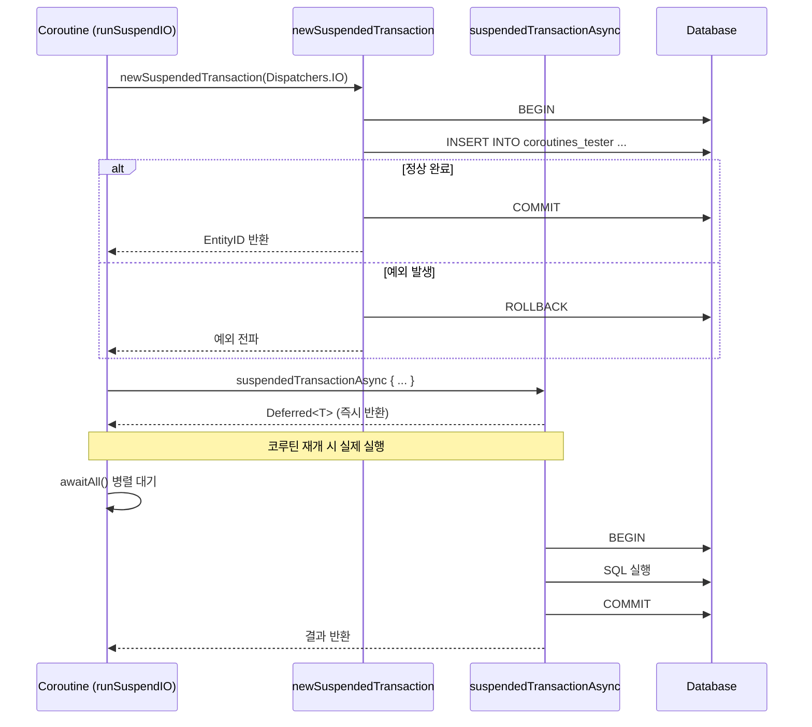
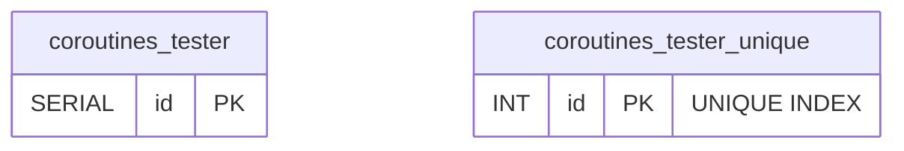

# 08 Coroutines: 기본 (01-coroutines-basic)

[English](./README.md) | 한국어

Exposed를 Kotlin Coroutines와 함께 사용하는 기본 모듈입니다.
`newSuspendedTransaction`, `suspendedTransactionAsync`, `withSuspendTransaction`을 중심으로 비동기 DB 접근을 실습합니다.

## 학습 목표

- 코루틴 트랜잭션 API를 익힌다.
- 비동기 병렬 쿼리 패턴을 구현한다.
- 취소/예외 시 트랜잭션 정리 동작을 이해한다.

## 선수 지식

- Kotlin Coroutines 기본
- [`../../05-exposed-dml/04-transactions/README.md`](../../05-exposed-dml/04-transactions/README.md)

## 핵심 개념

### newSuspendedTransaction — 기본 사용

```kotlin
// suspend 함수 내에서 트랜잭션 시작
newSuspendedTransaction(Dispatchers.IO) {
    Tester.insert { }  // DB 작업
}

// 기존 트랜잭션에서 중첩 실행 (withSuspendTransaction)
suspend fun JdbcTransaction.getTesterById(id: Int): ResultRow? =
    withSuspendTransaction {
        Tester.selectAll()
            .where { Tester.id eq id }
            .singleOrNull()
    }
```

### suspendedTransactionAsync — 병렬 실행

```kotlin
// 여러 트랜잭션을 병렬로 실행
val jobs: List<Deferred<EntityID<Int>>> = (1..10).map {
    suspendedTransactionAsync(Dispatchers.IO) {
        Tester.insertAndGetId { }
    }
}
val ids = jobs.awaitAll()
```

### Dispatcher 선택 기준

```kotlin
// I/O 바운드 DB 작업은 Dispatchers.IO 사용
newSuspendedTransaction(Dispatchers.IO) { ... }

// 단일 스레드 Dispatcher — 순서 보장이 필요한 경우
val singleThreadDispatcher = Executors.newSingleThreadExecutor().asCoroutineDispatcher()
newSuspendedTransaction(singleThreadDispatcher) { ... }
```

## 코루틴 트랜잭션 시퀀스 다이어그램



## newSuspendedTransaction 처리 시퀀스 다이어그램

```mermaid
%%{init: {'theme': 'base', 'backgroundColor': '#FAFAFA', 'themeVariables': {'background': '#FAFAFA', 'fontFamily': '"Comic Mono", "goorm sans code", "JetBrains Mono", "goorm sans"', 'actorBkg': '#E3F2FD', 'actorBorder': '#90CAF9', 'actorTextColor': '#1565C0', 'actorLineColor': '#90CAF9', 'activationBkgColor': '#E8F5E9', 'activationBorderColor': '#A5D6A7', 'labelBoxBkgColor': '#FFF3E0', 'labelBoxBorderColor': '#FFCC80', 'labelTextColor': '#E65100', 'loopTextColor': '#6A1B9A', 'noteBkgColor': '#F3E5F5', 'noteBorderColor': '#CE93D8', 'noteTextColor': '#6A1B9A', 'signalColor': '#1565C0', 'signalTextColor': '#1565C0'}}}%%
sequenceDiagram
    participant App
    participant CoroutineContext as CoroutineContext (Dispatchers.IO)
    participant ExposedDB as Exposed Transaction
    participant DB as Database

    App->>CoroutineContext: newSuspendedTransaction { }
    CoroutineContext->>ExposedDB: transaction block 시작
    ExposedDB->>DB: BEGIN
    ExposedDB->>DB: SQL Query (INSERT / SELECT ...)
    DB-->>ExposedDB: Result
    alt 정상 완료
        ExposedDB->>DB: COMMIT
        ExposedDB-->>CoroutineContext: mapped result
        CoroutineContext-->>App: suspend 반환
    else 예외 발생
        ExposedDB->>DB: ROLLBACK
        ExposedDB-->>CoroutineContext: 예외 전파
        CoroutineContext-->>App: 예외 전파
    end

    App->>CoroutineContext: suspendedTransactionAsync { }
    CoroutineContext-->>App: Deferred&lt;T&gt; (즉시 반환)
    Note over App,CoroutineContext: 병렬 실행 후 awaitAll() 대기
    CoroutineContext->>ExposedDB: transaction block (병렬)
    ExposedDB->>DB: BEGIN → SQL → COMMIT
    DB-->>ExposedDB: Result
    ExposedDB-->>CoroutineContext: 결과
    CoroutineContext-->>App: awaitAll() 결과 반환
```

## 테이블 ERD (coroutines_tester)



## 예제 구성

소스 위치: `src/test/kotlin/exposed/examples/coroutines`

| 파일                   | 주요 테스트 시나리오                                               |
|----------------------|-----------------------------------------------------------|
| `Ex01_Coroutines.kt` | 존재하지 않는 ID 조회, 단건 삽입/조회, 병렬 삽입, 중복 키 예외, 트랜잭션 격리, 취소 시 롤백 |

### 주요 테스트 시나리오

| 시나리오            | 사용 API                                   |
|-----------------|------------------------------------------|
| 기본 suspend 트랜잭션 | `newSuspendedTransaction`                |
| 기존 트랜잭션 내 중첩 실행 | `withSuspendTransaction`                 |
| 비동기 병렬 삽입 (10건) | `suspendedTransactionAsync` + `awaitAll` |
| 중복 키 삽입 → 예외 검증 | `assertFailsWith<ExposedSQLException>`   |
| 트랜잭션 격리 수준 지정   | `newSuspendedTransaction(isolation=...)` |

## 실행 방법

```bash
./gradlew :08-coroutines:01-coroutines-basic:test
```

테스트 환경 변수:

```bash
# H2만 사용하는 빠른 테스트
USE_FAST_DB=true ./gradlew :08-coroutines:01-coroutines-basic:test
```

## 실습 체크리스트

- 순차/병렬 트랜잭션 결과와 소요 시간을 비교
- 취소(cancellation) 상황에서 롤백 동작 확인
- `Dispatchers.IO` vs `singleThreadDispatcher` 동작 차이 비교

## 성능·안정성 체크포인트

- 이벤트 루프/기본 디스패처(`Dispatchers.Default`)에서 DB 블로킹 호출 금지
- `Dispatchers.IO`는 I/O 바운드 작업 전용으로 사용
- 트랜잭션 범위를 최소화해 경합 감소
- 코루틴 취소 시 `finally` 블록에서 자원 정리 보장

## 다음 모듈

- [`../02-virtualthreads-basic/README.md`](../02-virtualthreads-basic/README.md)
