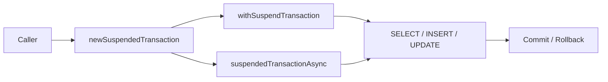

# 08 Coroutines: 기본 (01-coroutines-basic)

Exposed를 Kotlin Coroutines와 함께 사용하는 기본 모듈입니다.
`newSuspendedTransaction`, `suspendedTransactionAsync`를 중심으로 비동기 DB 접근을 실습합니다.

## 학습 목표

- 코루틴 트랜잭션 API를 익힌다.
- 비동기 병렬 쿼리 패턴을 구현한다.
- 취소/예외 시 트랜잭션 정리 동작을 이해한다.

## 선수 지식

- Kotlin Coroutines 기본
- [`../../05-exposed-dml/04-transactions/README.md`](../../05-exposed-dml/04-transactions/README.md)

## 핵심 개념

- `newSuspendedTransaction`
- `suspendedTransactionAsync`
- Dispatcher 선택과 컨텍스트 전파

## 예제 구성

| 파일                   | 설명                |
|----------------------|-------------------|
| `Ex01_Coroutines.kt` | 코루틴 트랜잭션/병렬 실행 예제 |

## 실행 방법

```bash
./gradlew :01-coroutines-basic:test
```

## 실습 체크리스트

- 순차/병렬 트랜잭션 결과와 소요 시간을 비교
- 취소(cancellation) 상황에서 롤백 동작 확인

## 성능·안정성 체크포인트

- 이벤트 루프/기본 디스패처에서 블로킹 호출 금지
- 트랜잭션 범위를 최소화해 경합 감소

## 예제 흐름 다이어그램



예제 코드: [
`src/test/kotlin/exposed/examples/coroutines/Ex01_Coroutines.kt`](src/test/kotlin/exposed/examples/coroutines/Ex01_Coroutines.kt)

## 다음 모듈

- [`../02-virtualthreads-basic/README.md`](../02-virtualthreads-basic/README.md)
