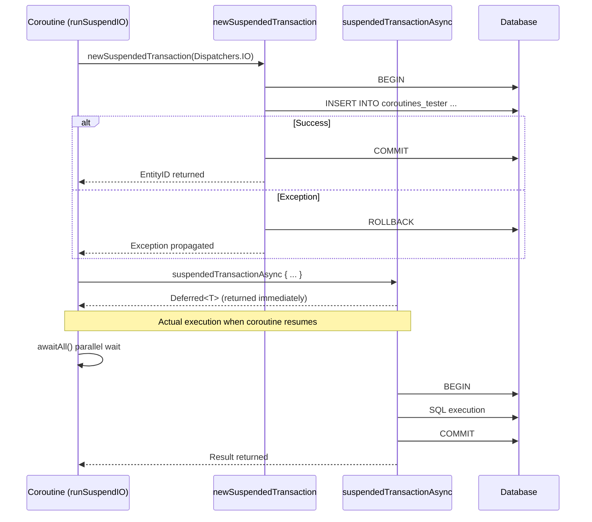
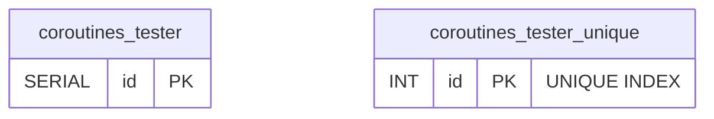

# 08 Coroutines: Basic (01-coroutines-basic)

English | [한국어](./README.ko.md)

The basic module for using Exposed with Kotlin Coroutines.
Hands-on practice for asynchronous DB access centered on `newSuspendedTransaction`, `suspendedTransactionAsync`, and `withSuspendTransaction`.

## Learning Goals

- Learn the coroutine transaction API.
- Implement asynchronous parallel query patterns.
- Understand transaction cleanup behavior on cancellation/exceptions.

## Prerequisites

- Kotlin Coroutines basics
- [`../../05-exposed-dml/04-transactions/README.md`](../../05-exposed-dml/04-transactions/README.md)

## Key Concepts

### newSuspendedTransaction — Basic Usage

```kotlin
// Start a transaction inside a suspend function
newSuspendedTransaction(Dispatchers.IO) {
    Tester.insert { }  // DB operation
}

// Nested execution within an existing transaction (withSuspendTransaction)
suspend fun JdbcTransaction.getTesterById(id: Int): ResultRow? =
    withSuspendTransaction {
        Tester.selectAll()
            .where { Tester.id eq id }
            .singleOrNull()
    }
```

### suspendedTransactionAsync — Parallel Execution

```kotlin
// Run multiple transactions in parallel
val jobs: List<Deferred<EntityID<Int>>> = (1..10).map {
    suspendedTransactionAsync(Dispatchers.IO) {
        Tester.insertAndGetId { }
    }
}
val ids = jobs.awaitAll()
```

### Dispatcher Selection Criteria

```kotlin
// Use Dispatchers.IO for I/O-bound DB work
newSuspendedTransaction(Dispatchers.IO) { ... }

// Single-thread Dispatcher — when ordering must be guaranteed
val singleThreadDispatcher = Executors.newSingleThreadExecutor().asCoroutineDispatcher()
newSuspendedTransaction(singleThreadDispatcher) { ... }
```

## Coroutine Transaction Sequence Diagram



## newSuspendedTransaction Processing Sequence Diagram

```mermaid
%%{init: {'theme': 'base', 'backgroundColor': '#FAFAFA', 'themeVariables': {'background': '#FAFAFA', 'fontFamily': '"Comic Mono", "goorm sans code", "JetBrains Mono", "goorm sans"', 'actorBkg': '#E3F2FD', 'actorBorder': '#90CAF9', 'actorTextColor': '#1565C0', 'actorLineColor': '#90CAF9', 'activationBkgColor': '#E8F5E9', 'activationBorderColor': '#A5D6A7', 'labelBoxBkgColor': '#FFF3E0', 'labelBoxBorderColor': '#FFCC80', 'labelTextColor': '#E65100', 'loopTextColor': '#6A1B9A', 'noteBkgColor': '#F3E5F5', 'noteBorderColor': '#CE93D8', 'noteTextColor': '#6A1B9A', 'signalColor': '#1565C0', 'signalTextColor': '#1565C0'}}}%%
sequenceDiagram
    participant App
    participant CoroutineContext as CoroutineContext (Dispatchers.IO)
    participant ExposedDB as Exposed Transaction
    participant DB as Database

    App->>CoroutineContext: newSuspendedTransaction { }
    CoroutineContext->>ExposedDB: Start transaction block
    ExposedDB->>DB: BEGIN
    ExposedDB->>DB: SQL Query (INSERT / SELECT ...)
    DB-->>ExposedDB: Result
    alt Success
        ExposedDB->>DB: COMMIT
        ExposedDB-->>CoroutineContext: mapped result
        CoroutineContext-->>App: suspend return
    else Exception
        ExposedDB->>DB: ROLLBACK
        ExposedDB-->>CoroutineContext: Exception propagated
        CoroutineContext-->>App: Exception propagated
    end

    App->>CoroutineContext: suspendedTransactionAsync { }
    CoroutineContext-->>App: Deferred&lt;T&gt; (returned immediately)
    Note over App,CoroutineContext: awaitAll() waits after parallel execution
    CoroutineContext->>ExposedDB: transaction block (parallel)
    ExposedDB->>DB: BEGIN → SQL → COMMIT
    DB-->>ExposedDB: Result
    ExposedDB-->>CoroutineContext: Result
    CoroutineContext-->>App: awaitAll() result returned
```

## Table ERD (coroutines_tester)



## Example Structure

Source location: `src/test/kotlin/exposed/examples/coroutines`

| File                   | Key Test Scenarios                                                                                        |
|----------------------|----------------------------------------------------------------------------------------------------------|
| `Ex01_Coroutines.kt` | Query non-existent ID, single insert/query, parallel insert, duplicate key exception, transaction isolation, rollback on cancel |

### Key Test Scenarios

| Scenario            | API Used                                   |
|-----------------|------------------------------------------|
| Basic suspend transaction | `newSuspendedTransaction`                |
| Nested execution within existing transaction | `withSuspendTransaction`                 |
| Async parallel insert (10 records) | `suspendedTransactionAsync` + `awaitAll` |
| Duplicate key insert → exception verification | `assertFailsWith<ExposedSQLException>`   |
| Specify transaction isolation level | `newSuspendedTransaction(isolation=...)` |

## How to Run

```bash
./gradlew :08-coroutines:01-coroutines-basic:test
```

Test environment variables:

```bash
# Fast test using H2 only
USE_FAST_DB=true ./gradlew :08-coroutines:01-coroutines-basic:test
```

## Practice Checklist

- Compare results and elapsed time between sequential and parallel transactions
- Verify rollback behavior during cancellation
- Compare behavior differences between `Dispatchers.IO` vs `singleThreadDispatcher`

## Performance & Stability Checkpoints

- Never call DB blocking operations from event loop / default dispatcher (`Dispatchers.Default`)
- Use `Dispatchers.IO` exclusively for I/O-bound work
- Minimize transaction scope to reduce contention
- Guarantee resource cleanup in `finally` blocks on coroutine cancellation

## Next Module

- [`../02-virtualthreads-basic/README.md`](../02-virtualthreads-basic/README.md)
