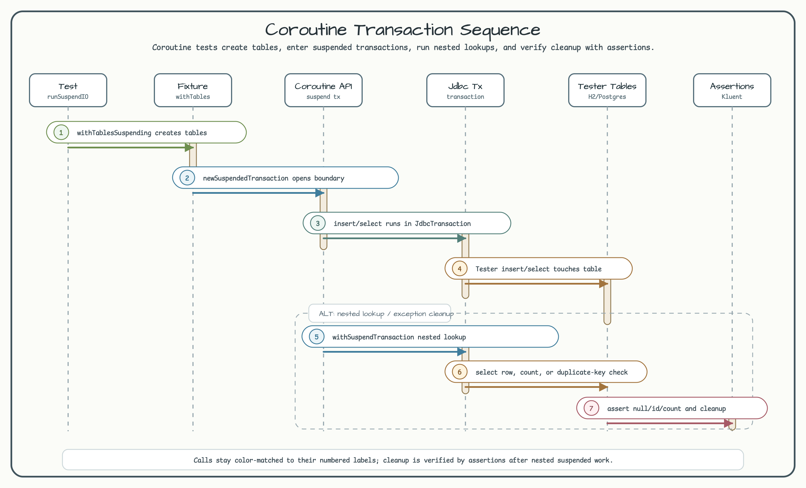
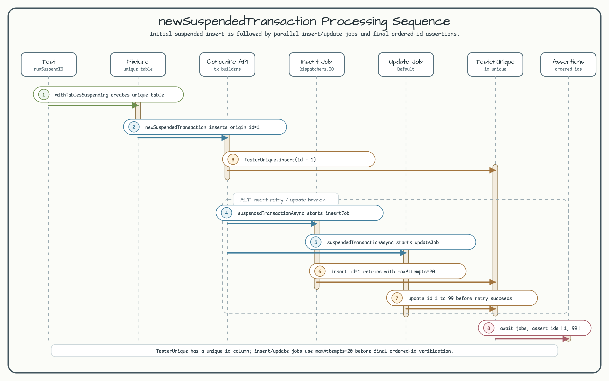
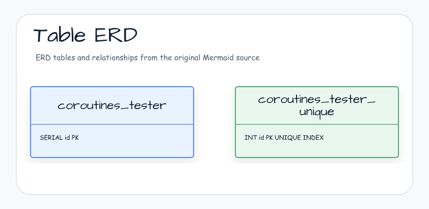

# 08 Coroutines: Basic (01-coroutines-basic)

English | [한국어](./README.ko.md)

This module keeps the examples intentionally small so the transaction boundary is easy to see. `Ex01_Coroutines.kt` uses `Tester` and `TesterUnique` to verify suspended transactions, nested lookups, async insert/update races, transaction isolation, and exception cleanup.

## Learning Goals

- Use `newSuspendedTransaction`, `withSuspendTransaction`, and `suspendedTransactionAsync` in the same fixture style used by the tests.
- Compare sequential suspended work with parallel insert/update jobs.
- Verify rollback and connection cleanup when duplicate keys or nested transaction failures occur.

## Prerequisites

- Kotlin Coroutines basics
- [`../../05-exposed-dml/04-transactions/README.md`](../../05-exposed-dml/04-transactions/README.md)

## Key Concepts

### newSuspendedTransaction — Basic Usage

```kotlin
// Start a transaction inside a suspend function
newSuspendedTransaction(Dispatchers.IO) {
    Tester.insert { }  // DB operation
}

// Nested execution within an existing transaction (withSuspendTransaction)
suspend fun JdbcTransaction.getTesterById(id: Int): ResultRow? =
    withSuspendTransaction {
        Tester.selectAll()
            .where { Tester.id eq id }
            .singleOrNull()
    }
```

### suspendedTransactionAsync — Parallel Execution

```kotlin
// Run multiple transactions in parallel
val jobs: List<Deferred<EntityID<Int>>> = (1..10).map {
    suspendedTransactionAsync(Dispatchers.IO) {
        Tester.insertAndGetId { }
    }
}
val ids = jobs.awaitAll()
```

### Dispatcher Selection Criteria

```kotlin
// Use Dispatchers.IO for I/O-bound DB work
newSuspendedTransaction(Dispatchers.IO) { ... }

// Single-thread Dispatcher — when ordering must be guaranteed
val singleThreadDispatcher = Executors.newSingleThreadExecutor().asCoroutineDispatcher()
newSuspendedTransaction(singleThreadDispatcher) { ... }
```

## Coroutine Transaction Sequence Diagram



## newSuspendedTransaction Processing Sequence Diagram



## Table ERD (coroutines_tester)



## Example Structure

Source location: `src/test/kotlin/exposed/examples/coroutines`

| File                   | Key Test Scenarios |
|----------------------|---|
| `Ex01_Coroutines.kt` | Missing ID lookup, sequential suspended transaction, async insert/update race on `TesterUnique`, nested suspended transactions, parallel fan-out, regular `transaction { }` interop, duplicate entity ID exception cleanup |

### Key Test Scenarios

| Scenario | API Used |
|---|---|
| Basic suspended transaction and missing-row lookup | `newSuspendedTransaction`, `withSuspendTransaction` |
| Async insert/update race on `TesterUnique` | `suspendedTransactionAsync`, `awaitAll`, `maxAttempts` |
| Nested suspended transaction fan-out | `newSuspendedTransaction`, `suspendedTransactionAsync` |
| Duplicate entity ID exception cleanup | `assertFailsWith<ExposedSQLException>` |
| Transaction isolation setup | `connection.transactionIsolation = Connection.TRANSACTION_READ_COMMITTED` |

## How to Run

```bash
./gradlew :01-coroutines-basic:test
```

Test environment variables:

```bash
# Fast test using H2 only
USE_FAST_DB=true ./gradlew :01-coroutines-basic:test
```

## Practice Checklist

- Compare results and elapsed time between sequential and parallel transactions
- Verify rollback behavior during cancellation
- Compare behavior differences between `Dispatchers.IO` vs `singleThreadDispatcher`

## Performance & Stability Checkpoints

- Never call DB blocking operations from event loop / default dispatcher (`Dispatchers.Default`)
- Use `Dispatchers.IO` exclusively for I/O-bound work
- Minimize transaction scope to reduce contention
- Guarantee resource cleanup in `finally` blocks on coroutine cancellation

## Next Module

- [`../02-virtualthreads-basic/README.md`](../02-virtualthreads-basic/README.md)
