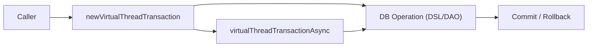

# 08 Coroutines: Virtual Threads 기본 (02-virtualthreads-basic)

Java 21 Virtual Threads 기반으로 Exposed 트랜잭션을 실행하는 모듈입니다. 블로킹 코드 스타일을 유지하면서 높은 동시성을 확보하는 패턴을 다룹니다.

## 학습 목표

- `newVirtualThreadTransaction` 사용법을 익힌다.
- Virtual Thread 비동기 실행 패턴을 이해한다.
- 플랫폼 스레드 방식과의 차이를 비교한다.

## 선수 지식

- Java 21+
- [`../01-coroutines-basic/README.md`](../01-coroutines-basic/README.md)

## 핵심 개념

- `newVirtualThreadTransaction`
- `virtualThreadTransactionAsync`
- 동시성 확장과 커넥션 풀 튜닝

## 예제 구성

| 파일                       | 설명                     |
|--------------------------|------------------------|
| `Ex01_VirtualThreads.kt` | Virtual Thread 트랜잭션 예제 |

## 실행 방법

```bash
./gradlew :08-coroutines:02-virtualthreads-basic:test
```

## 실습 체크리스트

- 동시 작업 수를 늘려 처리량/지연시간 변화를 측정
- 예외 발생 시 롤백/정리 동작 검증

## 성능·안정성 체크포인트

- Virtual Thread 증가와 DB 커넥션 수를 함께 조정
- 장시간 I/O 또는 외부 호출로 인한 병목을 분리

## 예제 흐름 다이어그램



예제 코드: [
`src/test/kotlin/exposed/examples/virtualthreads/Ex01_VirtualThreads.kt`](src/test/kotlin/exposed/examples/virtualthreads/Ex01_VirtualThreads.kt)

## 다음 챕터

- [`../../09-spring/README.md`](../../09-spring/README.md)
