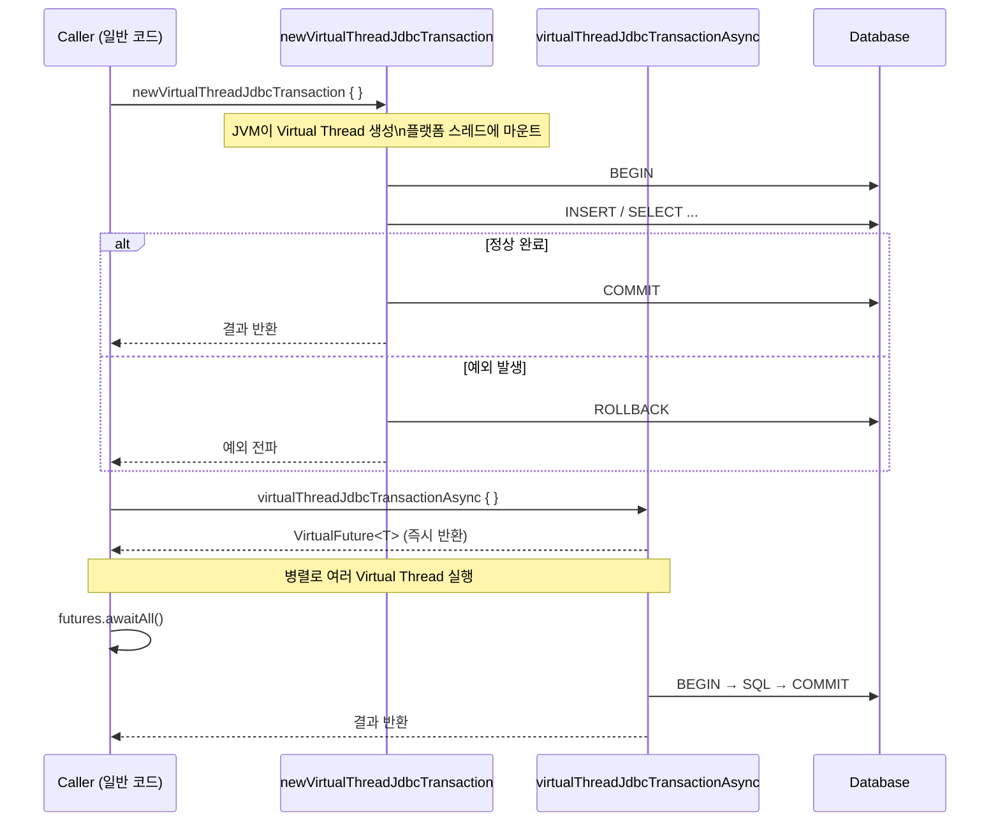

# 08 Coroutines: Virtual Threads 기본 (02-virtualthreads-basic)

Java 21 Virtual Threads 기반으로 Exposed 트랜잭션을 실행하는 모듈입니다. 블로킹 코드 스타일을 유지하면서 높은 동시성을 확보하는 패턴을 다룹니다.

## 학습 목표

- `newVirtualThreadJdbcTransaction` 사용법을 익힌다.
- Virtual Thread 비동기 실행 패턴을 이해한다.
- 플랫폼 스레드 방식 및 코루틴 방식과의 차이를 비교한다.

## 선수 지식

- Java 21+
- [`../01-coroutines-basic/README.md`](../01-coroutines-basic/README.md)

## 핵심 개념

### newVirtualThreadJdbcTransaction — 기본 사용

```kotlin
// Virtual Thread 위에서 트랜잭션 실행 (블로킹 스타일 유지)
newVirtualThreadJdbcTransaction {
    VTester.insert { }
    commit()
}

// 기존 트랜잭션에서 Virtual Thread 트랜잭션 중첩
fun JdbcTransaction.getTesterById(id: Int): ResultRow? =
    newVirtualThreadJdbcTransaction {
        VTester.selectAll()
            .where { VTester.id eq id }
            .singleOrNull()
    }
```

### virtualThreadJdbcTransactionAsync — 병렬 실행

```kotlin
// 여러 트랜잭션을 Virtual Thread로 병렬 실행
val futures: List<VirtualFuture<EntityID<Int>>> = (1..10).map {
    virtualThreadJdbcTransactionAsync {
        VTester.insertAndGetId { }
    }
}
val ids = futures.awaitAll()
```

## Virtual Thread 트랜잭션 흐름



## 코루틴 vs Virtual Threads 실무 선택 가이드

| 상황                           | 권장 방식             |
|------------------------------|-------------------|
| 신규 비동기 코드베이스                 | Kotlin Coroutines |
| 기존 동기 블로킹 코드에 동시성 추가         | Virtual Threads   |
| Spring WebFlux / Reactive 연동 | Kotlin Coroutines |
| Spring MVC (서블릿 기반) + 높은 동시성 | Virtual Threads   |
| 취소(cancellation) 세밀한 제어      | Kotlin Coroutines |
| Java 17 이하 환경                | Kotlin Coroutines |
| Java 21+ 환경, 코드 변경 최소화       | Virtual Threads   |

## 예제 구성

소스 위치: `src/test/kotlin/exposed/examples/virtualthreads`

| 파일                       | 주요 테스트 시나리오                                                            |
|--------------------------|------------------------------------------------------------------------|
| `Ex01_VirtualThreads.kt` | 존재하지 않는 ID 조회, 단건 삽입/조회, 병렬 삽입, 중복 키 예외, 일반 `transaction` 혼용, 중첩 예외 처리 |

### 주요 테스트 시나리오

| 시나리오                               | 사용 API                                                 |
|------------------------------------|--------------------------------------------------------|
| 기본 Virtual Thread 트랜잭션             | `newVirtualThreadJdbcTransaction`                      |
| 기존 트랜잭션 내 중첩 실행                    | `newVirtualThreadJdbcTransaction` (내부 중첩)              |
| 비동기 병렬 삽입 (10건)                    | `virtualThreadJdbcTransactionAsync` + `awaitAll`       |
| 중복 키 삽입 → 예외 검증                    | `assertFailsWith<ExecutionException>`                  |
| 일반 `transaction { }` 혼용 비교         | `transaction { }` vs `newVirtualThreadJdbcTransaction` |
| Java 21 전용 실행 조건 (`@EnabledOnJre`) | `@EnabledOnJre(JRE.JAVA_21)` 어노테이션                     |

## 실행 방법

```bash
./gradlew :08-coroutines:02-virtualthreads-basic:test
```

> Java 21 이상 환경에서만 실행됩니다. `@EnabledOnJre(JRE.JAVA_21)` 어노테이션으로 보호되어 있습니다.

```bash
# Java 버전 확인
java -version

# 특정 Java 버전으로 실행
mise use java@21
./gradlew :08-coroutines:02-virtualthreads-basic:test
```

## 실습 체크리스트

- 동시 작업 수를 늘려 처리량/지연시간 변화를 측정
- 예외 발생 시 롤백/정리 동작 검증
- 코루틴 버전과 Virtual Thread 버전의 같은 시나리오를 비교

## 성능·안정성 체크포인트

- Virtual Thread 증가와 DB 커넥션 수를 함께 조정
- 장시간 I/O 또는 외부 호출로 인한 병목을 분리
- `pinning` 현상 주의: `synchronized` 블록 내 블로킹 호출은 Virtual Thread를 플랫폼 스레드에 고정시킴

## 다음 챕터

- [`../../09-spring/README.md`](../../09-spring/README.md)
