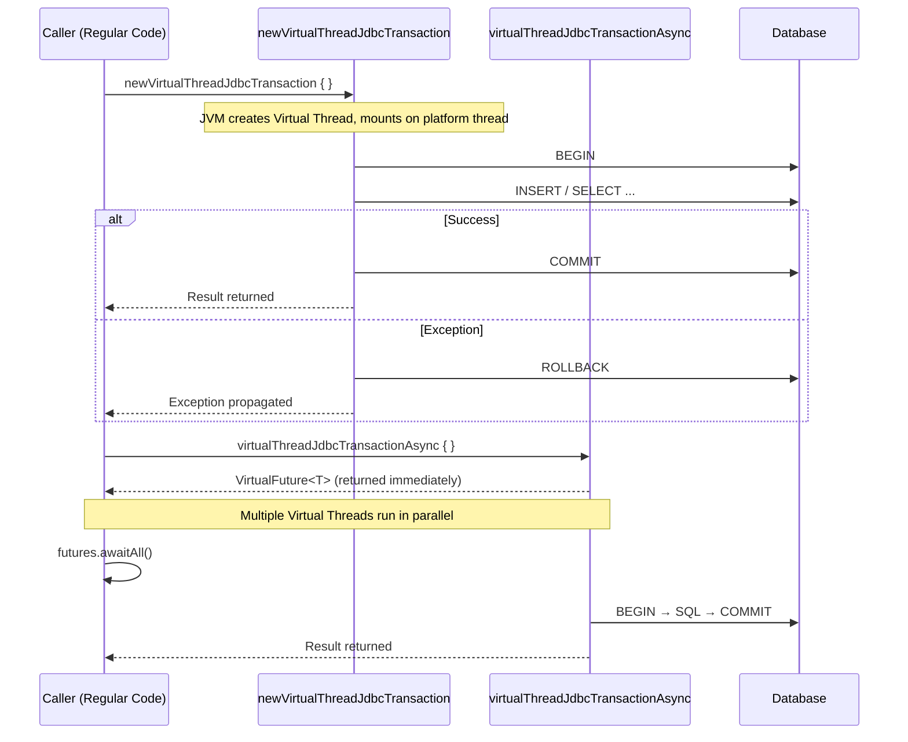
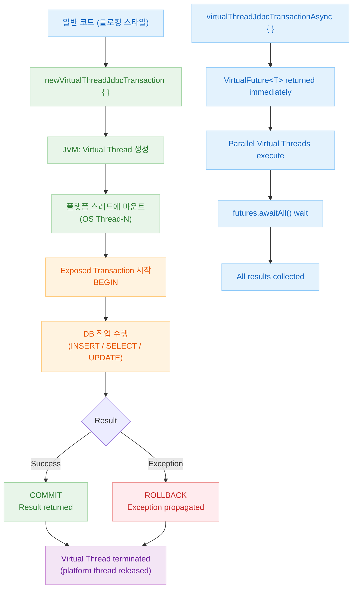
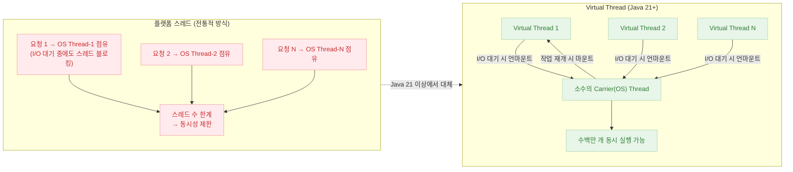
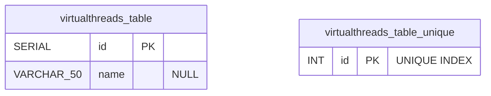

# 08 Coroutines: Virtual Threads Basic (02-virtualthreads-basic)

English | [한국어](./README.ko.md)

A module for running Exposed transactions on Java 21 Virtual Threads. Covers patterns for achieving high concurrency while retaining a blocking code style.

## Learning Goals

- Learn how to use `newVirtualThreadJdbcTransaction`.
- Understand the Virtual Thread async execution pattern.
- Compare differences with platform thread and coroutine approaches.

## Prerequisites

- Java 21+
- [`../01-coroutines-basic/README.md`](../01-coroutines-basic/README.md)

## Key Concepts

### newVirtualThreadJdbcTransaction — Basic Usage

```kotlin
// Run a transaction on a Virtual Thread (retains blocking style)
newVirtualThreadJdbcTransaction {
    VTester.insert { }
    commit()
}

// Nest a Virtual Thread transaction within an existing transaction
fun JdbcTransaction.getTesterById(id: Int): ResultRow? =
    newVirtualThreadJdbcTransaction {
        VTester.selectAll()
            .where { VTester.id eq id }
            .singleOrNull()
    }
```

### virtualThreadJdbcTransactionAsync — Parallel Execution

```kotlin
// Run multiple transactions in parallel using Virtual Threads
val futures: List<VirtualFuture<EntityID<Int>>> = (1..10).map {
    virtualThreadJdbcTransactionAsync {
        VTester.insertAndGetId { }
    }
}
val ids = futures.awaitAll()
```

## Virtual Thread Transaction Flow



## Coroutines vs Virtual Threads Practical Selection Guide

| Situation                                       | Recommended Approach  |
|------------------------------------------------|-----------------------|
| New async codebase                              | Kotlin Coroutines     |
| Adding concurrency to existing synchronous code | Virtual Threads       |
| Spring WebFlux / Reactive integration           | Kotlin Coroutines     |
| Spring MVC (servlet-based) + high concurrency   | Virtual Threads       |
| Fine-grained cancellation control               | Kotlin Coroutines     |
| Java 17 or lower environment                    | Kotlin Coroutines     |
| Java 21+ environment, minimize code changes     | Virtual Threads       |

## Virtual Thread Processing Model Flowchart



## Virtual Thread vs Platform Thread Comparison Diagram



## Table ERD (virtualthreads_table)



## Example Structure

Source location: `src/test/kotlin/exposed/examples/virtualthreads`

| File                       | Key Test Scenarios                                                                                                        |
|--------------------------|--------------------------------------------------------------------------------------------------------------------------|
| `Ex01_VirtualThreads.kt` | Query non-existent ID, single insert/query, parallel insert, duplicate key exception, mixing regular `transaction`, nested exception handling |

### Key Test Scenarios

| Scenario                                      | API Used                                                 |
|------------------------------------|--------------------------------------------------------|
| Basic Virtual Thread transaction             | `newVirtualThreadJdbcTransaction`                      |
| Nested execution within existing transaction | `newVirtualThreadJdbcTransaction` (inner nesting)       |
| Async parallel insert (10 records)           | `virtualThreadJdbcTransactionAsync` + `awaitAll`       |
| Duplicate key insert → exception verification | `assertFailsWith<ExecutionException>`                  |
| Comparison with regular `transaction { }`   | `transaction { }` vs `newVirtualThreadJdbcTransaction` |
| Java 21-only execution condition             | `@EnabledOnJre(JRE.JAVA_21)` annotation                |

## How to Run

```bash
./gradlew :08-coroutines:02-virtualthreads-basic:test
```

> Runs only on Java 21+. Protected by the `@EnabledOnJre(JRE.JAVA_21)` annotation.

```bash
# Check Java version
java -version

# Run with a specific Java version
mise use java@21
./gradlew :08-coroutines:02-virtualthreads-basic:test
```

## Practice Checklist

- Measure throughput/latency changes as the number of concurrent tasks increases
- Verify rollback/cleanup behavior on exceptions
- Compare the same scenarios between the coroutine version and Virtual Thread version

## Performance & Stability Checkpoints

- Adjust Virtual Thread count together with DB connection count
- Isolate bottlenecks caused by long I/O or external calls
- Watch for `pinning`: blocking calls inside `synchronized` blocks pin a Virtual Thread to its platform thread

## Next Chapter

- [`../../09-spring/README.md`](../../09-spring/README.md)
