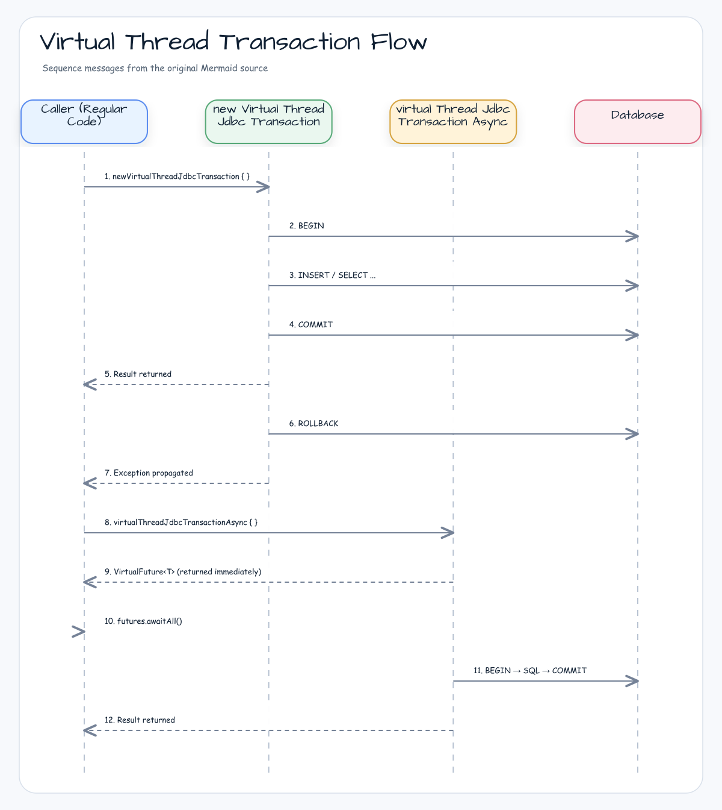
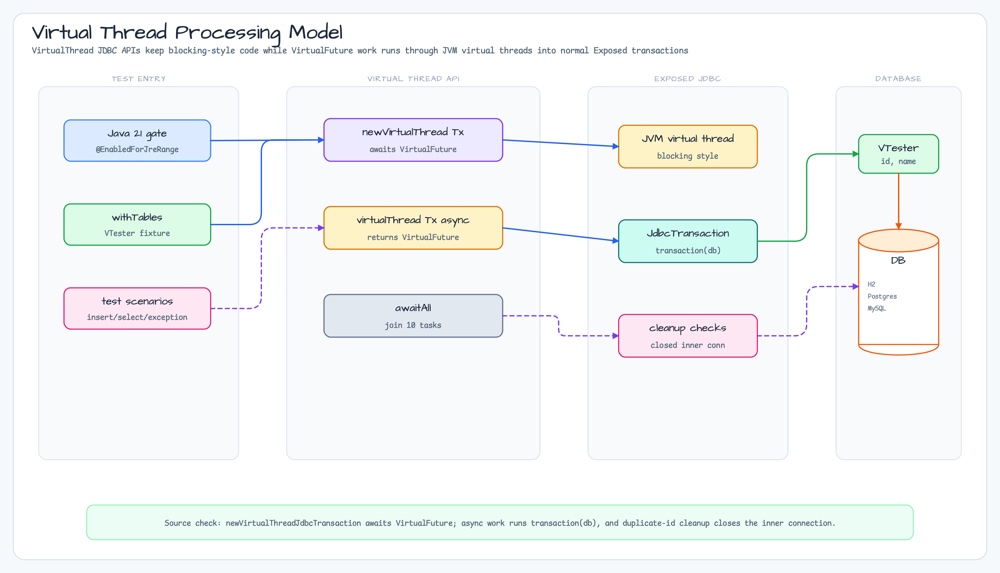
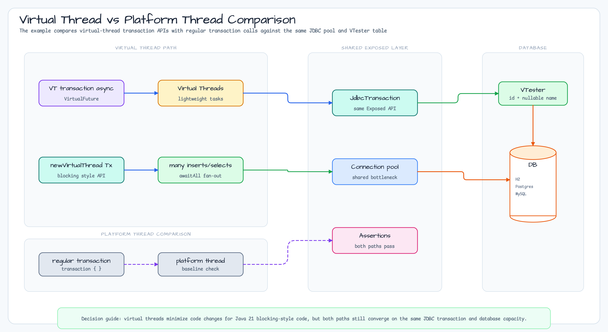
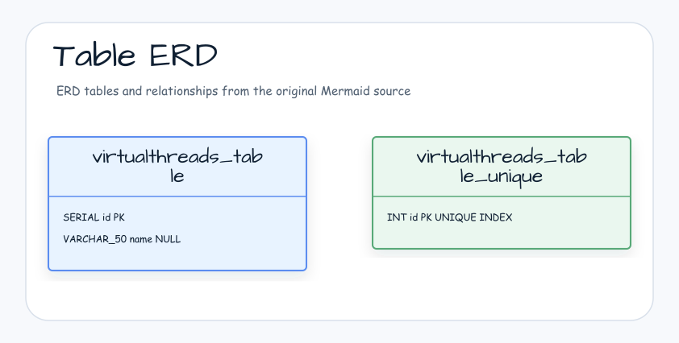

# 08 Coroutines: Virtual Threads Basic (02-virtualthreads-basic)

English | [한국어](./README.ko.md)

This module runs the same kind of Exposed transaction scenarios on Java 21 Virtual Threads. `Ex01_VirtualThreads.kt` keeps the blocking style, but moves execution through `newVirtualThreadJdbcTransaction` and `virtualThreadJdbcTransactionAsync` so fan-out, regular transaction interop, and exception cleanup are visible in the source.

## Learning Goals

- Use `newVirtualThreadJdbcTransaction` in Java 21-gated tests.
- Run async fan-out through `virtualThreadJdbcTransactionAsync` and `VirtualFuture.awaitAll()`.
- Compare Virtual Thread transactions with regular `transaction { }` and coroutine examples from the previous module.

## Prerequisites

- Java 21+
- [`../01-coroutines-basic/README.md`](../01-coroutines-basic/README.md)

## Key Concepts

### newVirtualThreadJdbcTransaction — Basic Usage

```kotlin
// Run a transaction on a Virtual Thread (retains blocking style)
newVirtualThreadJdbcTransaction {
    VTester.insert { }
    commit()
}

// Nest a Virtual Thread transaction within an existing transaction
fun JdbcTransaction.getTesterById(id: Int): ResultRow? =
    newVirtualThreadJdbcTransaction {
        VTester.selectAll()
            .where { VTester.id eq id }
            .singleOrNull()
    }
```

### virtualThreadJdbcTransactionAsync — Parallel Execution

```kotlin
// Run multiple transactions in parallel using Virtual Threads
val futures: List<VirtualFuture<EntityID<Int>>> = (1..10).map {
    virtualThreadJdbcTransactionAsync {
        VTester.insertAndGetId { }
    }
}
val ids = futures.awaitAll()
```

## Virtual Thread Transaction Flow



## Coroutines vs Virtual Threads Practical Selection Guide

| Situation                                       | Recommended Approach  |
|------------------------------------------------|-----------------------|
| New async codebase                              | Kotlin Coroutines     |
| Adding concurrency to existing synchronous code | Virtual Threads       |
| Spring WebFlux / Reactive integration           | Kotlin Coroutines     |
| Spring MVC (servlet-based) + high concurrency   | Virtual Threads       |
| Fine-grained cancellation control               | Kotlin Coroutines     |
| Java 17 or lower environment                    | Kotlin Coroutines     |
| Java 21+ environment, minimize code changes     | Virtual Threads       |

## Virtual Thread Processing Model Flowchart



## Virtual Thread vs Platform Thread Comparison Diagram



## Table ERD (virtualthreads_table)



## Example Structure

Source location: `src/test/kotlin/exposed/examples/virtualthreads`

| File                       | Key Test Scenarios |
|--------------------------|---|
| `Ex01_VirtualThreads.kt` | Java 21 gate, missing ID lookup, sequential Virtual Thread transaction, async fan-out, regular `transaction { }` interop, duplicate entity ID exception wrapping, connection cleanup |

### Key Test Scenarios

| Scenario | API Used |
|---|---|
| Basic Virtual Thread transaction | `newVirtualThreadJdbcTransaction` |
| Nested lookup from a `JdbcTransaction` receiver | `newVirtualThreadJdbcTransaction` |
| Async fan-out insert/select work | `virtualThreadJdbcTransactionAsync`, `VirtualFuture.awaitAll()` |
| Duplicate entity ID exception wrapping | `assertFailsWith<ExecutionException>`, `ExposedSQLException` cause |
| Comparison with regular `transaction { }` | `transaction { }` vs `newVirtualThreadJdbcTransaction` |
| Java 21-only execution condition | `@EnabledForJreRange(min = JRE.JAVA_21)` |

## How to Run

```bash
./gradlew :02-virtualthreads-basic:test
```

> Runs only on Java 21+. Protected by `@EnabledForJreRange(min = JRE.JAVA_21)`.

```bash
# Check Java version
java -version

# Run with a specific Java version
mise use java@21
./gradlew :02-virtualthreads-basic:test
```

## Practice Checklist

- Measure throughput/latency changes as the number of concurrent tasks increases
- Verify rollback/cleanup behavior on exceptions
- Compare the same scenarios between the coroutine version and Virtual Thread version

## Performance & Stability Checkpoints

- Adjust Virtual Thread count together with DB connection count
- Isolate bottlenecks caused by long I/O or external calls
- Watch for `pinning`: blocking calls inside `synchronized` blocks pin a Virtual Thread to its platform thread

## Next Chapter

- [`../../09-spring/README.md`](../../09-spring/README.md)
