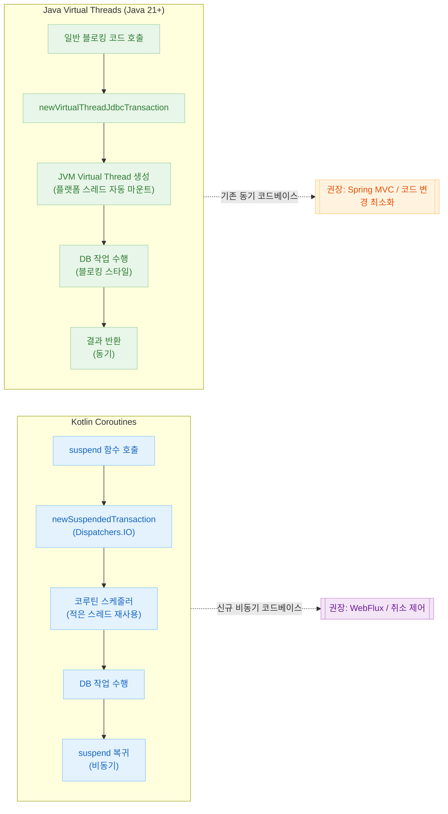
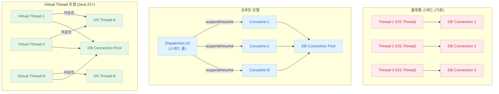
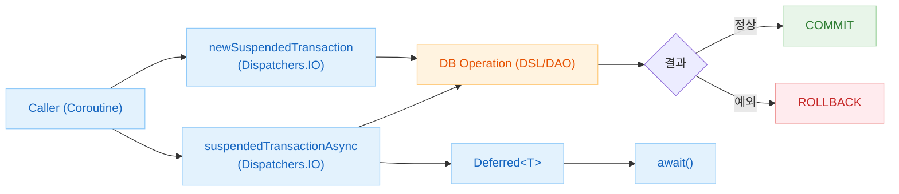
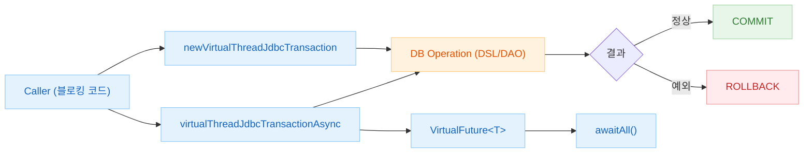

# 08 Coroutines

[English](./README.md) | 한국어

Exposed를 Kotlin 코루틴과 Virtual Thread 기반 동시성 모델에서 운영하는 패턴을 정리하며, 비동기 트랜잭션 설계 기준을 제공합니다.

## 챕터 목표

- `newSuspendedTransaction` 기반 비동기 접근 흐름을 이해한다.
- 코루틴 모델과 Virtual Thread 모델의 장단점을 비교하고 실무 선택 기준을 마련한다.
- 동시성 환경에서 안정적인 트랜잭션 경계를 설계한다.

## 선수 지식

- Kotlin Coroutines 기본 문법/Context 구조
- `05-exposed-dml/04-transactions`의 트랜잭션 패턴

## 코루틴 vs Virtual Thread 비교

| 항목               | Kotlin Coroutines                                      | Java Virtual Threads (Java 21+)                                        |
|------------------|--------------------------------------------------------|------------------------------------------------------------------------|
| API              | `newSuspendedTransaction`, `suspendedTransactionAsync` | `newVirtualThreadJdbcTransaction`, `virtualThreadJdbcTransactionAsync` |
| 코드 스타일           | `suspend` 함수, `await()`                                | 블로킹 스타일 유지 가능                                                          |
| 스레드 사용           | 적은 스레드 + Dispatcher 스케줄링                               | JVM이 자동으로 플랫폼 스레드에 마운트/언마운트                                            |
| 취소(Cancellation) | `Job.cancel()` + 구조적 동시성                               | `Future.cancel()` / `Thread.interrupt()`                               |
| DB 커넥션 관리        | Dispatcher.IO 풀 + 커넥션 풀 연동                             | Virtual Thread 수와 커넥션 풀 함께 조정 필요                                       |
| 기존 코드 마이그레이션     | `suspend` 키워드 추가 필요                                    | 블로킹 코드 그대로 사용 가능                                                       |
| 주 사용 사례          | 신규 비동기 코드베이스, Spring WebFlux 연동                        | 기존 동기 코드베이스의 동시성 확장                                                    |
| 최소 Java 버전       | 모든 버전                                                  | Java 21+                                                               |

## 동시성 모델 비교 다이어그램

### 코루틴 vs Virtual Thread 처리 흐름



### 스레드 모델 구조 비교



## 포함 모듈

| 모듈                        | 설명                       |
|---------------------------|--------------------------|
| `01-coroutines-basic`     | 코루틴 기반 Exposed 기본 예제     |
| `02-virtualthreads-basic` | Virtual Thread 기반 동시성 예제 |

## 권장 학습 순서

1. `01-coroutines-basic`
2. `02-virtualthreads-basic`

## 실행 방법

```bash
# 서브모듈 단독 실행
./gradlew :08-coroutines:01-coroutines-basic:test
./gradlew :08-coroutines:02-virtualthreads-basic:test

# 전체 챕터 실행
./gradlew :08-coroutines:test
```

## 트랜잭션 흐름 비교

### Coroutines Transaction Flow



### Virtual Thread Transaction Flow



## 테스트 포인트

- 취소(cancellation) 발생 시 자원 정리가 정상 동작하는지 확인한다.
- 병렬 처리 시 데이터 정합성이 유지되는지 검증한다.

## 성능·안정성 체크포인트

- 블로킹 호출이 Reactor/EventLoop를 점유하지 않도록 점검한다.
- 스레드/커넥션 풀 설정과 동시성 수준을 함께 튜닝한다.

## 복잡한 시나리오 가이드

### 코루틴 트랜잭션 패턴 (`01-coroutines-basic/`)

| 시나리오 | 구현 파일 |
|---|---|
| `newSuspendedTransaction` 기본 사용 | [`Ex01_Coroutines.kt`](01-coroutines-basic/src/test/kotlin/exposed/examples/coroutines/Ex01_Coroutines.kt) |
| `suspendedTransactionAsync` 병렬 실행 | [`Ex01_Coroutines.kt`](01-coroutines-basic/src/test/kotlin/exposed/examples/coroutines/Ex01_Coroutines.kt) |

### Virtual Thread 트랜잭션 패턴 (`02-virtualthreads-basic/`)

| 시나리오 | 구현 파일 |
|---|---|
| `newVirtualThreadJdbcTransaction` 기본 사용 | [`Ex01_VirtualThreads.kt`](02-virtualthreads-basic/src/test/kotlin/exposed/examples/virtualthreads/Ex01_VirtualThreads.kt) |
| `virtualThreadJdbcTransactionAsync` 비동기 병렬 실행 | [`Ex01_VirtualThreads.kt`](02-virtualthreads-basic/src/test/kotlin/exposed/examples/virtualthreads/Ex01_VirtualThreads.kt) |
| Virtual Thread + 일반 `transaction` 혼용 | [`Ex01_VirtualThreads.kt`](02-virtualthreads-basic/src/test/kotlin/exposed/examples/virtualthreads/Ex01_VirtualThreads.kt) |
| 중첩 트랜잭션 예외 처리 | [`Ex01_VirtualThreads.kt`](02-virtualthreads-basic/src/test/kotlin/exposed/examples/virtualthreads/Ex01_VirtualThreads.kt) |

## 다음 챕터

- [09-spring](../09-spring/README.md): Spring 통합 환경에서 Exposed 통합 패턴을 이어서 학습합니다.
